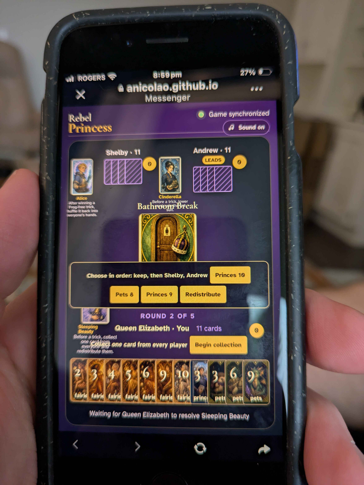

# Sleeping Beauty incident report

## Executive summary

On July 25, 2026, shortly before 11:00 PM in Toronto, Shelby, Andrew, and Liba (playing as **Queen Elizabeth**) became stuck while resolving Sleeping Beauty in Rebel Princess. The production Firestore event stream identifies the game as **`F38380`**.

This was not a connectivity failure and the buttons were not inert. The event log proves that Queen Elizabeth's client was appending events in response to taps. The failure was stale, client-only UI state carried from Sleeping Beauty's successful use in round 1 into its use in round 2:

- Round 1's selected redistribution was `Queens 2`, `Princes 10`, `Fairies 8`.
- Round 2's actual contributions were `Princes 10`, `Pets 8`, `Princes 9`.
- The client retained hidden round-1 selections and repeatedly submitted arrays containing `Queens 2` and `Fairies 8`.
- The deterministic reducer correctly rejected every such array because it was not a permutation of the current three contributions.
- The game consequently remained at a valid but unresolved `pendingPower`, suspending ordinary play.

The best fix is to scope Sleeping Beauty's local selection state to one pending-power episode, reset all of it at game/round/rematch boundaries and when collection begins or ends, prevent the collection controls from remaining visible while a power is pending, and validate that the selected card labels exactly equal the current contributions before enabling or submitting **Redistribute**. The reducer's exact-set validation should remain unchanged.

## User prompts, verbatim

The following records every user message supplied for this investigation, including the workspace context.

### Prompt 1: workspace context

```text
<environment_context>
  <cwd>/Users/anicolao/projects/games/rebelprincess</cwd>
  <shell>zsh</shell>
  <current_date>2026-08-04</current_date>
  <timezone>America/Toronto</timezone>
  <filesystem><workspace_roots><root>/Users/anicolao/projects/games/rebelprincess</root></workspace_roots><permission_profile type="disabled"><file_system type="unrestricted" /></permission_profile></filesystem>
</environment_context>
```

### Prompt 2: investigation request

```text
On or just before 2026-07-25, 11:00 PM, Andrew, Shelby and Liba ("Queen Elizabeth") were playing a game of rebel princess and the Sleeping Beauty power got them stuck. In the screenshot sleeping_failure.jpg you can see that the user was being asked who to hand cards to, but the buttons were not working. Examine the repo to understand how to inspect the firestore data, identify which game it was, do a replay, and form a hypothesis as to what happened and how to fix it. Make no changes.
```

### Prompt 3: documentation request

```text
Write a markdown file that records all my prompts verbatim and what you did to trace and debug the situation and your final conclusion as to the best fix. Include the screenshot so that the reader can understand your conclusions thoroughly, as well as relevant evidence from the event log to support your reasoning.
```

## Incident screenshot



The screenshot contains several details that can be compared directly with the replay:

- The active player is **Queen Elizabeth**, whose Princess is Sleeping Beauty.
- The other players are **Shelby** with Alice and **Andrew** with Cinderella.
- This is **round 2 of 5**, and the active Round card is **Bathroom Break**.
- The redistribution prompt shows `Pets 8`, `Princes 9`, and `Princes 10`.
- Every player has 11 cards. A three-player deal starts at 12 cards each, and Sleeping Beauty has temporarily removed one contribution from each hand, so 11 is the expected pending-state count.
- The status says the game is synchronized, ruling out an obvious disconnected-client explanation.
- The screen simultaneously shows **Begin collection** and the completed three-card redistribution chooser. Those controls represent different stages of the same power and should not be visible together.
- The status at the bottom says the table is waiting for Queen Elizabeth to resolve Sleeping Beauty, matching the replayed `pendingPower`.

The photographed phone's status bar reads 8:59 PM, while Firestore server timestamps place the matching event sequence between 10:44 PM and 10:59 PM Toronto time. The server timestamps, player names, Princesses, round, and exact three cards make the game identification unambiguous. The repository copy of the JPEG has a later filesystem creation date and contains no useful original capture timestamp.

## How the game data is stored and replayed

The repository documentation and code establish the following data model:

```text
games/{gameId}/events/{eventId}
```

The event documents are immutable and append-only. Each includes `type`, `payload`, `actorUid`, `clientSeq`, a Firestore server `createdAt` timestamp, `schemaVersion`, and `reducerVersion`. The write path is implemented by [`appendGameEvent`](src/lib/game-events.ts#L527), and the live subscription reads the whole room event collection and calls [`deriveGame`](src/lib/game-events.ts#L563). Firestore does not store a mutable game-state document; the current state must be reconstructed by ordering and reducing all valid events.

The production project is `rebel-princess-20260715`, as recorded in [`README.md`](README.md) and [`.firebaserc`](.firebaserc). The deployed GitHub Pages bundle at the incident time was deployment commit `5298d08`, built from source commit `d4b2b94`, which is also the source revision examined during this investigation.

## Investigation procedure

All production inspection during the original diagnosis was read-only. No Firestore documents, indexes, authentication users, or game events were created, updated, or deleted.

1. I inspected `sleeping_failure.jpg` at its original resolution and recorded the players, Princesses, Round card, round number, card counts, displayed contribution cards, and simultaneous controls.
2. I read [`ARCHITECTURE.md`](ARCHITECTURE.md), [`README.md`](README.md), [`firestore.rules`](firestore.rules), and [`src/lib/game-events.ts`](src/lib/game-events.ts) to establish the project, event path, append-only contract, and replay function.
3. I checked the git history and deployment branch to verify which source revision was live at the incident time.
4. I verified that the existing local Firebase CLI session had authorized access to the production project. I used that existing CLI OAuth identity with the Firestore REST API; I did not sign in anonymously or create an application user.
5. I first attempted a collection-group query over `events` filtered and ordered by `createdAt`. Firestore returned `FAILED_PRECONDITION` because there was no collection-group ascending index for `events.createdAt`. Creating the suggested index would have changed production, so I did not create it.
6. I instead performed an index-free, read-only collection-group scan, received 1,903 event documents, and filtered them locally to the July 24–27 window. The only game in the target interval with Shelby, Andrew, and Queen Elizabeth was `F38380`.
7. After identifying the room, I read `games/F38380/events` directly. Firestore REST values were decoded into the same event shapes the application consumes.
8. I ordered the events using the repository's `orderEvents` implementation and repeatedly invoked `deriveGame` on successive prefixes. This showed exactly which events changed projected state and which were accepted into Firestore but ignored as illegal by the reducer.
9. I compared the replayed state and payloads with the local Svelte state lifecycle and rendering conditions in [`src/routes/+page.svelte`](src/routes/+page.svelte).
10. I ran the current unit suite. All 84 tests passed, confirming that the reducer's validation still behaves consistently and highlighting that the missing coverage is a multi-round UI lifecycle case.

## Identification of game `F38380`

All times below are Firestore server timestamps converted to America/Toronto (UTC−04:00 on the incident date).

| Local time | Event | Actor | Relevant payload/result |
|---|---|---|---|
| Jul 25 22:44:05 | `game/created` | Shelby | Game `F38380` |
| Jul 25 22:44:57 | `player/joined` | Andrew | Joined `F38380` |
| Jul 25 22:46:26 | `player/joined` | Queen Elizabeth | Liba joined under the displayed name Queen Elizabeth |
| Jul 25 22:46:40 | `player/configured` | Shelby | Princess `alice` |
| Jul 25 22:46:51 | `player/configured` | Andrew | Princess `cinderella` |
| Jul 25 22:46:53 | `player/configured` | Queen Elizabeth | Princess `sleeping-beauty` |
| Jul 25 22:46:55 | `game/dealt` | Shelby | Round order begins with `odds-and-evens`, then `bathroom-break` |

The full five-card round order replayed as:

```text
odds-and-evens
bathroom-break
once-upon-a-time
late-for-a-very-important-date
prince-rings-twice
```

No other event stream in the target time window matched the three names and screenshot state.

## Event-log evidence

### Round 1: Sleeping Beauty succeeds

The first use establishes the client state that later leaked into round 2.

| Local time | Actor sequence | Event | Payload | Replayed result |
|---|---:|---|---|---|
| 22:50:37 | Queen Elizabeth 7 | `power/activated` | `powerId: sleeping-beauty` | Creates empty Sleeping Beauty `pendingPower` |
| 22:50:42 | Andrew 453 | `power/contributed` | `Princes 10` | Accepted |
| 22:50:54 | Shelby 516 | `power/contributed` | `Fairies 8` | Accepted |
| 22:51:04 | Queen Elizabeth 11 | `power/contributed` | `Queens 2` | Accepted; three contributions are ready |
| 22:51:55 | Queen Elizabeth 14 | `power/activated` | cards: `Queens 2`, `Princes 10`, `Fairies 8` | Accepted; cards redistributed and Sleeping Beauty exhausted for round 1 |

The client-side `selectedPowerCards` array therefore ended round 1 as:

```text
[Queens 2, Princes 10, Fairies 8]
```

At 22:54:44 Shelby appended the second `game/dealt`, moving the projection to round 2. Replay reset the reducer's per-round Princess exhaustion correctly. It did not—and cannot—reset Svelte component variables that are not part of the event projection.

### Round 2: current contributions are collected

| Local time | Actor sequence | Event | Payload | Replayed result |
|---|---:|---|---|---|
| 22:55:27 | Queen Elizabeth 25 | `power/activated` | `powerId: sleeping-beauty` | Creates round-2 Sleeping Beauty `pendingPower` |
| 22:56:00.334 | Shelby 528 | `power/contributed` | `Princes 10` | Accepted and removed from Shelby's hand |
| 22:56:00.964 | Andrew 465 | `power/contributed` | `Pets 8` | Accepted and removed from Andrew's hand |
| 22:56:18 | Queen Elizabeth 28 | `power/contributed` | `Princes 9` | Accepted and removed from Queen Elizabeth's hand |

The only legal redistribution payload at this point was any ordering of exactly this set:

```text
{Princes 10, Pets 8, Princes 9}
```

### Round 2: stale and empty resolution attempts

Queen Elizabeth's actor sequence 29 through 53 contains 25 further `power/activated` events. Thirteen have no `cards` field, consistent with repeated taps on the still-visible **Begin collection** control. Twelve carry three-card arrays, but none equals the current contribution set.

| Actor sequence(s) | Submitted `cards` | Why the reducer rejects it |
|---:|---|---|
| 29, 34 | `Queens 2`, `Princes 10`, `Fairies 8` | Exact stale round-1 selection; `Queens 2` and `Fairies 8` were not contributed in round 2 |
| 35, 47 | `Queens 2`, `Fairies 8`, `Princes 9` | Two stale cards; missing `Princes 10` and `Pets 8` |
| 42–46, 51 | `Queens 2`, `Fairies 8`, `Princes 10` | Two stale cards; missing `Pets 8` and `Princes 9` |
| 48, 50 | `Queens 2`, `Fairies 8`, `Pets 8` | Two stale cards; missing both round-2 Princes |
| 30–33, 36–41, 49, 52–53 | no `cards` field | Cannot resolve a pending three-card redistribution |

The first failed array at 22:56:39 is especially strong evidence: it is byte-for-card the successful round-1 order. Later arrays show that tapping current visible buttons removed or inserted some cards while the two invisible stale cards remained in local state.

The last event is Queen Elizabeth sequence 53 at **22:59:47**. Replaying the complete stream produces:

```text
gameId: F38380
round: 2
roundCard: bathroom-break
currentTurn: Andrew
pendingPower:
  powerId: sleeping-beauty
  actor: Queen Elizabeth
  cards:
    - Shelby: Princes 10
    - Andrew: Pets 8
    - Queen Elizabeth: Princes 9
exhaustedPrincesses: []
handCounts:
  Shelby: 11
  Andrew: 11
  Queen Elizabeth: 11
```

That projection matches the photographed screen. A normal card play cannot proceed while `pendingPower` exists, so the table remains stuck until Queen Elizabeth submits a valid ordering.

## Root-cause analysis

### 1. Round transition resets the wrong local state

The live subscription detects a new round, but only resets pass selection:

```ts
if (next.roundIndex !== observedRoundIndex) {
  selectedPassCards = [];
  observedRoundIndex = next.roundIndex;
}
```

See [`src/routes/+page.svelte` lines 99–110](src/routes/+page.svelte#L99). It does not reset `openPrincessPower` or `selectedPowerCards`.

### 2. Sleeping Beauty selection is only cleared by manually toggling the Princess card

`selectedPowerCards = []` appears only in `usePrincessCard`, alongside toggling `openPrincessPower`:

```ts
if (['little-mermaid', 'ice-princess', 'scheherazade', 'sleeping-beauty'].includes(powerId) && game?.trick?.plays.length === 0) {
  openPrincessPower = openPrincessPower === powerId ? '' : powerId;
  selectedPowerCards = [];
  return;
}
```

See [`src/routes/+page.svelte` lines 490–513](src/routes/+page.svelte#L490). After the successful round-1 redistribution, neither variable is cleared. At the start of round 2, the already-open collection panel lets the user begin again without pressing the Princess card, bypassing the only reset.

### 3. Mutually incompatible stages render simultaneously

The **Begin collection** block is guarded by `powerAvailable`, an empty trick, and `openPrincessPower`, but not by `!game.pendingPower`. The redistribution block is a separate conditional immediately afterward. Consequently, both appear at once, exactly as shown in the screenshot. See [`src/routes/+page.svelte` lines 742–752](src/routes/+page.svelte#L742).

The shared `activatePower` guard also checks `powerAvailable` rather than whether the requested action is a legal begin or resolution for the current pending phase. This permits repeated no-card `power/activated` events while collection is already pending.

### 4. The button enables based only on array length

The chooser marks only cards whose labels are visible in `pendingPower.cards`, but **Redistribute** uses this condition:

```svelte
disabled={selectedPowerCards.length !== game.players.length}
```

A length of three says nothing about whether those three local cards are the current three contributions. Stale cards are invisible in the chooser but still count toward the length. `selectRedistribution` also refuses to add another visible card once that hidden array has reached the player count.

This explains the user's experience: visible card buttons appeared to do nothing or behaved inconsistently, while Redistribute submitted a hidden mixture of old and new cards.

### 5. The reducer protects canonical state correctly

The reducer accepts a Sleeping Beauty resolution only when:

- the payload has one card per player;
- the pending power has one contribution per player;
- every submitted label belongs to the current contribution set; and
- all submitted labels are unique.

See [`src/lib/game-events.ts` lines 384–404](src/lib/game-events.ts#L384). This validation rejected the stale arrays, conserving cards and preserving a recoverable pending state. Weakening this validation would conceal the UI bug and risk duplicating, losing, or redistributing cards that were never contributed.

## Why existing tests passed

The dedicated [`019-sleeping-beauty` E2E scenario](tests/e2e/019-sleeping-beauty/019-sleeping-beauty.spec.ts) opens Sleeping Beauty, contributes and selects three cards, resolves it once, and closes the game. It verifies the happy path thoroughly but never advances the same live browser page to a new round and uses Sleeping Beauty again.

The reducer and card-conservation unit tests are also behaving correctly: stale resolution events are supposed to be ignored. This is a component-state lifecycle defect that requires a multi-round browser regression test.

## Recommended fix

The best fix is a layered UI correction; the canonical reducer should continue rejecting invalid event payloads.

### A. Scope transient UI state to a game, round, and pending-power episode

Reset at least `openPrincessPower` and `selectedPowerCards` when any of these occurs:

- the watched game ID changes;
- a rematch begins;
- `roundIndex` changes;
- Sleeping Beauty collection begins;
- the active Sleeping Beauty `pendingPower` is resolved or disappears.

Ideally the component should track a pending-power episode key, such as game number, round index, power ID, actor UID, and the transition from no pending power to pending power. A fresh episode must always start with an empty ordered selection, even if one contributed card happens to have the same label as a prior round's contribution.

### B. Make collection and resolution phases mutually exclusive

- Render **Begin collection** only when there is no `pendingPower` and the Princess is currently usable.
- Close `openPrincessPower` immediately after a successful begin action.
- When Sleeping Beauty is pending for its actor, render only the contribution-waiting or redistribution UI.
- Use separate begin and resolution handlers with phase-specific guards instead of allowing the generic activation guard to submit either shape in either phase.

This removes the overlapping controls and the thirteen empty activation events seen in the incident stream.

### C. Validate the exact current card set in the client

Before enabling **Redistribute** or appending its event, compare card labels against `game.pendingPower.cards`:

- selected count equals player count;
- selected labels are unique;
- every selected label is in the current pending contribution set; and
- every pending contribution label appears in the selection.

The selection click handler should likewise operate only on current pending entries. Array length alone must not enable submission.

### D. Add the missing regression test

Add a browser test that keeps the same Sleeping Beauty client alive across two rounds:

1. Use and resolve Sleeping Beauty in round 1.
2. Complete round 1 and deal round 2 without reloading the page.
3. Assert that the old power panel and ordered cards are cleared.
4. Use Sleeping Beauty again with a different set of contributions.
5. Assert that **Begin collection** disappears while pending.
6. Assert that **Redistribute** starts disabled, only current cards acquire order numbers, and it enables only after all current cards are selected.
7. Resolve and verify each recipient's final hand through the Firestore-backed clients.
8. Assert that no extra no-card or stale-card `power/activated` events were appended.

## Recovery observation

The incident stream was left in a recoverable state. Reloading Queen Elizabeth's page would recreate the Svelte component with an empty `selectedPowerCards` array, replay `pendingPower` from Firestore, and display the current three contributed cards. Selecting `Princes 10`, `Pets 8`, and `Princes 9` in any desired recipient order would then append a payload the reducer could accept. This is further evidence that the durable event stream was sound and the defect was confined to client-local state.

No recovery event was appended during the investigation.

## Final conclusion

Game `F38380` became stuck because Sleeping Beauty's **round-1 local selection survived into round 2**. The controls did generate events, but the visible round-2 buttons were backed by an array already filled with hidden round-1 cards. The reducer correctly refused those invalid redistributions and kept the game suspended at the unresolved power.

The most reliable correction is to make local Princess UI state episode-scoped, reset it on every relevant lifecycle boundary, render exactly one phase at a time, and require exact equality with the current contributed-card set before enabling or submitting redistribution. A two-round, same-page E2E test is necessary to prevent recurrence.
