# Before-trick hand-raise and priority design

**Status:** Implemented on the PR branch

**Scope:** Princess powers whose printed timing is “before a trick”

**Related feedback:** August 9 action race and power-response findings

## Decision summary

Use advance hand-raising to decide whether the next trick needs a before-a-trick (BAT) priority window:

1. During a trick, a player with an unused BAT power may secretly raise or lower their hand for the next trick at any time. During the opening pass, they may do the same for the first trick.
2. If no hand is raised when the signaling phase ends, the next trick starts normally with no extra interaction.
3. If at least one hand is raised, card play is blocked before the next trick and BAT priority starts with the leading player, then proceeds in play order among players with unused BAT powers.
4. On priority, a player either activates their Princess or declines. An activated power resolves completely before priority advances.
5. Every activation resets the decline sequence. Players who declined earlier but have not activated get another opportunity after priority goes around again.
6. The window closes only when every player who still has an unused BAT power has declined consecutively since the most recent activation.
7. Signals are consumed and all hands are lowered when their target window begins.

This is a rolling-priority protocol rather than the earlier simultaneous reservation queue. It removes the lead-versus-reservation race, uses table order instead of network arrival to break ties, and permits a player to respond even if they declined before another power was activated.

## Example

Alex leads the next trick. Alex, Jo, and Sam all have unused BAT powers. At least one player raised a hand during the preceding trick.

1. Alex gets priority and declines.
2. Jo activates the Ice Princess. The inspection and freeze resolve immediately. Jo’s Princess is exhausted.
3. The decline sequence resets, and Sam gets priority. Sam declines.
4. Priority returns to Alex because Alex has not acted. After seeing the Ice Princess resolve, Alex may now activate or decline again.
5. If Alex declines, Sam and Alex have both declined consecutively since Jo’s activation. Jo is already exhausted, so the window closes and the trick begins.

Alex’s first decline did not remove Alex from the window. Only successfully activating a power removes a player from later circuits.

## Why the current model fails

The current UI opens several power choosers in local component state. No shared event exists until the owner completes an initial target or option choice. During that interval, other clients still derive an ordinary empty trick, so the leader can submit a card.

After an activation reaches Firestore, the reducer projects one `pendingPower`. While it exists, all other `power/activated` events are ignored. The implementation therefore both locks too late and prevents one BAT power from answering another.

Advance signaling fixes the first problem before the trick becomes playable. Rolling priority fixes the second by giving every still-unused BAT power another turn after each activation.

## Goals

- Decide whether BAT interaction is needed before the next trick becomes playable.
- Add no extra clicks to a trick when nobody has signaled interest.
- Let players change their signaling intent freely before the signaling boundary.
- Resolve BAT powers one at a time in visible table order.
- Let an earlier decliner reconsider after any later player activates.
- End the window only after an uninterrupted full circuit of declines.
- Keep target and card choices current by resolving a power immediately when priority is taken.
- Preserve immutable event replay, reconnect reconstruction, and old game streams.

## Non-goals

- Secrecy is UI-level only. The shared Firestore stream may contain each player’s signal.
- There is no special disconnect recovery. The game waits for the player who has priority.
- This does not add command idempotency or server-enforced game legality.
- This does not change after-play powers such as Mulan and Alice, or while-playing powers such as Snow White and Thumbelina.
- This does not redefine the printed effect of an individual Princess.

## Terminology

- **BAT power:** a Princess power with printed timing “before a trick.”
- **Signal:** the latest raised/lowered hand state for a future BAT window.
- **Signaling phase:** the preceding trick, or the opening pass for trick one.
- **Signal boundary:** the canonical event prefix at which the next trick becomes eligible for BAT priority.
- **Priority window:** the sequential opportunity to activate BAT powers before card play.
- **Priority holder:** the one player currently asked to Activate or Decline.
- **Acted player:** a player who successfully activated and exhausted their BAT power in this window.
- **Decline sequence:** the still-eligible players who have declined since the most recent activation.

The relevant Princesses are Cinderella, Pocahontas, the Pea Princess, the Little Mermaid, Sleeping Beauty, Scheherazade, the Ice Princess, and Rapunzel.

## State machine

```mermaid
stateDiagram-v2
    [*] --> Signaling
    Signaling --> Signaling: hand raised or lowered
    Signaling --> Playing: boundary reached with no raised hands
    Signaling --> Priority: boundary reached with at least one raised hand
    Priority --> Resolving: priority holder activates
    Resolving --> Priority: power resolves; declines reset
    Priority --> Priority: priority holder declines; circuit incomplete
    Priority --> Playing: every unacted player declines consecutively
    Playing --> Signaling: next trick starts
```



For the first trick, `Signaling` overlaps the opening pass. For later tricks, it overlaps card play in the preceding trick. The last trick may be targeted by a signal during the penultimate trick; the hand control is absent during the final trick because there is no following trick in that round.

## Signal lifecycle

### Scope signals to the next trick

A signal targets the next trick index within the current dealt round:

```text
targetTrickIndex
```

During the opening pass, `targetTrickIndex` is `0`. During trick `n`, signals target trick `n + 1`. The enclosing game and deal segment supply game and round scope. Stale events for another target trick remain in history but do not affect projection.

### Raise and lower freely

The latest accepted signal event from a player wins. A player may raise, lower, and raise again any number of times while the signaling phase is open. Neither action exhausts the Princess or commits the player to activate it.

The UI exposes this as a local toggle throughout the opening pass or current trick, independent of whose turn it is. Lowering the hand removes that player from the trigger calculation if the lower event enters canonical order before the signal boundary.

### Evaluate once at the boundary

At the signal boundary, the reducer snapshots whether at least one eligible player’s latest signal is Raised.

- No raised hands: consume the target’s signals and allow ordinary play.
- One or more raised hands: consume the signals, derive a priority window, and block ordinary play.

After a window opens, lowering a hand cannot cancel it. The signal has already served its sole purpose: requesting that everyone receive BAT priority. A signaler who changed their mind simply Declines when asked.

The event stream supplies the boundary order. A lower event ordered before the boundary counts; one ordered afterward is stale. No client clock is consulted.

## First-trick signaling

Players may raise or lower their hands throughout the opening passing phase. The signal remains live while mandatory post-pass Round-card setup is completed. It is evaluated immediately before the first trick’s BAT priority could begin.

This supplies the same advance opportunity as signaling during a preceding trick without inventing a special first-trick confirmation screen.

If the round has no opening pass cards, the existing ready/deal transition must still expose a short logical signaling phase before the first lead becomes legal. It need not use a timer: the deal projection can require each BAT owner to acknowledge Ready or raise a hand as part of the existing setup completion. This zero-pass edge case should be covered before implementation because some Round cards may specify no pass.

## Priority order

When a window opens, capture:

- the leader at that moment;
- seated play order;
- every player who owns an unexhausted BAT Princess; and
- the derived window ID.

Priority begins with the captured leader if eligible, otherwise with the next eligible player in play order. It advances clockwise, skipping players who do not own a BAT power or who have already acted.

The captured priority order does not change during the window. Pocahontas may change who will lead the trick, but that does not reorder a priority circuit already in progress.

## Rolling decline rule

The reducer maintains `actedUids` and an ordered `declinedSinceActivation` list.

When the priority holder declines:

1. append that UID to `declinedSinceActivation`;
2. move priority to the next eligible player who has not acted; and
3. close the window if `declinedSinceActivation` now contains every player who remains eligible and unacted.

When the priority holder activates:

1. resolve the power completely;
2. exhaust its Princess and add the actor to `actedUids`;
3. clear `declinedSinceActivation`; and
4. move priority to the next eligible, unacted player after the actor.

Clearing the decline sequence is what lets earlier decliners reconsider. The window ends only after a complete circuit with no intervening activation.

If all eligible players have acted, the window closes immediately because no unused BAT power remains.

## Immediate resolution

A player who takes priority must finish their power before anyone else is asked.

- Cinderella, the Pea Princess, and Rapunzel resolve from a single activation confirmation.
- Pocahontas and the Little Mermaid select a current target or suit.
- The Ice Princess and Scheherazade select a target, then complete their deterministic inspection.
- Sleeping Beauty retains priority through contribution and redistribution.

Interactive selection uses the existing projected `pendingPower`, not merely an open local chooser. This preserves the lock and reconstructs the correct controls after refresh.

Only after `pendingPower` resolves does the reducer reset declines and advance priority. Other BAT activation and decline events are ignored while a power is resolving.

A power is offered only when its base preconditions are currently satisfiable. Because resolution is sequential, another Princess cannot invalidate it midway through its chooser. A successful resolution exhausts the Princess; opening or lowering a signaling hand never does.

## Implemented projection

```ts
type BeforeTrickWindow = {
  id: string;
  startingLeaderUid: string;
  eligibleUids: string[];
  priorityUid: string;
  actedUids: string[];
  declinedSinceActivation: string[];
};

type BatProjection = {
  batPriorityEnabled: boolean;
  batSignals: Record<string, {
    targetTrickIndex: number;
    raised: boolean;
  }>;
  batSignalTargetTrick: number | null;
  beforeTrickWindow: BeforeTrickWindow | null;
};
```

The existing `pendingPower` shape carries power-specific stages. Sleeping Beauty, for example, moves through collection and redistribution while retaining priority.

## Event contract

| Event | Actor | Purpose |
|---|---|---|
| `power/hand-raised` | Unexhausted BAT owner | Sets that actor’s signal to Raised for the target trick |
| `power/hand-lowered` | Unexhausted BAT owner | Sets that actor’s signal to Lowered for the target trick |
| `power/priority-declined` | Current priority holder | Adds a decline and advances or closes the priority circuit |
| `power/activation-started` | Current priority holder | Takes priority and opens that Princess’s projected resolution controls |
| `power/activated` | Active power owner | Applies the completed power and resumes priority |
| `power/contributed` | Required contributor | Supplies Sleeping Beauty’s cards while her active power is resolving |

Priority decisions and activation events contain the active `windowId`; resolution events also contain `powerId`. `power/activated` carries the target, suit, card, or cards.

`power/activated` remains valid for version 1 streams under its existing reducer semantics. Newly created `game/dealt` events set `batPriority: true`; deals without that feature flag retain the legacy path. This preserves old replays without reinterpreting their existing version-1 events.

## Determinism and concurrent input

Signals may arrive concurrently, but only their latest canonical state at the boundary matters. Firestore server timestamp and event ID remain the existing total order.

The priority window itself has only one legal decision-maker at a time. If stale clients submit competing events, the reducer accepts only the event authored by the current `priorityUid` or `pendingPower.actorUid` for the current window.

Card play is already blocked before priority begins because the trigger was captured during the preceding phase. A lead event for a trick with a derived priority window is rejected regardless of network timing after the boundary.

This is the principal improvement over immediate reservations: table order determines who acts first, and no BAT click competes with the lead of the same trick.

## Power composition

Each power applies to the projection before priority moves. A later player therefore sees updated hands, leader, forced cards, and trick modifiers before choosing whether and how to activate.

Non-conflicting effects compose. When two Princess restrictions cannot both be satisfied, the later-resolved restriction should take precedence, with one printed exception: an Ice Princess forced card overrides ordinary following and other play restrictions as already stated in `RULES.md`.

Leader-relative restrictions should be represented on the trick rather than permanently attached to the UID who led when signaling began. Pocahontas can change the eventual leader; later Mermaid or Rapunzel effects apply to that updated state.

The implementation should add an explicit pairwise conflict table to `RULES.md`. The scheduler must not preserve the current scattered, order-sensitive rejection checks.

## Mandatory Round-card phases

Signals are captured before the next trick, but the first implementation preserves the current execution sequence:

1. finish a mandatory Round-card action such as Wedding Gift or Musical Chairs;
2. evaluate the captured hand signals and, if requested, complete BAT priority; then
3. allow the leader to play.

A signal remains raised across the mandatory Round-card step. This design does not interleave Round-card contributions with BAT priority.

## Action ownership and UI

### During signaling

- An unused BAT Princess displays a small **Raise hand for next trick** toggle.
- Only the local player sees whether their own hand is raised.
- The main table does not identify signalers. UI-level secrecy is sufficient.
- Raising and lowering provide immediate local acknowledgment and append the corresponding event.
- During the final trick, the toggle is absent because there is no next trick in the round.

### During priority

- The leader’s hand is visible but disabled.
- Exactly one eligible seat receives the gold active treatment.
- The priority holder sees **Use [Princess]** and **Decline**.
- Other players see **Waiting for Alex’s before-trick decision**.
- After a decline, the marker moves to the next eligible player.
- After an activation, the effect resolves and is announced before the marker moves.
- When the decline sequence resets, a previously declining player’s seat becomes eligible again.
- When the window closes, focus returns to the current leader and ordinary legal-card highlighting resumes.

Phase changes and reconsideration must be announced through the existing live status region and remain keyboard accessible.

## Reconnect and disconnection

Signals, priority, declines, and active resolution are reducer output, so refresh reconstructs the correct state. Local chooser state is disposable.

Every decision carries the current `windowId`. A stale signal, decline, activation, or resolution remains immutable history but has no projection effect, and the originating client explains that the action is no longer current.

There is no timeout, auto-pass, or host override in this design. A disconnected priority holder stalls the game in the same way a disconnected current player does today.

## Reducer invariants

- Signals affect only their exact game, round, and target trick.
- Raising or lowering never exhausts a Princess.
- A signal’s latest canonical event wins until the boundary.
- No priority window opens unless at least one eligible hand is raised at the boundary.
- A priority window exists only before an empty, incomplete trick.
- Card play cannot change projection while a priority window exists.
- Priority order is captured once and does not change when the eventual leader changes.
- Only the current priority holder can decline or start a power.
- Only one power resolves at a time, and its owner retains priority until completion.
- A successful activation exhausts its Princess and removes that actor from later circuits.
- Every successful activation clears the decline sequence.
- A decline never permanently removes an unacted player from the window.
- The window closes only after all remaining unacted players decline consecutively, or after all eligible players act.
- Sleeping Beauty’s pending cards remain counted by the card-conservation invariant.

## Test plan

### Reducer tests

- Raise then lower before the boundary does not open a window.
- Lower then raise before the boundary opens a window.
- A hand raised during passing opens priority before the first trick.
- A hand raised during the penultimate trick opens priority before the last trick.
- No signal control or accepted signal exists during the final trick.
- No raised hands permit the next lead without extra decisions.
- Priority begins with the captured leader and skips ineligible seats.
- One uninterrupted circuit of declines closes the window.
- An activation resolves immediately, exhausts its actor, and resets prior declines.
- A player who declined before an activation receives priority again afterward.
- Acted players are skipped on later circuits.
- Pocahontas changes the eventual leader without changing the captured priority order.
- Only the current priority holder or active resolver can submit an accepted event.
- Stale signals and decisions do not affect the following trick.
- Card conservation holds at every prefix, including final-trick Sleeping Beauty.

### Browser tests

- During passing, a player can raise, lower, and raise their hand for trick one.
- During a trick, a non-active player can toggle their next-trick hand freely.
- At the boundary, a requested window blocks the leader before any BAT choice begins.
- Priority visibly moves in play order.
- Alex declines, Jo activates, and Alex is offered another decision after Jo resolves.
- A complete post-activation decline circuit returns control to the leader.
- An interactive power retains the active marker through all chooser stages.
- Refresh during signaling, priority, and Sleeping Beauty resolution restores the correct controls.
- Phone and desktop layouts keep hand and priority controls visible.

Existing individual Princess scenarios should be migrated to signal the next window, take priority, and resolve before the lead.

## Delivered implementation

1. Scoped signal events and boundary derivation open the requested window.
2. Pure rolling-priority helpers determine the next eligible player and decline completion.
3. `actionOwnership` and the table UI expose signaling, priority, and waiting states.
4. Direct and interactive BAT powers resolve through priority; interactive powers retain `pendingPower` while locked.
5. `game/dealt.batPriority` protects legacy replays while enabling the protocol for new games.
6. Reducer and browser scenarios cover lowering, lead blocking, decline reset, activation, and interactive resolution.

## Alternatives not chosen

### Public reservation followed by a frozen FIFO queue

The earlier design still allowed a reservation to race the lead at the start of the trick and ordered simultaneous intent by network arrival. It also prevented a player who had passed from reconsidering after seeing another power resolve.

### Ask every BAT owner before every trick

This eliminates races but adds mandatory interaction to every trick. Advance hand-raising keeps ordinary tricks unchanged when nobody is interested.

### Ask everyone exactly once

A single circuit prevents an early decliner from responding to a later activation. Resetting declines after every activation preserves response opportunities while still guaranteeing termination after an uninterrupted pass around the table.

### Use a response timer or mutable Firestore lock

The advance signal removes the same-trick lead race without client clocks, server timers, or a second mutable source of coordination authority.

## Remaining rules questions

1. Is “later-resolved restriction wins when constraints conflict” correct, subject to the Ice Princess exception?
2. Is preserving mandatory Round-card preparation before BAT priority correct for Wedding Gift and Musical Chairs?
3. For a zero-card opening pass, should BAT owners acknowledge Ready as part of setup, or should the application treat dealing itself as an explicit signaling phase?
