# Before-trick reservation and response design

**Status:** Proposed for review

**Scope:** Princess powers whose printed timing is “before a trick”

**Related feedback:** August 9 action race and power-response findings

## Decision summary

Replace the single `pendingPower` gate with an explicit, replayable before-trick window:

1. Clicking a before-trick Princess appends `power/reserved` immediately, before opening any target or card chooser.
2. The first accepted reservation blocks card play and opens a response phase for every other eligible before-trick Princess.
3. Eligible players publicly choose **Reserve** or **Pass**. The initiator closes responses only after everyone has answered.
4. Reserved powers form a deterministic queue in canonical event order and resolve one at a time in that same order.
5. A power chooses targets and cards only when it reaches the front of the queue, so later responders act on the state produced by earlier powers.
6. The leader may play only after the queue is empty and the window closes.

This preserves the append-only Firestore stream and deterministic reducer. It adds no mutable lock document, server clock, timeout, or Cloud Function.

## Why the current model fails

The current UI opens several power choosers in local component state. No shared event exists until the owner completes the first choice. During that interval, every other client still derives an ordinary empty trick, so the leader can submit a card.

After an activation does reach Firestore, the reducer projects one `pendingPower`. While it exists, all other `power/activated` events are ignored. The implementation therefore has two distinct problems:

- it locks too late for interactive powers; and
- once locked, it cannot collect or order responses from other Princesses.

The August 9 Prince lead was rejected because Sleeping Beauty’s event happened to enter canonical order first. The rejection was legal under the projection, but the leader had no visible warning during Sleeping Beauty’s client-only confirmation step.

## Goals

- Publish the lock as the first action caused by a Princess click.
- Give every eligible before-trick Princess one explicit response opportunity.
- Resolve multiple powers in an order that is deterministic on every client.
- Keep target and card choices current by collecting them at resolution time.
- Make action ownership and blocked play obvious to all players.
- Preserve immutable event replay, reconnect behavior, and old game streams.
- Exhaust a Princess only when her reserved power resolves successfully.

## Non-goals

- This does not add command idempotency; stable command IDs remain the next separate infrastructure change.
- This does not create server-enforced game legality or privacy. The project retains its trusted-client model.
- This does not add disconnect timeouts or host overrides.
- This does not change after-play powers such as Mulan and Alice, or while-playing powers such as Snow White and Thumbelina.
- This does not redefine the printed effects of individual Princesses. It does define how multiple otherwise-valid effects are scheduled.

## Terminology

- **Window:** one before-trick coordination epoch for an empty trick.
- **Reservation:** a public, binding declaration that a player intends to use their before-trick Princess in this window.
- **Responder:** an eligible Princess owner other than the first reserving player.
- **Response:** the responder’s latest accepted Reserve or Pass decision before responses close.
- **Queue:** the frozen list of reservations awaiting resolution.
- **Active resolver:** the owner of the reservation at the front of the queue.

The relevant Princesses are Cinderella, Pocahontas, the Pea Princess, the Little Mermaid, Sleeping Beauty, Scheherazade, the Ice Princess, and Rapunzel.

## State machine

```mermaid
stateDiagram-v2
    [*] --> Idle
    Idle --> Collecting: first power/reserved
    Idle --> Playing: card/played wins canonical race
    Collecting --> Collecting: responder reserves or passes
    Collecting --> Resolving: initiator closes complete responses
    Resolving --> Resolving: front power resolves; queue remains
    Resolving --> Playing: final power resolves; window closes
    Playing --> Idle: trick completes and next pre-trick actions finish
```



`Idle` here means that the trick is empty, mandatory Round-card preparation is complete, and no before-trick window exists. Ordinary card play remains unchanged when nobody invokes a Princess.

## Window identity and eligibility

The window ID is derived rather than randomly generated:

```text
gameNumber:roundIndex:completedTricks:leaderUid
```

Every new event carries that ID. A stale click from a prior trick or prior leader is therefore retained in history but rejected by the reducer.

The first accepted reservation captures a stable responder set. A player is eligible when all of these are true at that event prefix:

- their selected Princess has “before a trick” timing;
- the Princess is not exhausted for the round;
- the trick is empty;
- no mandatory Round-card action is pending; and
- the power’s base precondition can still be met.

Eligibility is frozen for the window. Later power effects may make a reserved power impossible to apply, but they do not add a new responder halfway through coordination.

## Proposed projection

Replace the scheduling role of `pendingPower` with a public projection similar to:

```ts
type BeforeTrickWindow = {
  id: string;
  phase: 'collecting' | 'resolving';
  initiatorUid: string;
  eligibleResponderUids: string[];
  responses: Record<string, {
    decision: 'reserve' | 'pass';
    powerId?: string;
    eventId: string;
  }>;
  queue: Array<{
    reservationEventId: string;
    actorUid: string;
    powerId: string;
  }>;
  activeResolution: null | {
    reservationEventId: string;
    stage: string;
  };
};
```

The exact resolution stage remains power-specific. For example, Sleeping Beauty moves through contribution and redistribution stages while remaining the sole active resolver.

`actionOwnership` derives directly from this projection:

- unanswered responders are active during `collecting`;
- answered responders are complete;
- the initiator is active when every response exists and the window can close;
- only the front reservation owner is active during `resolving`; and
- the leader is idle and visibly blocked until the window disappears.

## Event contract

| Event | Actor | Purpose |
|---|---|---|
| `power/reserved` | Eligible Princess owner | Opens the window or changes that actor’s unanswered/pass response to a binding reservation |
| `power/passed` | Eligible responder | Declines to reserve their Princess for this window |
| `power/responses-closed` | Initiator | Freezes the queue after every captured responder has answered |
| `power/resolved` | Active resolver | Supplies the target, suit, card, or cards needed to apply the front power |
| `power/resolution-skipped` | Active resolver | Records that no legal resolution remains; does not exhaust the Princess |
| `power/contributed` | Required contributor | Continues to supply Sleeping Beauty’s per-player cards while she is the active resolver |

Each scheduling event includes `windowId`; reservation, resolution, and skip events also include `powerId`. `power/resolved` carries the power-specific payload currently carried by `power/activated`.

`power/activated` remains valid for older streams under its existing reducer semantics. The implementation increments `REDUCER_VERSION`; a deal authored at the new version uses the reservation protocol, while version 1 deals continue through the legacy branch. Replay therefore never reinterprets an old event.

## Detailed protocol

### 1. Reserve immediately

The Princess card is labelled as a reservation action. Its first click:

1. disables that local control synchronously;
2. appends `power/reserved` without waiting for a target or option;
3. shows “Reserving…” until the event is accepted; and
4. opens no private chooser yet.

If this is the first valid reservation for the window, the reducer captures eligible responders and enters `collecting`. Every client then disables card play and highlights all unanswered responders.

A reservation is a commitment to take a resolution turn. It cannot be changed back to Pass. A player can still be skipped without exhaustion if the preceding queue makes the power illegal.

### 2. Collect responses

Every captured responder sees two explicit controls:

- **Reserve [Princess]**
- **Pass this trick**

Responses are public because Princess identities and exhaustion are already public. A Pass may be changed to Reserve until responses close; a Reservation is binding. This permits a player who passed early to react after another reservation appears without allowing a declared power to be withdrawn as a bluff.

When every responder has an accepted response, the initiator sees **Resolve reserved powers**. Clicking it appends `power/responses-closed`. The reducer accepts that event only if the actor is the initiator and the response set is complete at that exact event prefix.

There is deliberately no implicit auto-close. The extra click makes the frozen queue visible and prevents a final responder’s event from silently starting resolution before the table can observe it.

### 3. Freeze a deterministic queue

The queue contains the initiating reservation followed by reserved responses in canonical event order: Firestore server timestamp, then event ID as the existing tie-breaker.

The queue resolves first-in, first-out. The initiating power resolves first; responses resolve afterward in the order they were accepted. This gives “response” its ordinary meaning: a later power sees and may modify the state produced by the power it answered.

No new reservation or response is accepted after `power/responses-closed`.

### 4. Resolve one power at a time

Only the owner of the front reservation receives controls. Target, suit, and card choices are computed from the current projection, not from state captured at reservation time.

- Cinderella, the Pea Princess, and Rapunzel can resolve with a single confirmation action.
- Pocahontas and the Little Mermaid choose from current legal options.
- The Ice Princess and Scheherazade choose a target first, then resolve their deterministic inspection.
- Sleeping Beauty remains at the front until every contribution and the redistribution are complete.

On a valid `power/resolved`, the reducer applies the effect, exhausts that Princess, removes the front item, and activates the next reservation. If no legal target or choice remains, the owner appends `power/resolution-skipped`; the queue advances without exhaustion.

The queue closes automatically after its final entry resolves or skips. The latest derived leader may then play.

### 5. Compose effects

Effects are applied in queue order. Later responders therefore operate on updated hands, leader, forced cards, and trick modifiers.

Non-conflicting effects compose. When two Princess restrictions cannot both be satisfied, the later-resolved restriction takes precedence, with one printed exception: an Ice Princess forced card overrides ordinary following and other play restrictions as already stated in `RULES.md`.

Leader-relative effects should be represented on the trick rather than permanently attached to the UID who happened to lead at reservation time. Pocahontas may change the leader; a later Mermaid or Rapunzel response then constrains that current leader. A target-specific Ice Princess or Scheherazade effect remains attached to its chosen player.

The implementation should add an explicit pairwise conflict table to `RULES.md` alongside the reducer work. The state machine must not continue the current pattern of scattered, order-sensitive rejection checks.

## Race semantics

The system cannot prove which human clicked first on different devices. It can provide one canonical order for accepted events.

- If `power/reserved` sorts before a competing lead, the reservation opens the window and the lead is rejected.
- If `card/played` sorts first, the trick has begun and the reservation is rejected as stale.
- If two reservations race, the first in canonical order becomes the initiator and the second becomes a reserved response in the same derived window.
- A rejected event remains in the immutable stream but has no projection effect. The originating client explains the rejection from the new projection instead of silently clearing the click.

This removes the existing multi-click gap: the shared lock is now the first network action, not the final chooser action. A separate mutable lock document would not establish human click order either; it would only move canonical arbitration outside the event stream.

## Mandatory Round-card phases

The first implementation preserves current sequencing:

1. finish a mandatory Round-card action such as Wedding Gift or Musical Chairs;
2. allow the before-trick Princess reservation window; then
3. allow the leader to play.

This design does not interleave Round-card contributions with Princess responses. If the published rules require the reverse order for a specific Round card, that should be handled as a separate rules decision rather than an implicit side effect of this scheduler.

## Reconnect, stale input, and disconnects

All coordination state is reducer output, so a reconnecting client reconstructs the window, responses, queue, and active resolver from the event stream. Local chooser state is disposable.

Every control submits the current `windowId` and, during resolution, the front `reservationEventId`. Events for a closed window or non-front reservation are ignored and receive a visible stale-action message.

The protocol does not use client timers. If an eligible responder or active resolver disconnects, the game waits just as it currently waits for a player’s card play. Host-forced pass, replacement players, and abandonment policy need a general disconnect design; silently timing out a Princess response would make replay depend on wall-clock behavior.

## UI behavior

- The first click changes the local Princess card to **Reserving…** immediately.
- Once accepted, the table banner reads **Before-trick powers reserved by Alex — cards are locked**.
- Every unanswered responder seat receives the existing gold active treatment and a **Choose power** marker.
- Passed or reserved responders receive distinct completion markers.
- The collection summary lists reservations in their future queue order without exposing private card choices.
- During resolution, only the front owner is highlighted and all clients see **Waiting for Jo to resolve the Ice Princess (2 of 3)**.
- The leader’s hand remains visible but disabled, with an explanation naming the window owner or active resolver.
- When the queue closes, focus returns to the current leader and the ordinary legal-card highlight resumes.

All controls must remain keyboard reachable and announce phase changes through the existing live status region.

## Reducer invariants

The implementation is acceptable only if these invariants hold for every event prefix:

- A window exists only for an empty, incomplete trick.
- At most one window and one active resolver exist.
- Card play cannot change projection while a window exists.
- The captured responder set does not change after the first reservation.
- Each eligible responder has at most one latest response.
- Responses cannot close until every captured responder has answered.
- Only the initiator can close responses.
- Only the front reservation can resolve or skip.
- A Princess exhausts at most once per round and only after successful resolution.
- Sleeping Beauty’s pending cards remain counted by the card-conservation invariant.
- A window closes only when its queue is empty.

## Test plan

### Reducer tests

- Reservation ordered before lead rejects the lead; lead ordered before reservation rejects the reservation.
- The first of two concurrent reservations becomes initiator and the other becomes a response.
- Card play remains blocked throughout collection and multi-step resolution.
- Pass can change to Reserve before close; Reserve cannot change back to Pass.
- Close is rejected for incomplete responses, the wrong actor, or a stale window.
- Three reservations freeze and resolve in canonical FIFO order.
- Only the active resolver can submit choices or Sleeping Beauty contributions.
- A now-illegal queued power skips without exhaustion.
- Leader changes and play restrictions compose in resolution order.
- Duplicate, stale, and out-of-order scheduling events do not change projection.
- Card conservation holds at every prefix, including final-trick Sleeping Beauty.

### Browser tests

- The first click blocks an observer’s leader hand before the initiator makes a target choice.
- Multiple responders are highlighted simultaneously and can independently Reserve or Pass.
- The initiator sees the complete response summary and closes it explicitly.
- Three clients resolve two interactive powers in queue order, with correct observer feedback.
- A rejected racing lead explains why it did not play.
- Refresh during collection and refresh during a multi-step resolution restore the correct controls.
- Phone and desktop layouts keep the responder and resolver controls visible.

Existing individual Princess scenarios should be migrated to start with reservation, response completion, and queue resolution rather than bypassing the protocol.

## Delivery plan

1. Add event schemas, projection types, pure eligibility helpers, and reducer tests while retaining old-stream replay.
2. Extend `actionOwnership` and render the collection/queue status without changing individual power resolution.
3. Route direct before-trick powers through reserve/respond/close/resolve.
4. Route interactive powers through the same scheduler and replace `pendingPower` with active resolution substates.
5. Add pairwise conflict tests and document those decisions in `RULES.md`.
6. Migrate browser scenarios and remove the new-game path that activates before-trick powers directly.

## Alternatives not chosen

### Require a Pass from every Princess before every trick

This eliminates the initial race but adds several mandatory clicks to every trick, even when nobody wants to use a power. Opening responses only after the first reservation keeps ordinary tricks fast.

### Use a short response timer

Client clocks, background tabs, latency, and reconnects would make the result nondeterministic. A server-enforced timer would require new authoritative infrastructure and an explicit timeout rule.

### Store a mutable Firestore lock

A coordination document would split authority between mutable state and the canonical stream, require atomic lock/event recovery, and still arbitrate by server arrival rather than human click time. The reservation event already supplies the required total order and replay evidence.

### Keep one `pendingPower` and reopen play after each resolution

That still lets the leader race each gap and gives later powers no guaranteed response opportunity. One window must remain locked until every declared power resolves.

## Review questions

1. Is FIFO response resolution correct, or should later responses resolve first as a stack?
2. Is “later-resolved restriction wins when constraints conflict” the desired rule, subject to the Ice Princess exception?
3. Should the initiator alone close complete responses, or should any seated player be allowed to do so?
4. Is preserving Round-card preparation before the Princess window correct for Wedding Gift and Musical Chairs?
5. Is waiting indefinitely for a disconnected responder acceptable until a general disconnect policy is designed?
