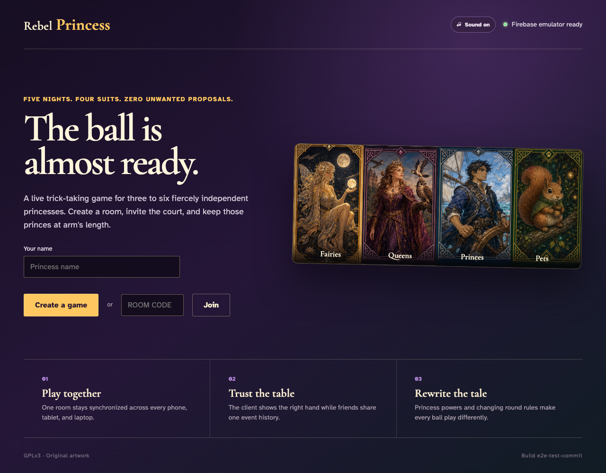

# Application shell and Firebase readiness

The static client loads its original card artwork and reaches the local Firestore emulator.

## The ball is ready for the first players

**Verifications:**
- [x] The page has the stable Rebel Princess title
- [x] The landing page exposes its primary heading
- [x] The client has reached the Firestore emulator
- [x] The exact deterministic build marker is visible
- [x] The alternate artwork preview grid is loaded

---
