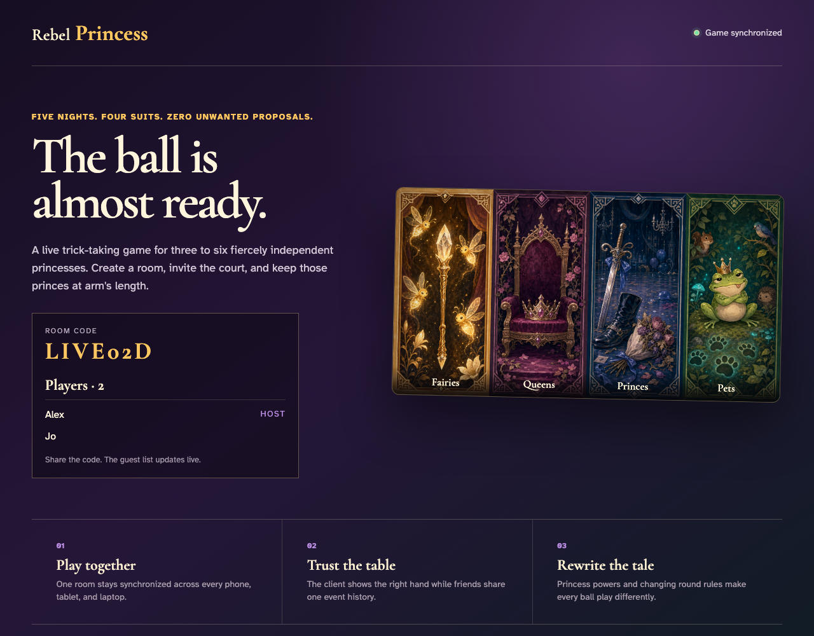

# Create and join a live game

Two independent anonymous browser clients share one append-only event stream, then the host reloads and reconstructs the same room.

## Both players remain in the synchronized room after reload

**Verifications:**
- [x] The stable invite code identifies the shared game
- [x] The append-only stream reconstructs both room members
- [x] The host and guest names are both visible to the trusted client

---
