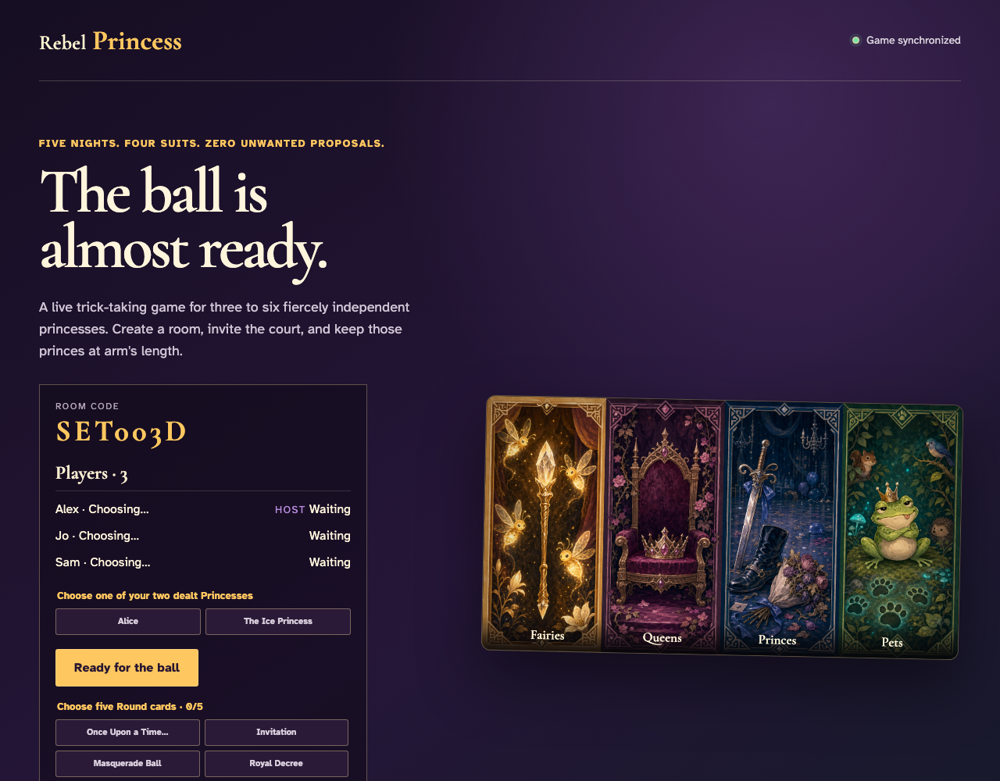
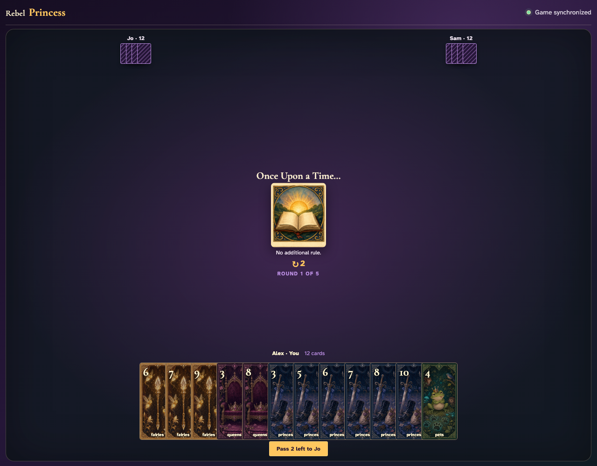

# Princess setup and deterministic deal

Three players choose from two deterministically dealt Princesses, ready themselves, and receive a complete seeded deal while each client renders only its own hand.

## Each player receives two stable Princess options for the whole game

**Verifications:**
- [x] The host may choose from exactly two Princesses rather than the full roster
- [x] The dealt options survive a complete replay unchanged

---

## The first round is ready with the host’s exact twelve-card hand

**Verifications:**
- [x] The selected first Round card is illustrated at the center of Round 1 of 5
- [x] All 36 cards exist in the trusted shared stream
- [x] Only the local player’s exact seeded hand is rendered face-up
- [x] Opponents are represented by twelve-card counts

---
