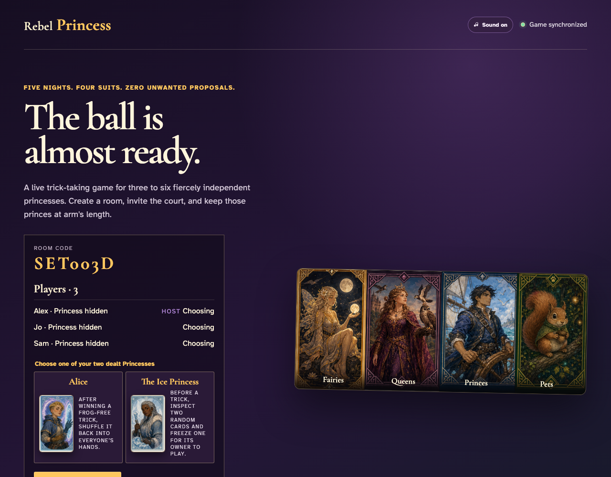
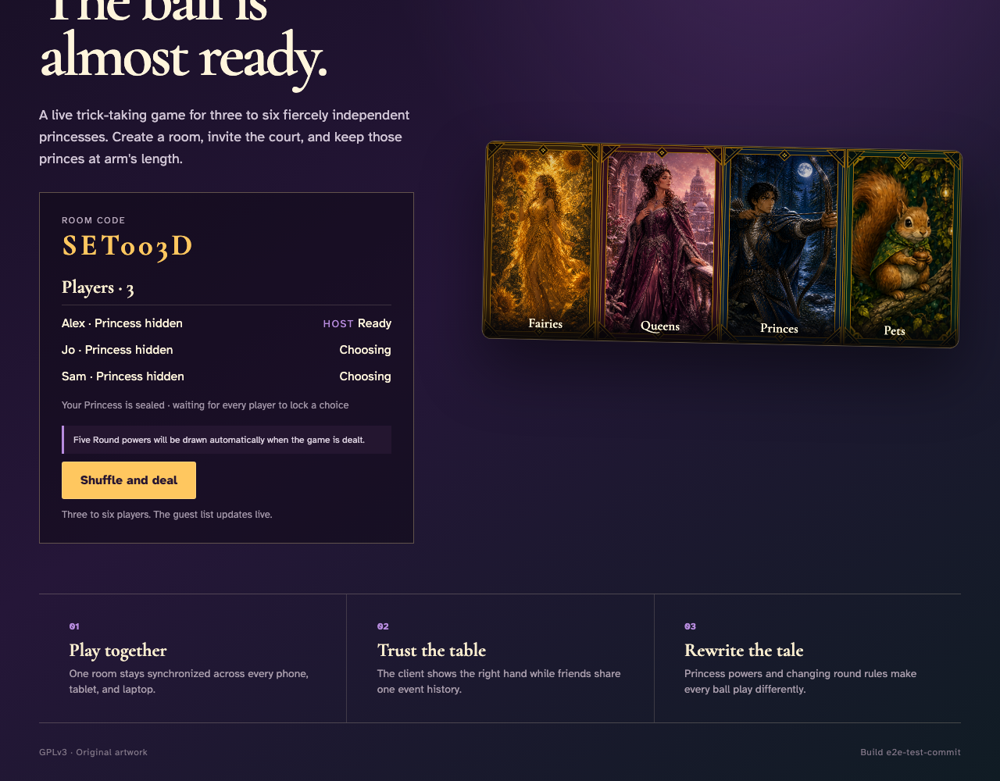
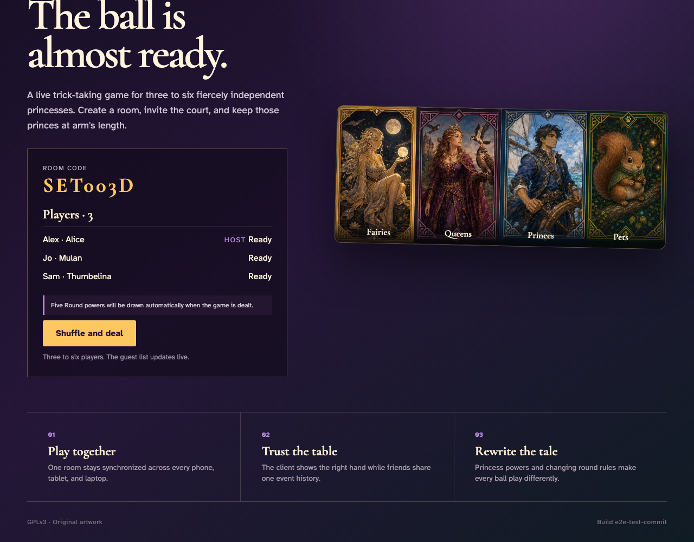
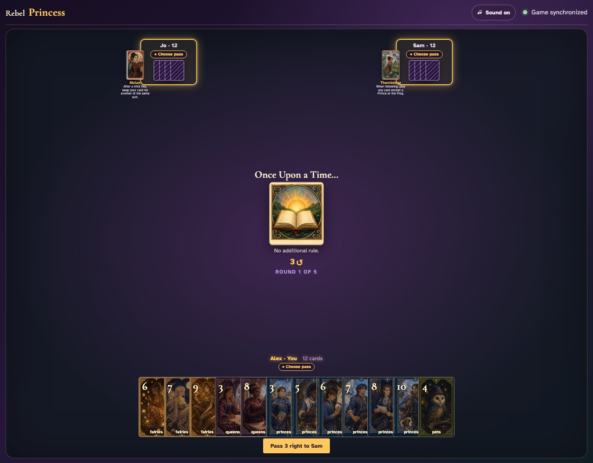

# Princess setup and deterministic deal

Three players choose from two deterministically dealt Princesses, ready themselves, and receive a complete seeded deal while each client renders only its own hand.

## Each player receives two stable Princess options for the whole game

**Verifications:**
- [x] The host may choose from exactly two Princesses rather than the full roster
- [x] The dealt options survive a complete replay unchanged
- [x] Each Princess name is centered above both her portrait and power

---

## Alex locks a Princess choice without exposing it to players who are still choosing

**Verifications:**
- [x] Jo sees that Alex is ready but not which Princess Alex selected
- [x] Jo can still choose freely from both dealt Princesses

---

## Five Round powers are drawn automatically instead of being chosen by the host

**Verifications:**
- [x] The host is told that Round powers will be drawn automatically
- [x] No Round power selection controls are offered

---

## The first round is ready with the host’s exact twelve-card hand

**Verifications:**
- [x] The selected first Round card is illustrated at the center of Round 1 of 5
- [x] All 36 cards exist in the trusted shared stream
- [x] Only the local player’s exact seeded hand is rendered face-up
- [x] Opponents are represented by twelve-card counts

---
