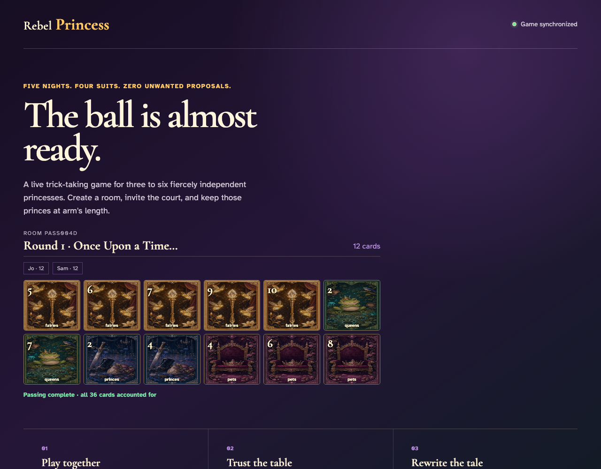

# Simultaneous card passing

Early submissions reveal no incoming cards; the final submission deterministically resolves all three exact hands without losing or duplicating a card.

## All exact hands resolve after the final hidden submission

**Verifications:**
- [x] The UI reports that simultaneous passing is complete
- [x] The host receives the exact two cards from the player on the right
- [x] All 36 cards remain accounted for after resolution
- [x] Opponent hand counts remain twelve without revealing their faces

---
