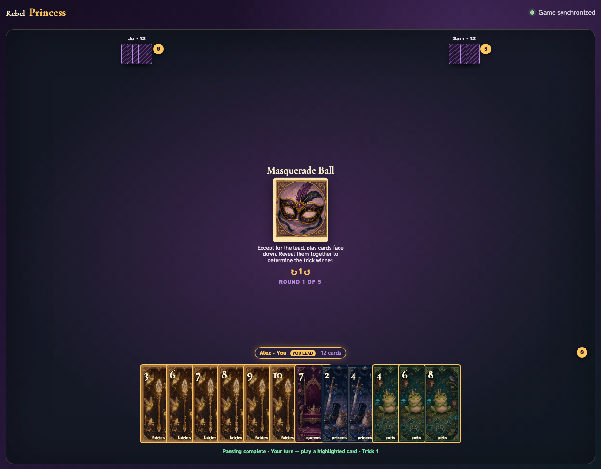

# Simultaneous card passing

Early submissions reveal no incoming cards; the final submission deterministically resolves all three exact hands without losing or duplicating a card.

## The host is prompted to choose one card for each neighbor

**Verifications:**
- [x] The pass action names Jo and Sam and is disabled until two cards are chosen
- [x] The center card states the round rule in text
- [x] The center card places one arrow on each side of the single-card count

---

## The first chosen card rises from the hand

**Verifications:**
- [x] Fairies 3 is visibly selected
- [x] The next card remains above the raised card so its value stays readable
- [x] One card is not enough to pass

---

## A selected card can be returned to the hand

**Verifications:**
- [x] Fairies 3 is no longer selected
- [x] The pass action remains disabled

---

## Two selected cards enable the named pass

**Verifications:**
- [x] Both selected cards are visibly raised
- [x] The split pass to Jo and Sam is now enabled

---

## Committed cards remain visible while the host waits

**Verifications:**
- [x] The waiting message identifies both recipients and the split pass
- [x] Each committed card identifies its specific destination
- [x] Destination ribbons are left-aligned to remain readable under overlap

---

## Taking back one committed card reopens the choice

**Verifications:**
- [x] Fairies 4 remains selected after the pass is retracted
- [x] The host must again choose a second card

---

## The revised pair is committed to its individual recipients

**Verifications:**
- [x] Fairies 4 heads to Jo while Fairies 5 heads to Sam
- [x] The host waits for both other players

---

## All exact hands resolve after the final hidden submission

**Verifications:**
- [x] The UI reports that simultaneous passing is complete
- [x] The host’s revised pass and exact incoming cards survive reload
- [x] All 36 cards remain accounted for after resolution
- [x] Every card preserves the source atlas cell aspect ratio
- [x] The gameplay table has no horizontal or vertical scrolling
- [x] Opponent hand counts remain twelve without revealing their faces

---
