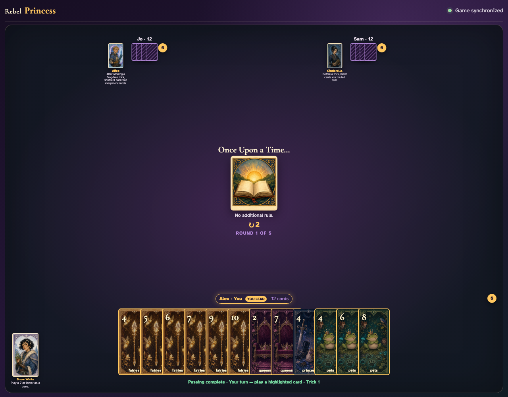
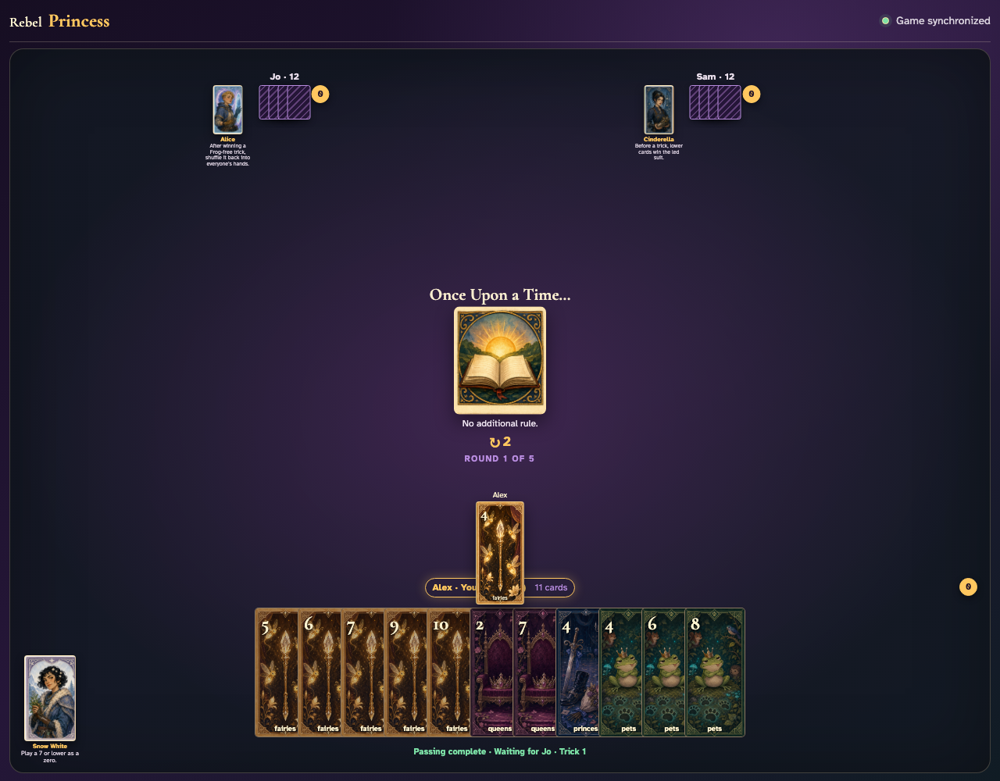
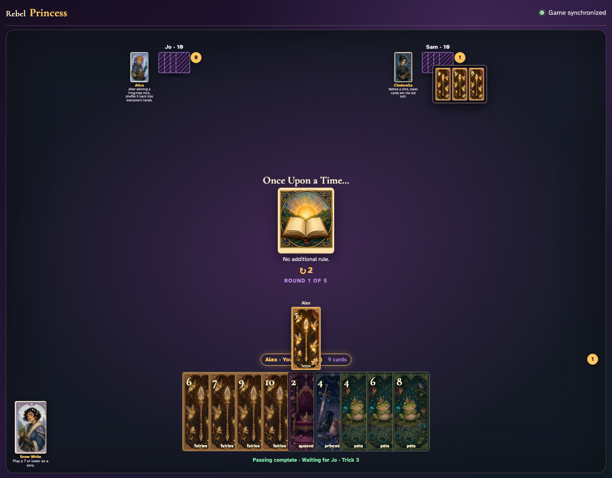
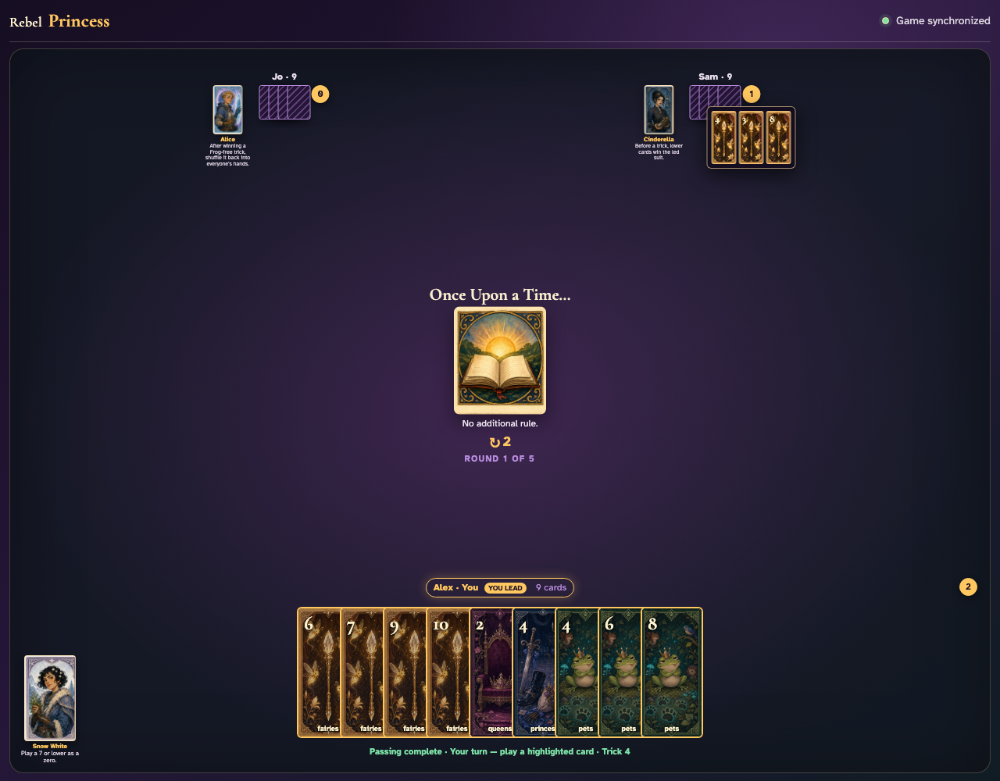

# Base trick-taking loop

Three trustworthy clients play complete synchronized tricks through follow-suit, void, Prince-breaking, capture, and winner-led transitions.

## The leader may play non-Princes but cannot lead an unbroken Prince

**Verifications:**
- [x] Alex is prompted to lead the first trick
- [x] Every client identifies Alex as the leader
- [x] Every client sees the remaining players clockwise in play order
- [x] The leader sees a prominent highlighted lead badge
- [x] A Prince is disabled before the suit is broken
- [x] A Fairy is a legal opening lead

---

## Every client sees the lead and Jo must follow suit

**Verifications:**
- [x] The shared trick shows Alex’s Fairy 4
- [x] The played card uses the Fairies atlas graphic and visible value
- [x] The played card animates from the hand into the table
- [x] Jo can follow with a Fairy
- [x] Jo cannot discard an off-suit Prince while holding Fairies

---

## The completed trick pauses on the table, sweeps toward its winner, and remains available for review

**Verifications:**
- [x] Sam’s trick counter records the captured trick
- [x] Tapping the counter reveals the most recently captured cards
- [x] The collection uses the requested three-second ease-in-out motion

---

## A void player may discard a Prince and break the suit

**Verifications:**
- [x] Jo has no Fairies remaining and may play a Prince
- [x] The current trick is synchronized through Alex’s lead

---

## The trick winner leads again and may now lead Princes

**Verifications:**
- [x] Alex has captured two complete tricks
- [x] Prince 4 is enabled after the suit was broken
- [x] The fourth trick is ready for the previous winner

---
