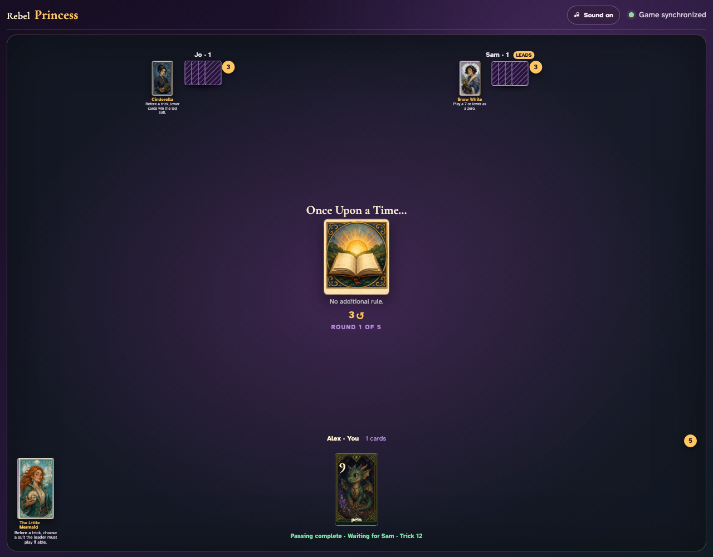
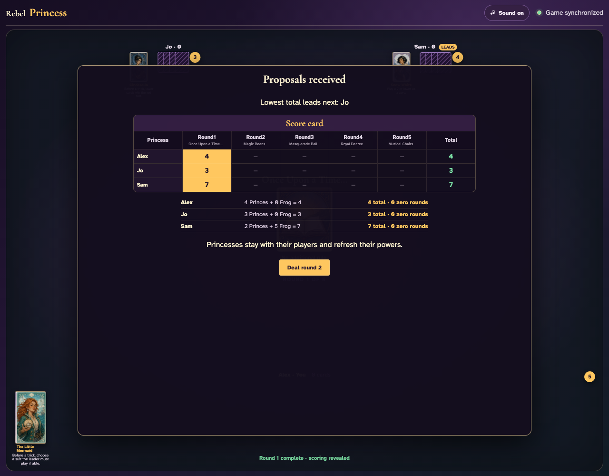
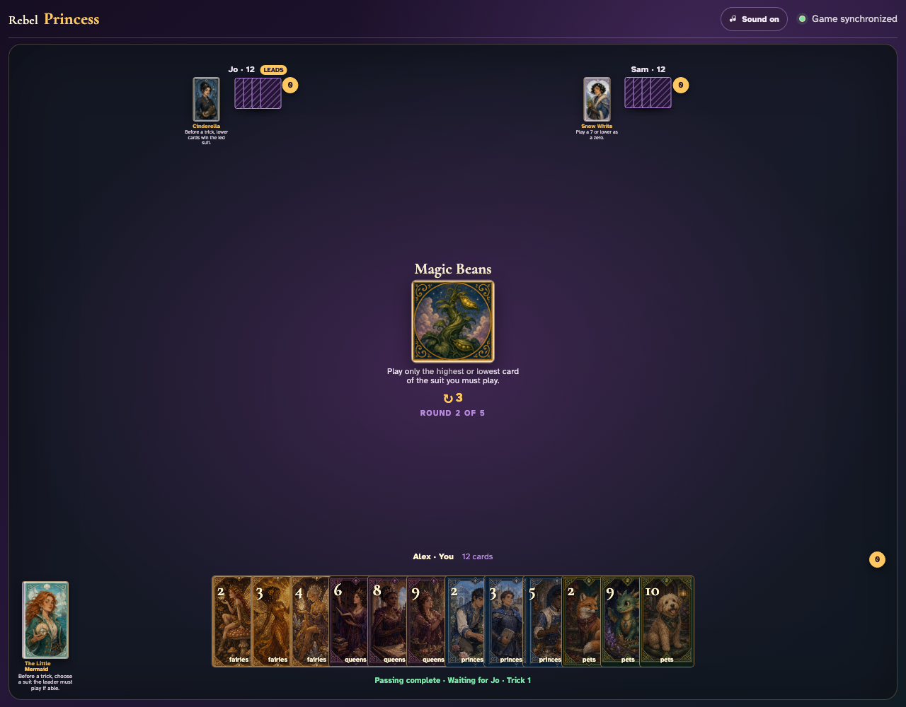

# Round scoring and transition

The final live trick reveals Prince and Frog proposals, preserves cumulative totals and Princesses, then redeals with the lowest cumulative scorer leading.

## The final three cards remain a normal synchronized live trick

**Verifications:**
- [x] Exactly three cards remain across the shared hands
- [x] One trustworthy client is visibly prompted to lead the final trick

---

## The completed round reveals proposal sources and cumulative totals

**Verifications:**
- [x] Every player receives a visible Prince and Frog breakdown
- [x] The deck’s nine Princes and five-point Frog account for fourteen proposals
- [x] The five-round score card fills round one and leaves future rounds open
- [x] The unique lowest cumulative scorer is named as the next leader
- [x] Princesses stay fixed and only their powers refresh

---

## Fresh hands begin round two under the lowest scorer’s lead

**Verifications:**
- [x] The next Round card and round count are revealed
- [x] Every client has a fresh twelve-card hand after the right pass
- [x] The lowest cumulative scorer visibly leads the new round
- [x] The first-round cumulative proposals remain in the projection

---
