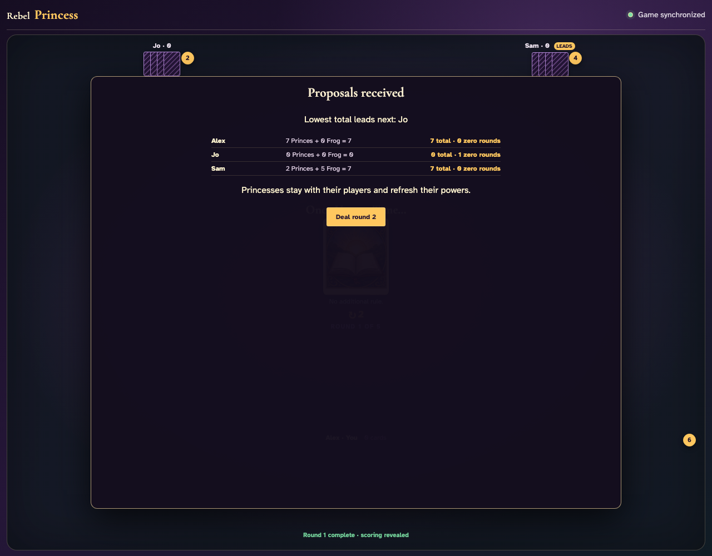
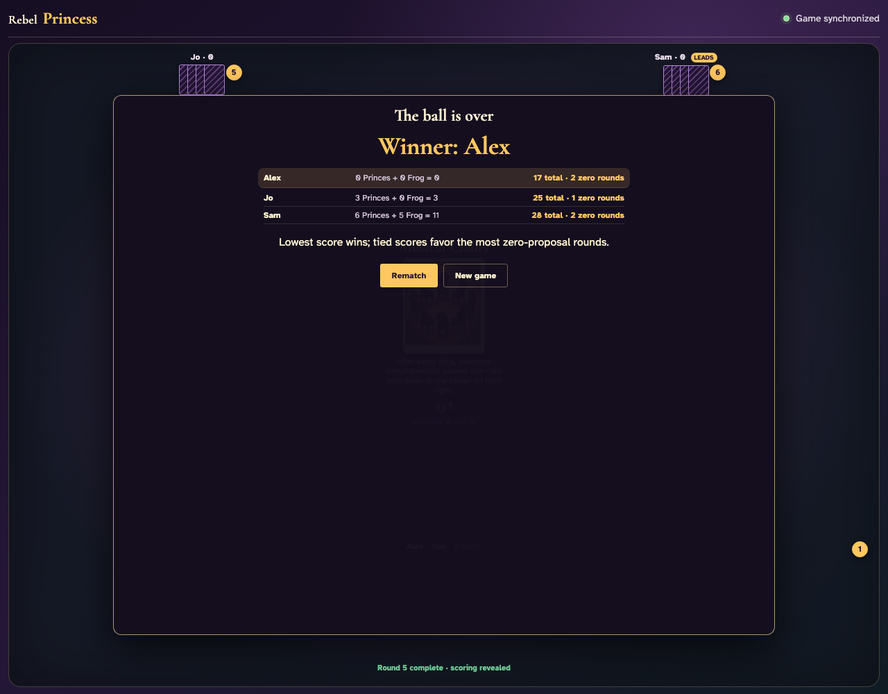
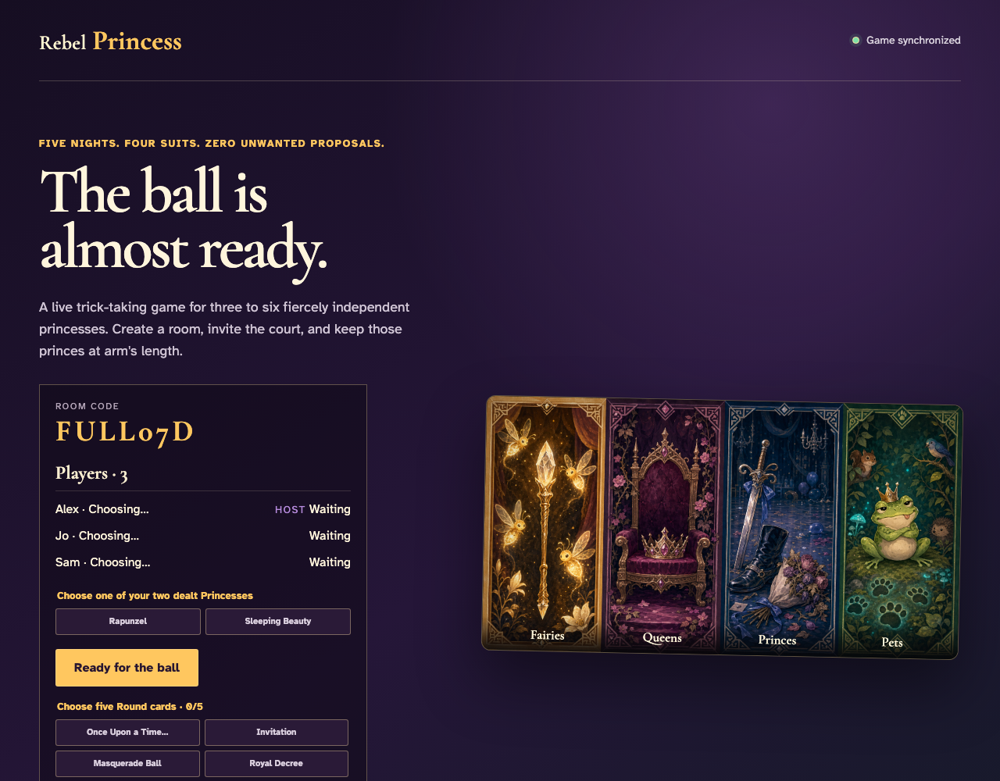

# Complete five-round game

Three real clients play all 180 dealt cards through the append-only Firestore stream, verify every round score and cumulative total, resolve the final tie-break, and begin a rematch.

## All thirty-six cards produce a complete first-round score

**Verifications:**
- [x] The round accounts for all nine Princes and the five-point Frog
- [x] All three clients see the completed round

---

## The fifth score resolves the immutable game result

**Verifications:**
- [x] Exactly 180 cards were legally played over five full rounds
- [x] The five round totals account for seventy proposals
- [x] Every final row reports its zero-proposal round tie-break count
- [x] Every client sees the same named winner or shared victory

---

## The append-only rematch returns the same players to fresh setup

**Verifications:**
- [x] Membership and display names carry into the rematch
- [x] Princess choices and ready state reset for the new game
- [x] Every client leaves the immutable final table together

---
