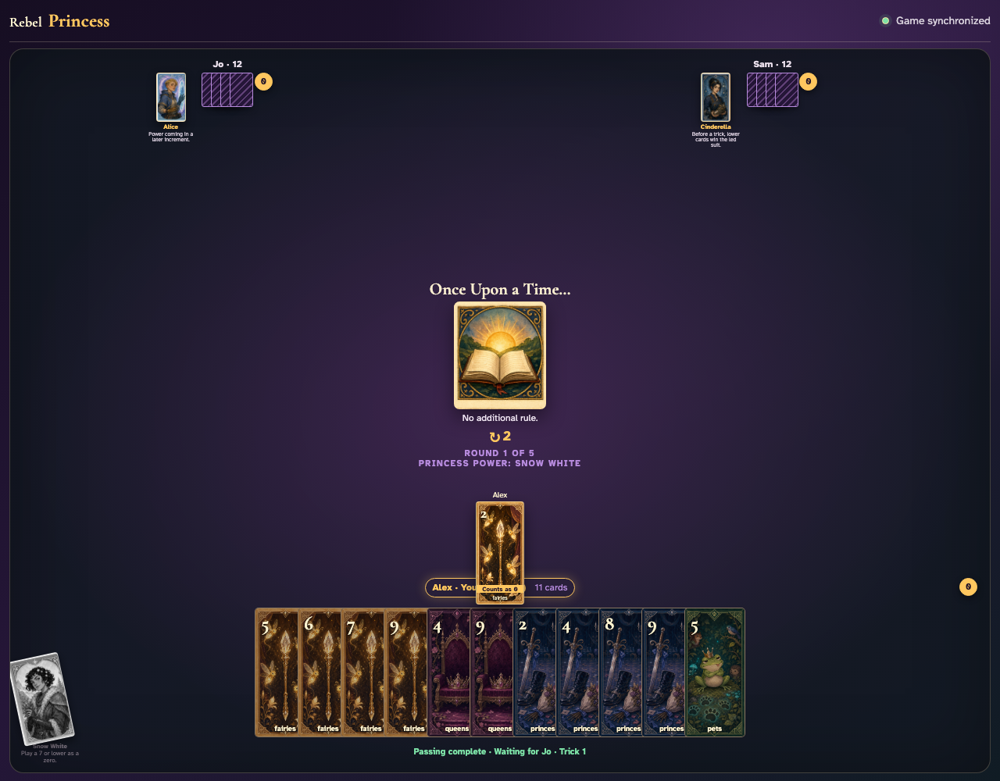
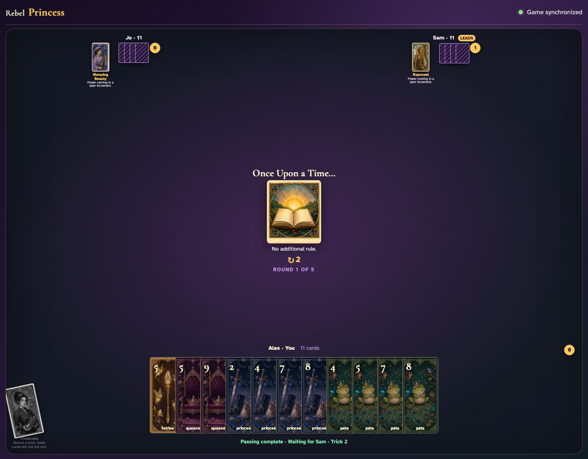
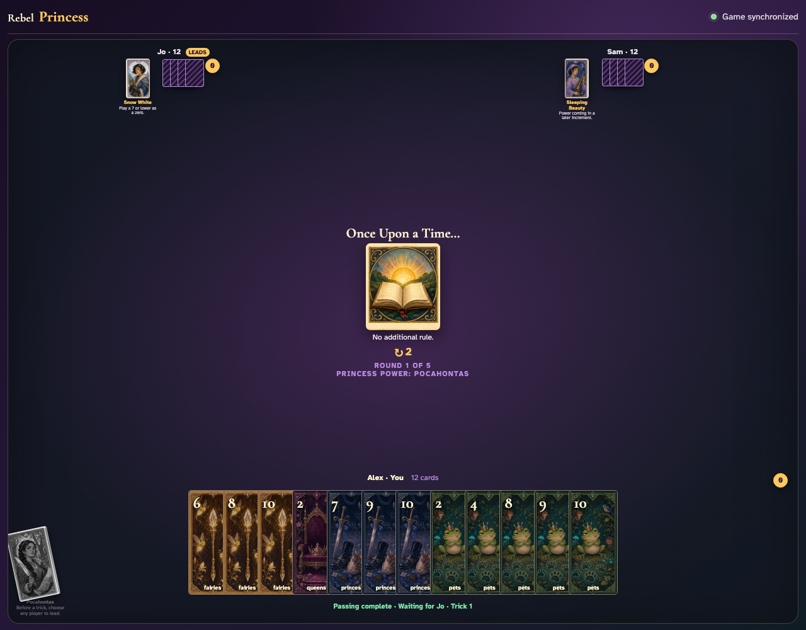
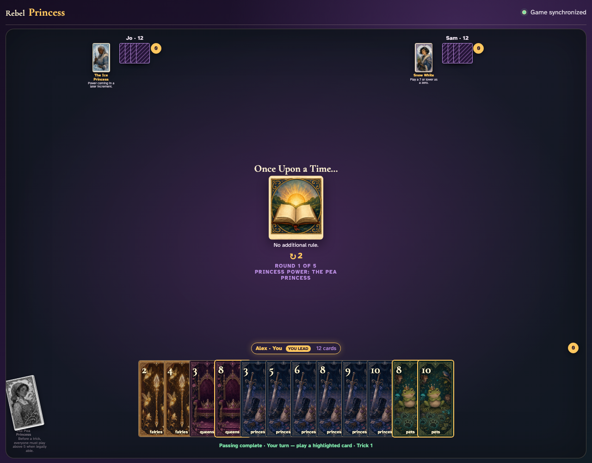
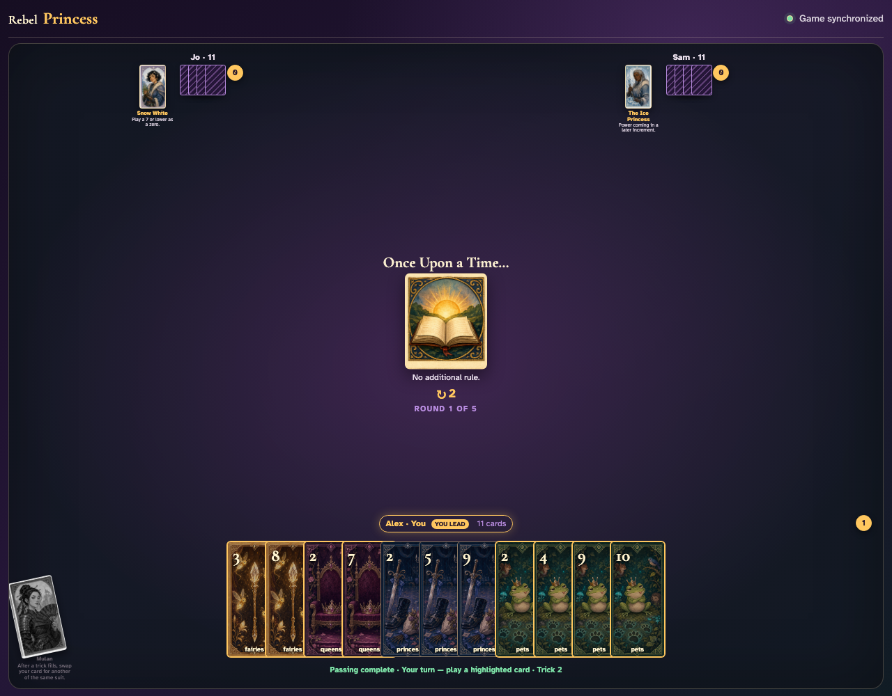

# Direct Princess powers

Five deterministic games activate Snow White, Cinderella, Pocahontas, Mulan, and the Pea Princess through real clients and the append-only Firestore stream.

## Snow White turns her chosen low card into zero

**Verifications:**
- [x] The actual card remains visible with an effective value of zero
- [x] The observer sees Snow White’s card tilted and desaturated for this round

---

## Cinderella reverses the hierarchy for one complete trick

**Verifications:**
- [x] All clients see Cinderella tilted and desaturated after the trick resolves
- [x] The completed trick is awarded under the lower-card hierarchy

---

## Pocahontas hands the lead to another player

**Verifications:**
- [x] Jo receives the prominent local lead indicator
- [x] Every client sees Pocahontas tilted, desaturated, and unavailable

---

## The Pea Princess requires a card above five when one is legal

**Verifications:**
- [x] Every highlighted legal choice is above five
- [x] The active rule and exhausted Princess card are visible to observers

---

## Mulan replaces her played card after everyone commits

**Verifications:**
- [x] The original played card returns to Mulan’s hand
- [x] The replacement is the actual card shown in the resolved trick
- [x] All clients see Mulan tilted and desaturated after the swap

---
