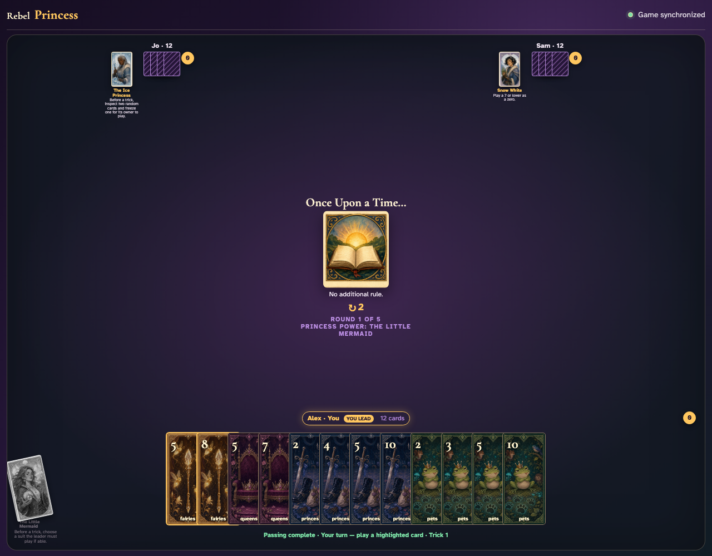
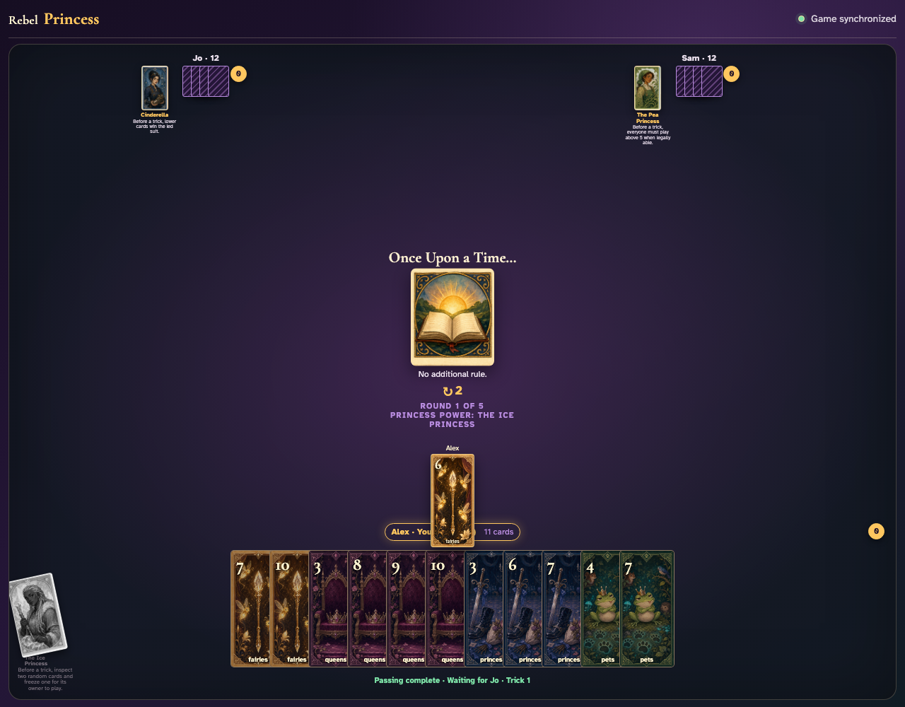
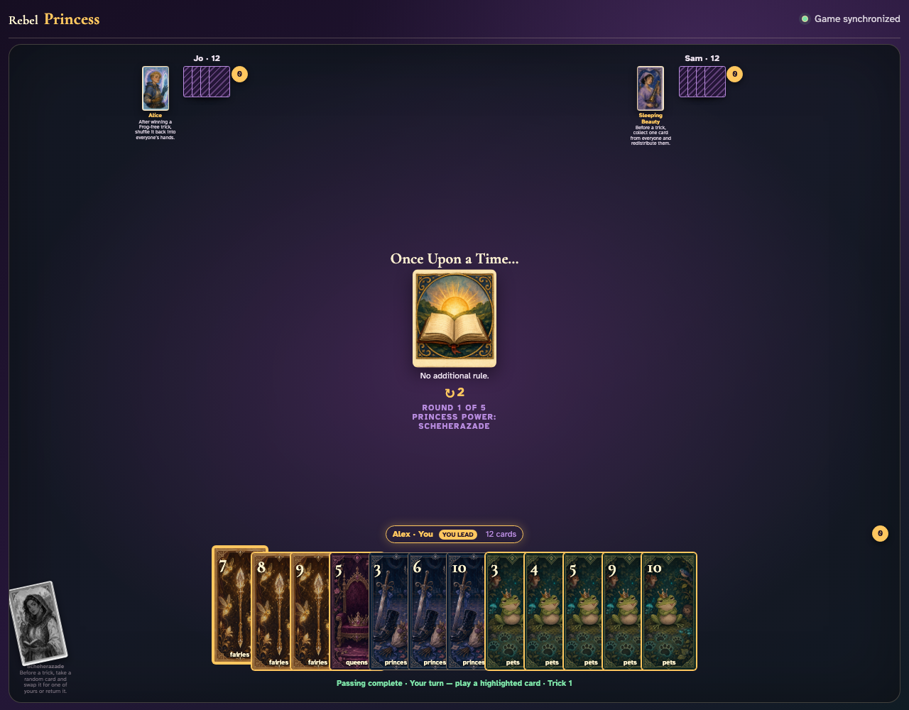
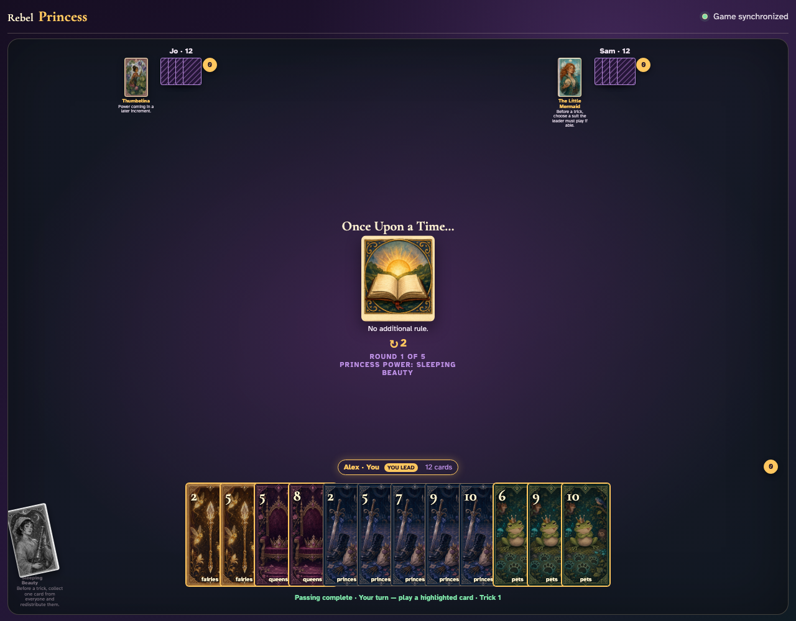
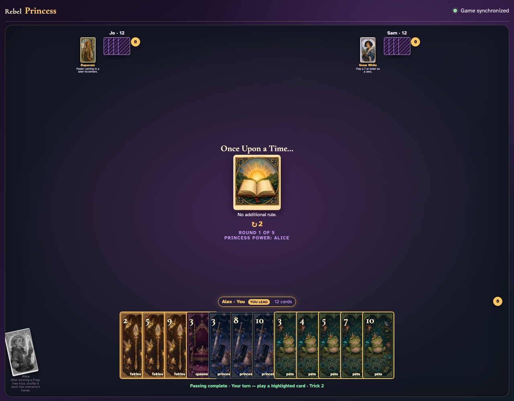

# Interactive Princess powers

Five deterministic games exercise suit requests, forced cards, hand swaps, multiplayer contributions, redistribution, and trick returns through real clients and Firestore.

## The Little Mermaid requires the leader to play a chosen suit

**Verifications:**
- [x] Every legal lead uses the requested suit
- [x] Observers see the active power and exhausted card

---

## The Ice Princess inspects two cards and freezes one for its owner

**Verifications:**
- [x] Only the chosen frozen card is playable for Jo
- [x] The Ice Princess is visibly exhausted

---

## Scheherazade exchanges a random card from another hand for one of hers

**Verifications:**
- [x] The inspected card enters Scheherazade’s hand
- [x] The card she gave away leaves her hand and hand sizes remain conserved

---

## Every player contributes and Sleeping Beauty assigns every card

**Verifications:**
- [x] Sleeping Beauty keeps the first selected contribution
- [x] Jo and Sam receive their explicitly ordered cards

---

## Alice shuffles a Frog-free trick she won back into all hands

**Verifications:**
- [x] Every player receives exactly one returned card
- [x] Alice’s captured trick counter decreases and her card exhausts

---
