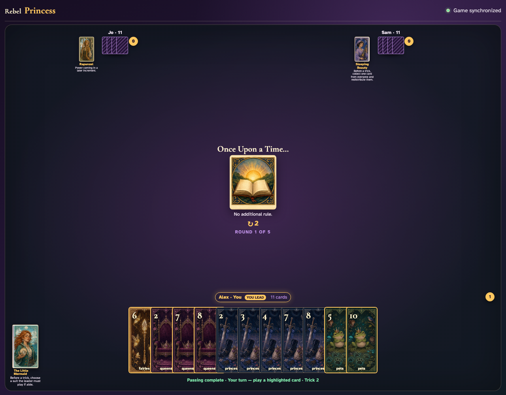
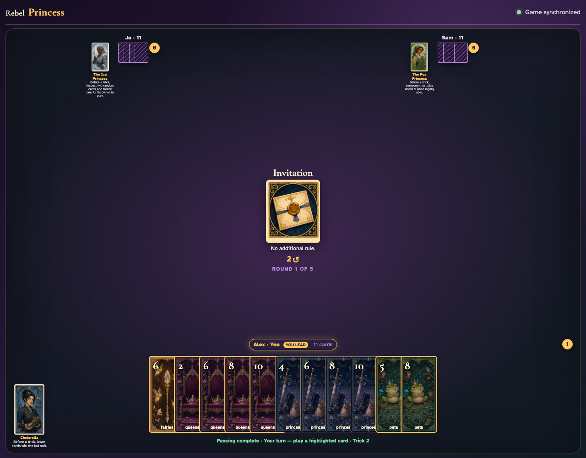
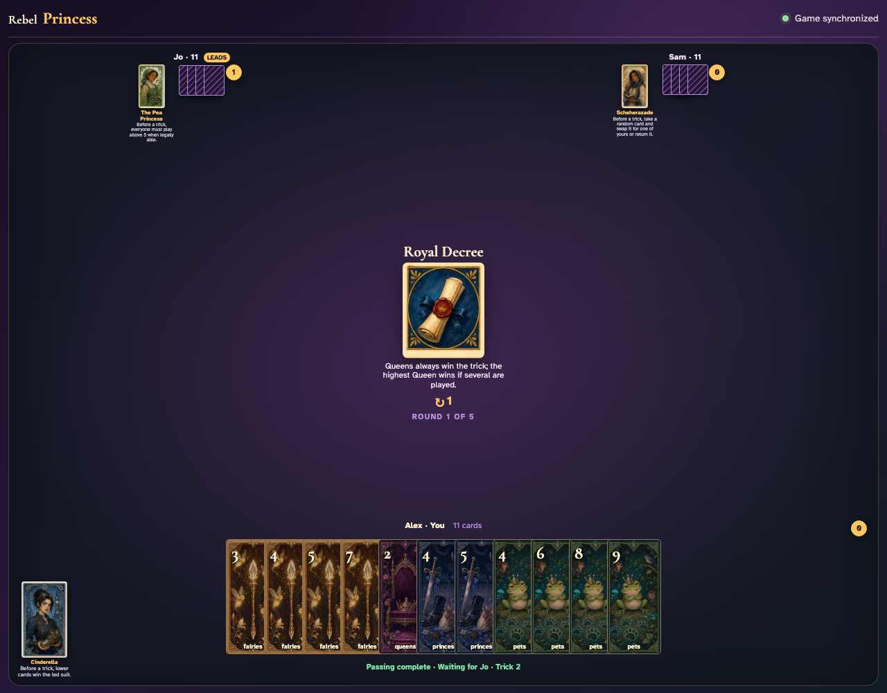
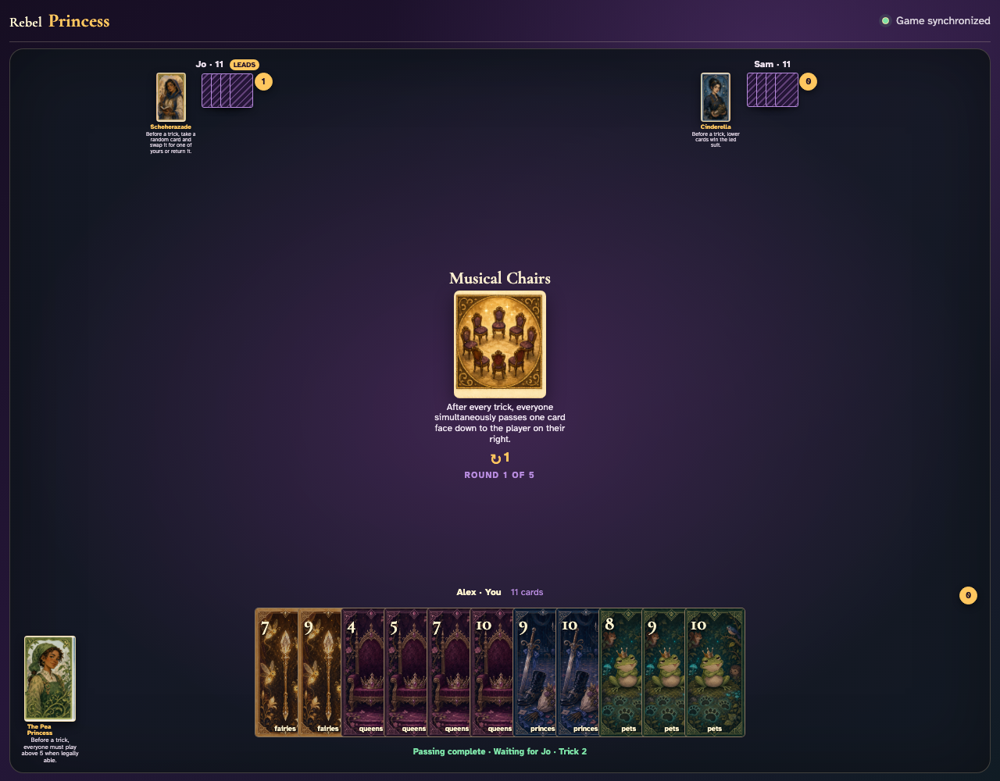
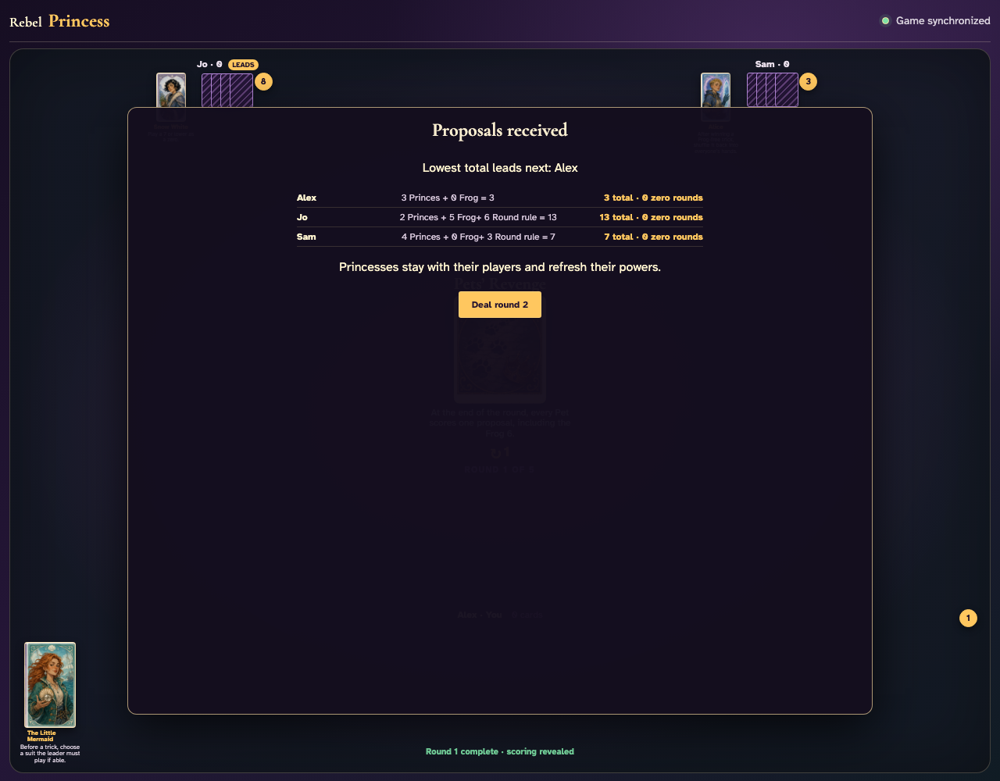
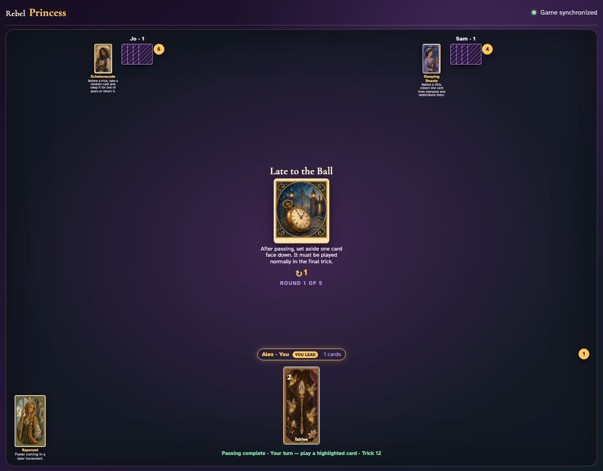

# Introductory Round cards

Seven deterministic games prove both teaching rounds and every introductory trick, scoring, pass, concealment, and reserved-card rule through real clients and Firestore.

## Once Upon a Time leaves a complete trick unchanged

**Verifications:**
- [x] The card states there is no additional rule
- [x] Exactly one ordinary trick is awarded

---

## Invitation provides a second no-effect teaching round

**Verifications:**
- [x] Invitation explicitly has no additional rule
- [x] The normal winner takes the trick

---

## Masquerade followers stay face down until every player commits

**Verifications:**
- [x] The concealed card is revealed as its actual graphic at resolution
- [x] The resolved trick is awarded normally

---

## An off-suit Queen defeats the higher card of the led suit

**Verifications:**
- [x] Jo’s off-suit Queen appears in the resolved trick
- [x] Royal Decree awards that trick to Jo

---

## After the trick, everyone simultaneously passes one card right

**Verifications:**
- [x] Every hand remains the same size after the exchange
- [x] Each player receives the card from their left

---

## Pets’ Revenge adds one proposal for every captured Pet

**Verifications:**
- [x] The scoring breakdown names the Round-rule additions
- [x] All nine three-player Pets are counted exactly once

---

## Each reserved card returns as its owner’s only final-trick card

**Verifications:**
- [x] Every player has exactly their reserved card for the final trick
- [x] The table announces the final trick

---
