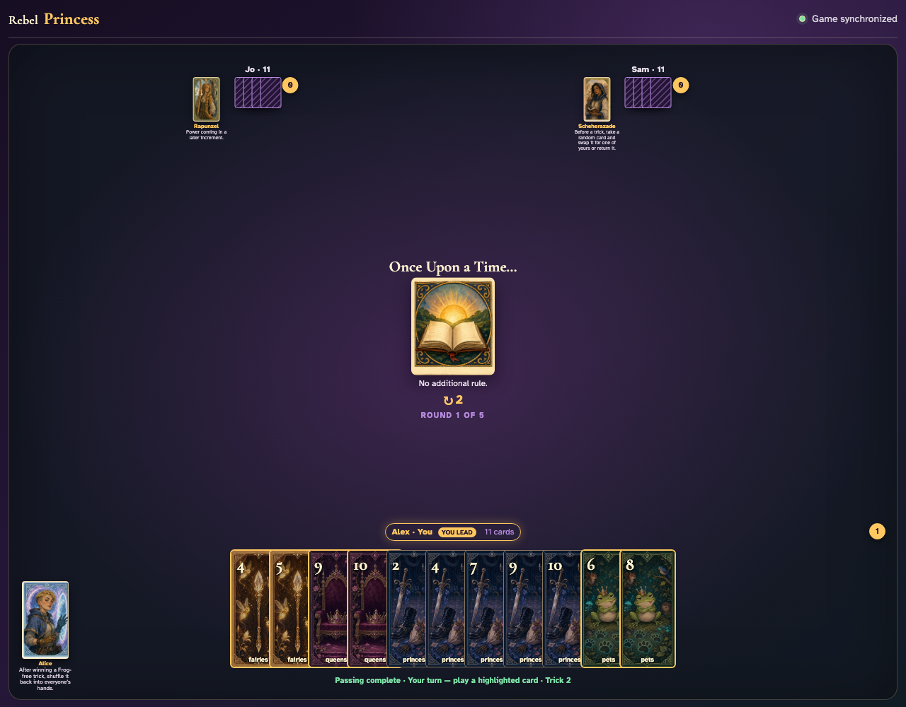
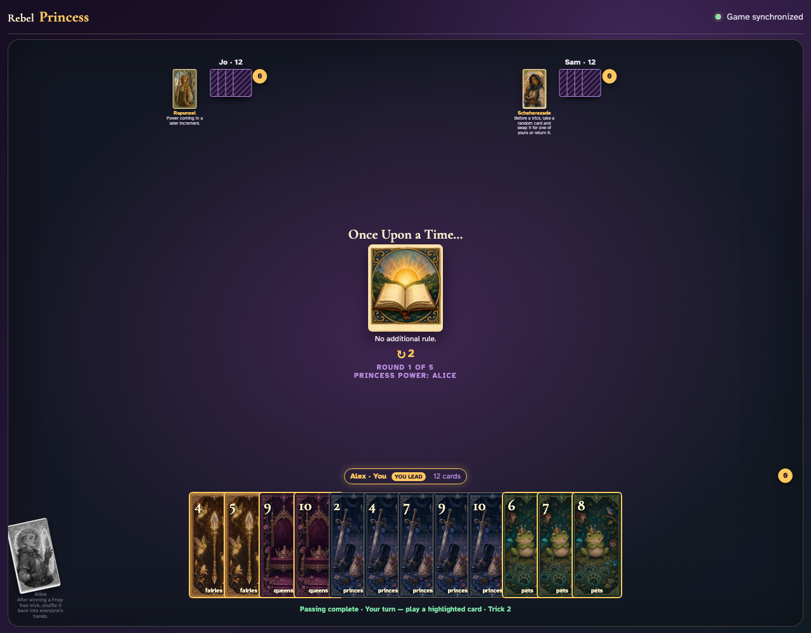

# Alice click activation

Click every card until Alice wins a Frog-free trick, then click Alice.

## Alice has won a reviewable Frog-free trick

**Verifications:**
- [x] Alice’s power button is semantically enabled
- [x] The captured trick contains three card records and no Frog

---

## Alice is clicked and the won trick leaves her captured collection

**Verifications:**
- [x] Alice’s card is semantically disabled after use
- [x] Alice’s captured trick counter decreases

---

## After ordinary clicked play, clicking Alice returns the won cards

**Verifications:**
- [x] Every player receives one returned card
- [x] Alice is visibly exhausted

---
