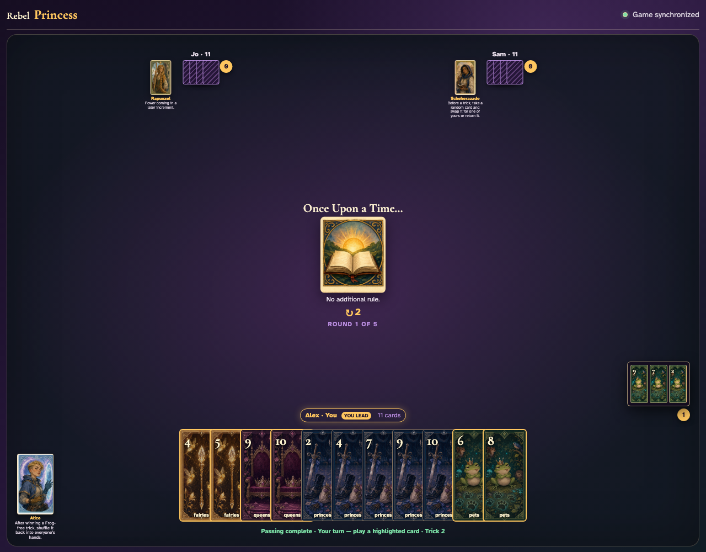
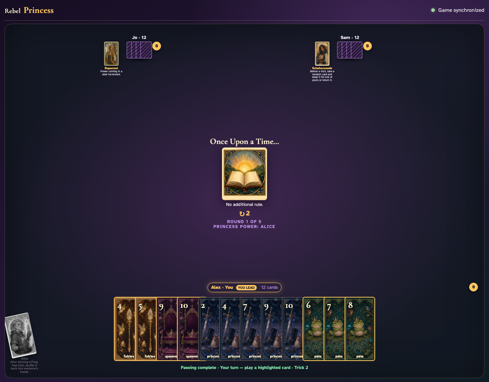

# Alice click activation

Click every card until Alice wins a Frog-free trick, then click Alice.

## Alice opens the trick she just won and reviews all three cards

**Verifications:**
- [x] Alice’s power button is semantically enabled
- [x] The open review contains three card records
- [x] None of the reviewed cards is the Frog

---

## Alice returns the reviewed trick; Pets 7 is now visible in her hand

**Verifications:**
- [x] Every player receives one returned card
- [x] Each newly added hand card came from the reviewed trick
- [x] Alice’s returned card is a visible hand button
- [x] Alice is visibly exhausted

---
