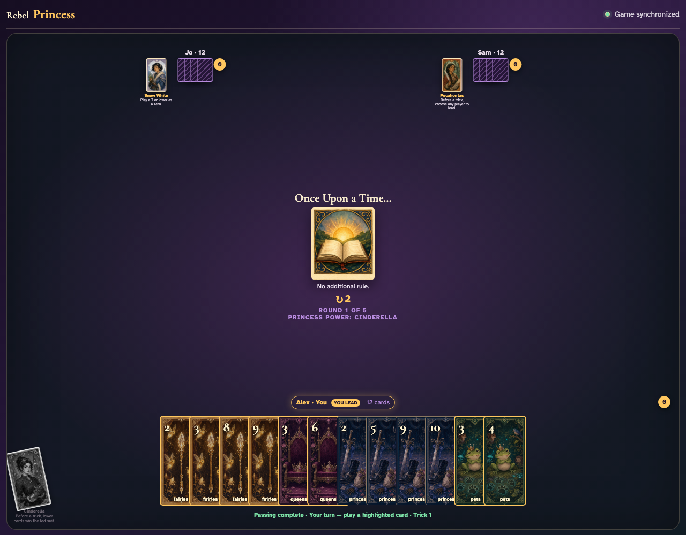
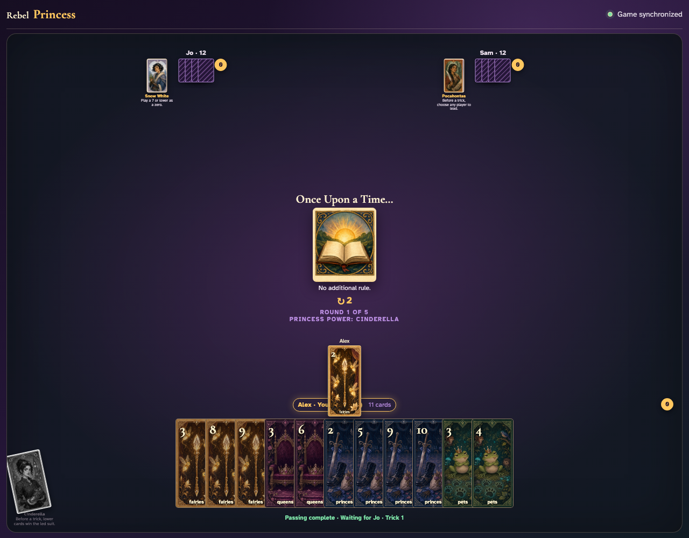
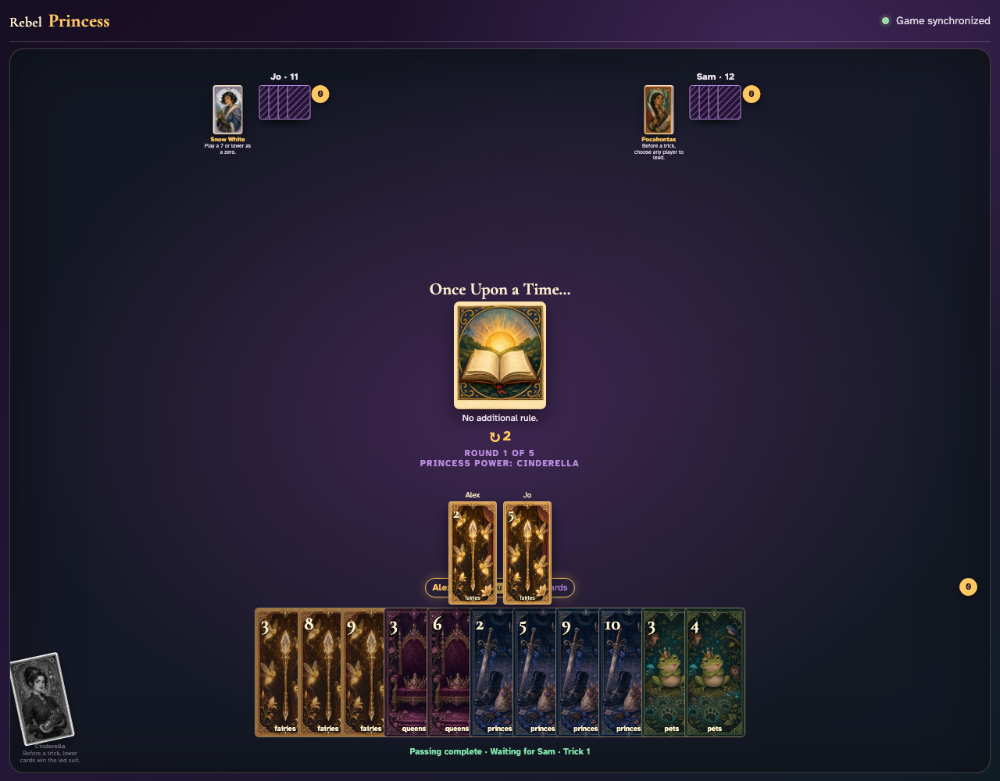
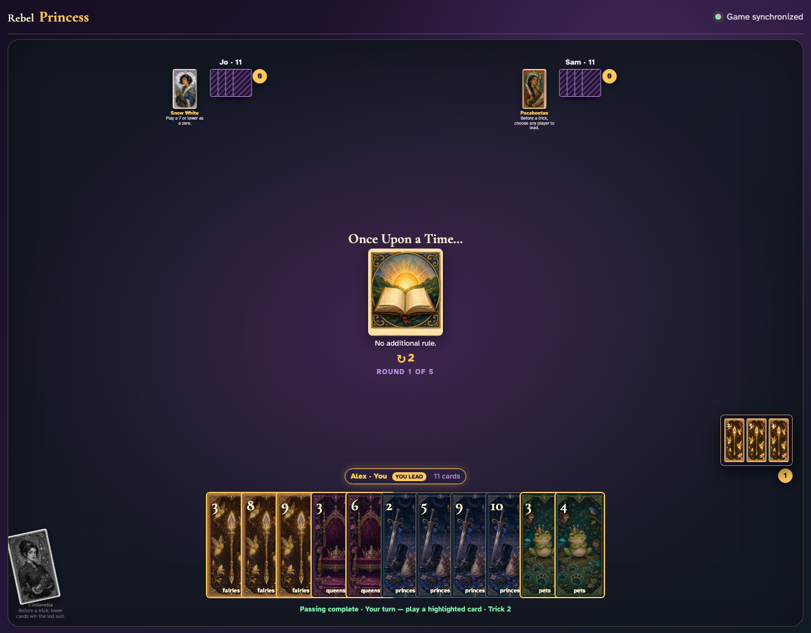

# Cinderella click activation

Click Cinderella, then click every card in the reversed trick.

## Cinderella is available before the trick

**Verifications:**
- [x] The Princess card is an enabled button
- [x] No Princess power is active yet

---

## Clicking Cinderella activates the reversed trick

**Verifications:**
- [x] The active power is exposed as shared status text
- [x] Observer projection records Cinderella as exhausted

---

## Alex leads Fairies 2 into Cinderella’s reversed trick

**Verifications:**
- [x] The center contains exactly the lead card record
- [x] The active Cinderella rule remains visible

---

## Jo follows with Fairies 5 and both ranks remain visible

**Verifications:**
- [x] The center contains two played card records
- [x] Both exact card graphics are labelled in the trick

---

## Alex takes the reversed trick with the lowest led-suit card, Fairies 2

**Verifications:**
- [x] The winner’s open review contains all three played card records
- [x] The reviewed cards exactly match the three clicked plays
- [x] Fairies 2 is the lowest card of the led suit
- [x] All clients see Cinderella exhausted
- [x] Alex has one awarded trick

---
