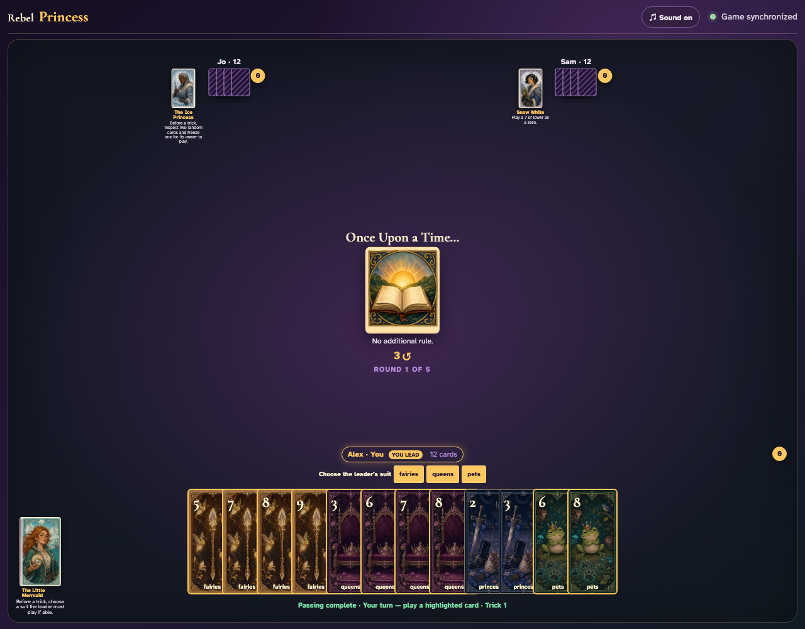
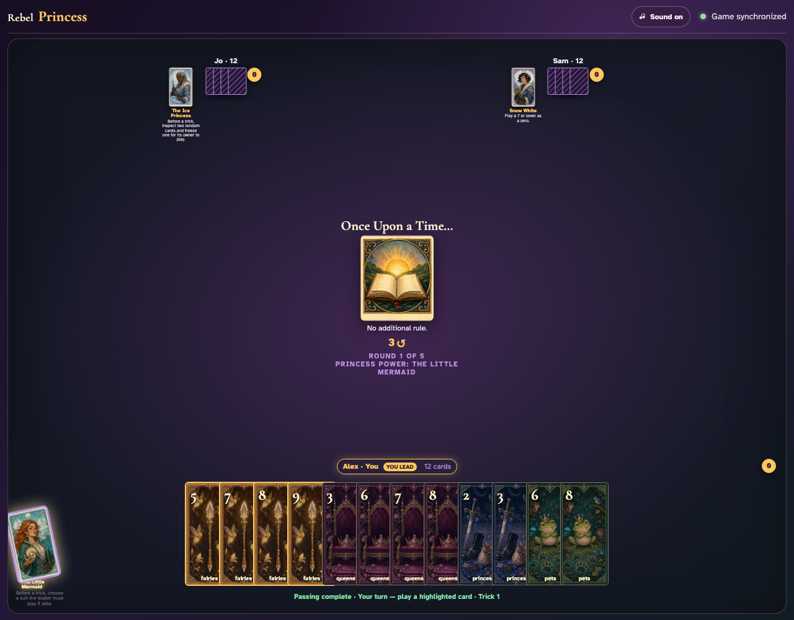
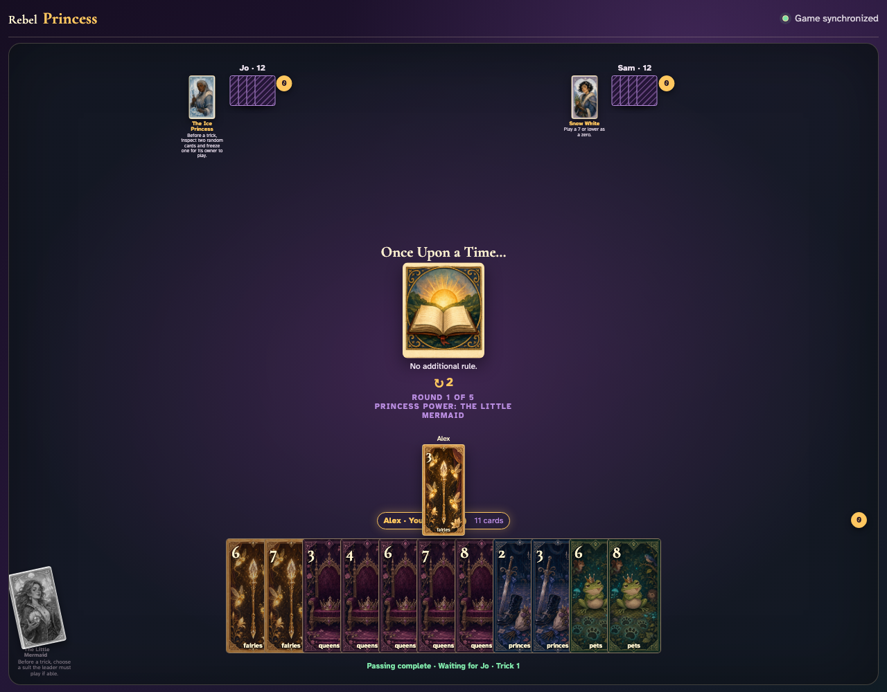

# Little Mermaid click activation

Click the Little Mermaid and click a visible suit choice.

## Clicking the Mermaid opens the legal suit chooser

**Verifications:**
- [x] The Princess button reports pressed
- [x] At least one semantic suit button is available

---

## The clicked suit becomes the shared active rule

**Verifications:**
- [x] The power is exposed to observers
- [x] The suit chooser closes after selection

---

## The clicked suit constrains the leader’s visible cards

**Verifications:**
- [x] Every legal lead matches the clicked suit
- [x] Observers see the Mermaid exhausted

---

## Alex clicks Fairies 3, visibly leading the requested fairies suit

**Verifications:**
- [x] The played card belongs to the requested suit
- [x] Every player sees the requested-suit lead in the center

---
