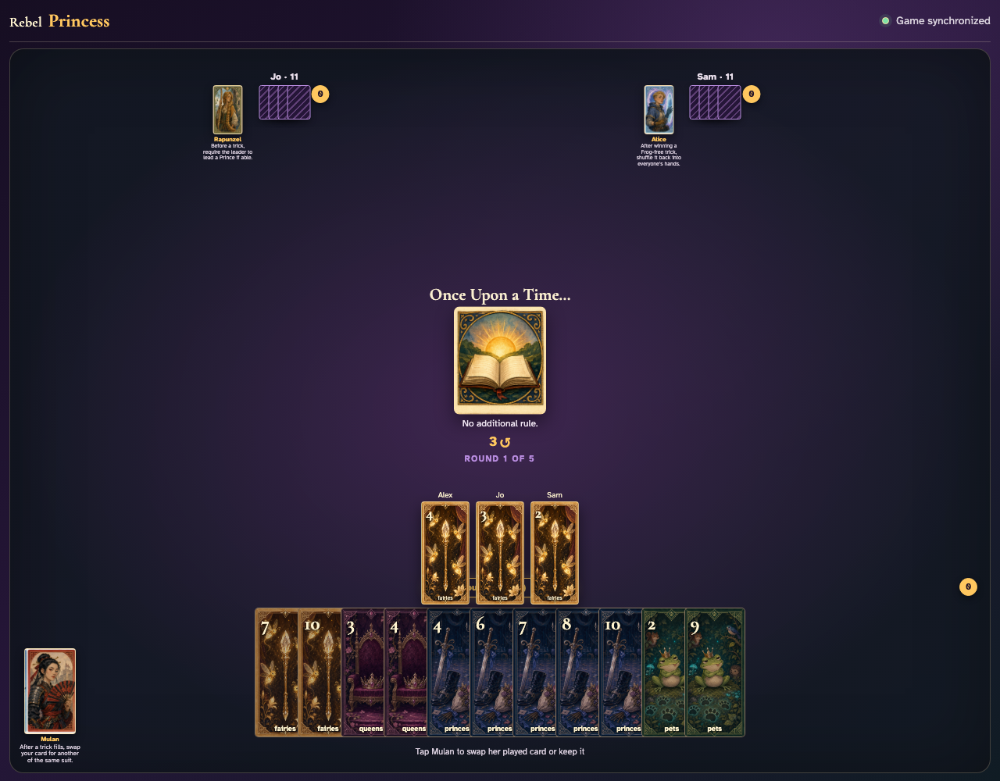
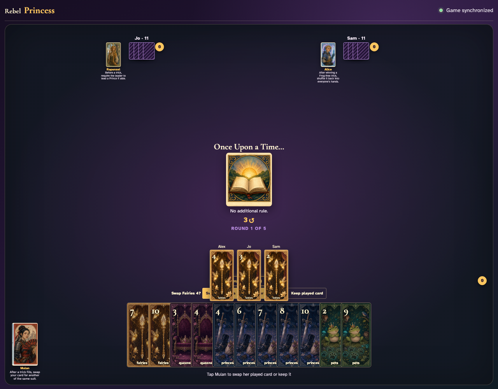
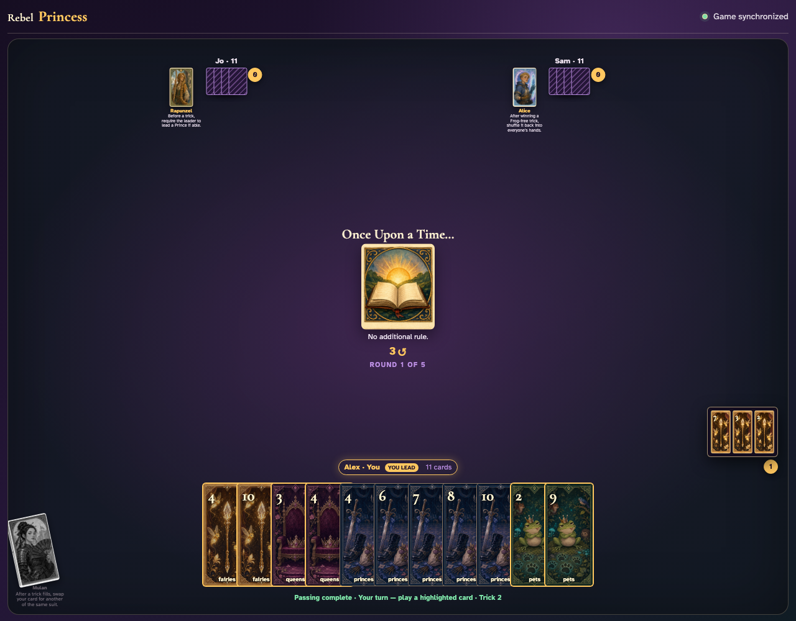

# Mulan click activation

Click all three trick cards, click Mulan, then click a replacement.

## The completed trick pauses and prompts Mulan

**Verifications:**
- [x] Mulan’s button becomes enabled only at the decision
- [x] Observers name Alex as the pending resolver

---

## Clicking Mulan reveals same-suit replacements

**Verifications:**
- [x] The Princess button reports pressed
- [x] At least one replacement button is enabled

---

## The awarded trick opens for review: Alex’s Fairies 7 replaced Fairies 4

**Verifications:**
- [x] The open trick review contains the replacement graphic
- [x] The original card is absent from the awarded trick
- [x] The original card returns to Mulan’s hand

---
