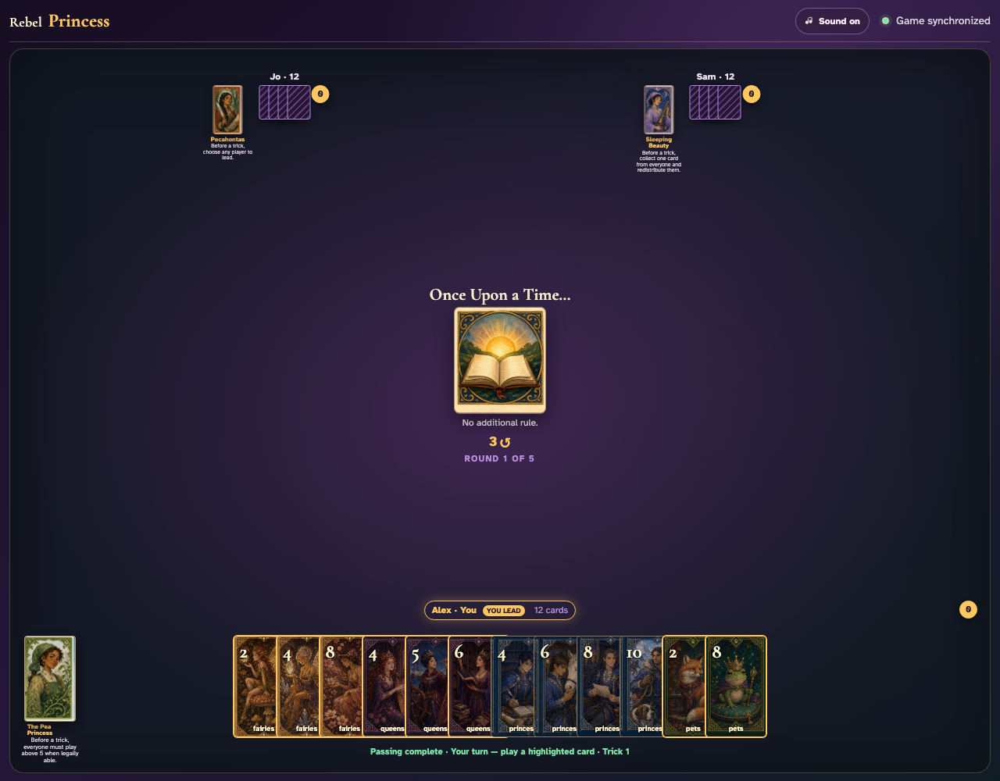
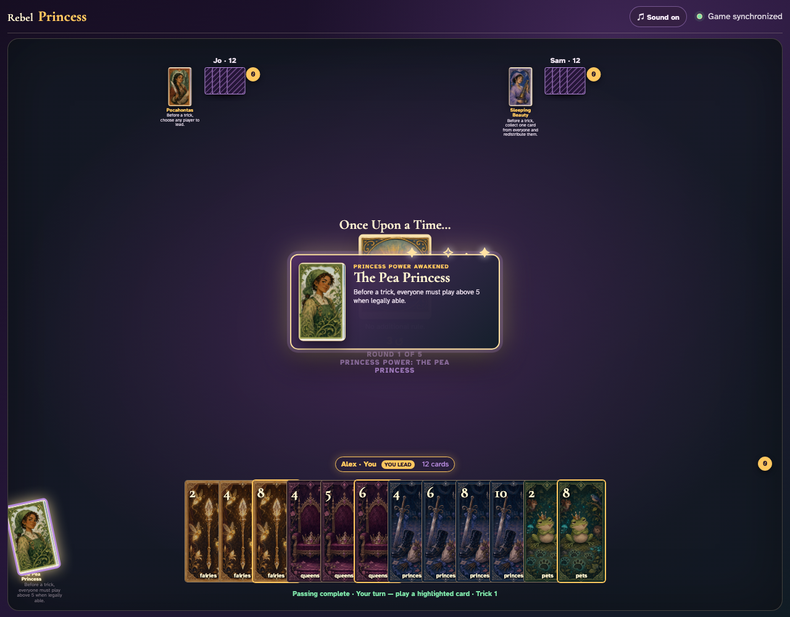
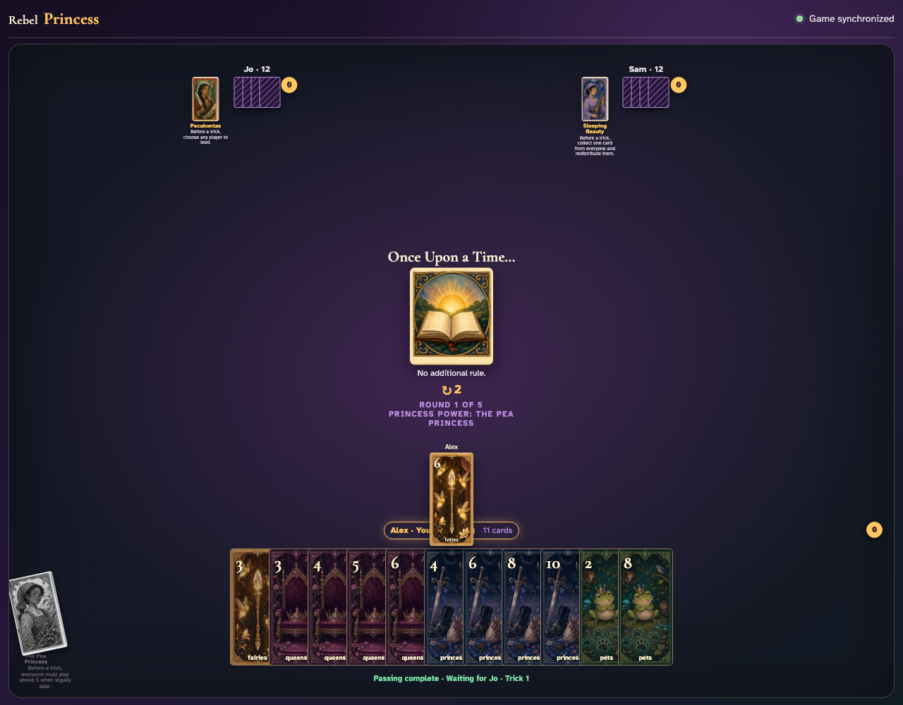
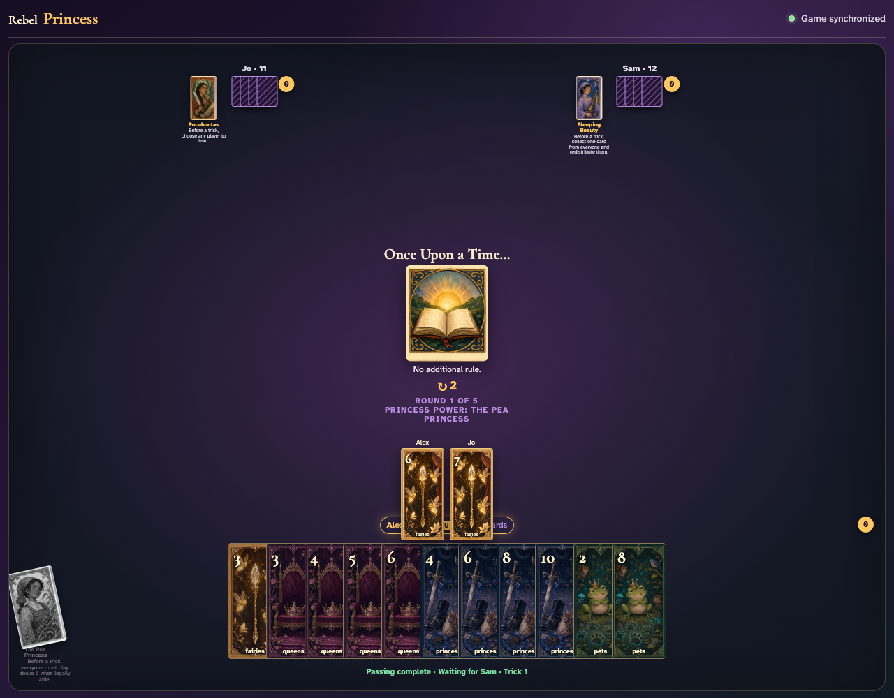
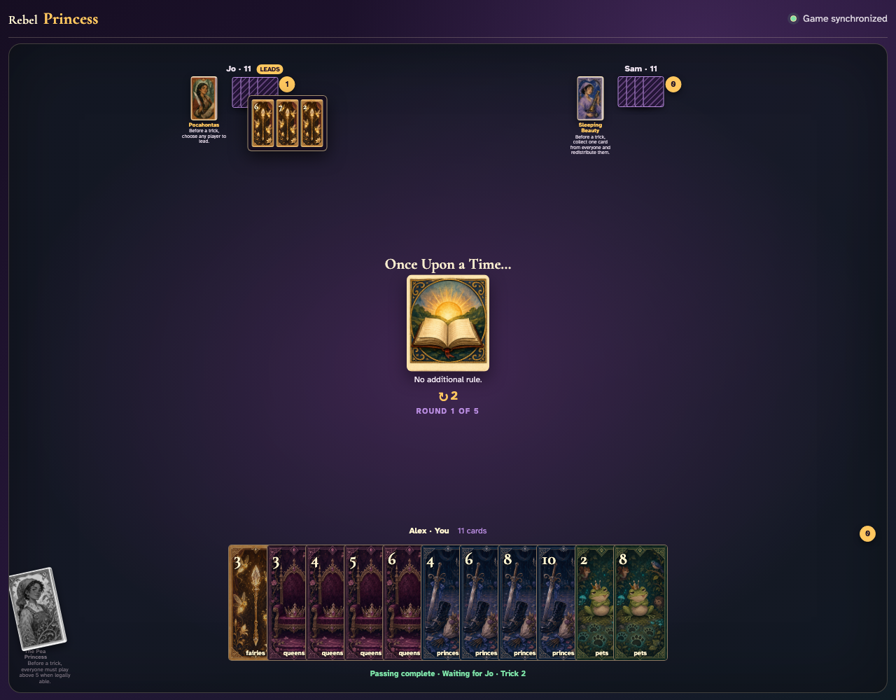

# Pea Princess click activation

Click the Pea Princess, then click through the constrained trick.

## The Pea Princess is ready before any card is played

**Verifications:**
- [x] Her Princess card is enabled
- [x] The full legal lead set is initially visible

---

## Clicking her visibly restricts the legal card records

**Verifications:**
- [x] The active power is visible
- [x] Every legal card rank is above five

---

## Alex clicks the constrained Fairies 6; its rank above five is visible in the trick

**Verifications:**
- [x] Every initially legal card is above five
- [x] Alex’s clicked high card is visible to every player

---

## Sam has no above-five card in the led suit, so the legal low-card fallback is shown before it is clicked

**Verifications:**
- [x] Sam has at least one legal follow-suit card
- [x] Every available fallback is five or lower

---

## Jo’s awarded trick shows Fairies 6, Fairies 7, and Sam’s legal low-card fallback, Fairies 2

**Verifications:**
- [x] The open review contains all three clicked cards
- [x] Observers see the active exhausted Princess

---
