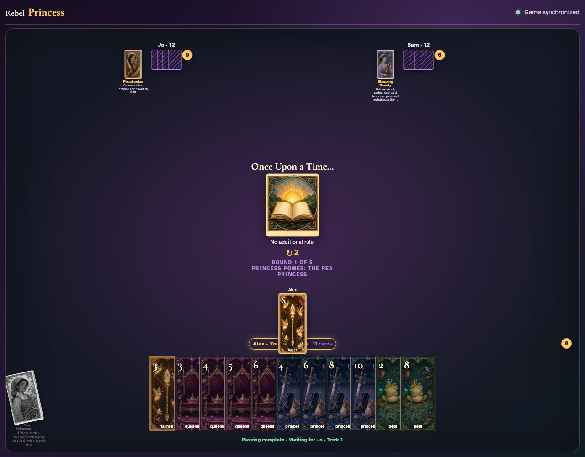

# Pea Princess click activation

Click the Pea Princess, then click through the constrained trick.

## The Pea Princess is ready before any card is played

**Verifications:**
- [x] Her Princess card is enabled
- [x] The full legal lead set is initially visible

---

## Clicking her visibly restricts the legal card records

**Verifications:**
- [x] The active power is visible
- [x] Every legal card rank is above five

---

## The clicked Princess constrains visible legal cards and a constrained card is clicked

**Verifications:**
- [x] Every initially legal card is above five
- [x] Observers see the active exhausted Princess

---
