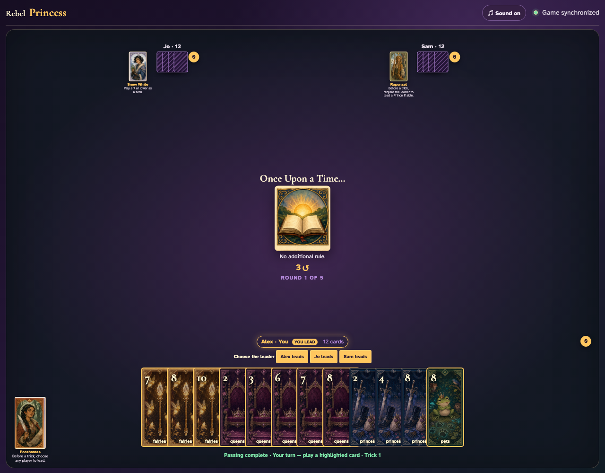
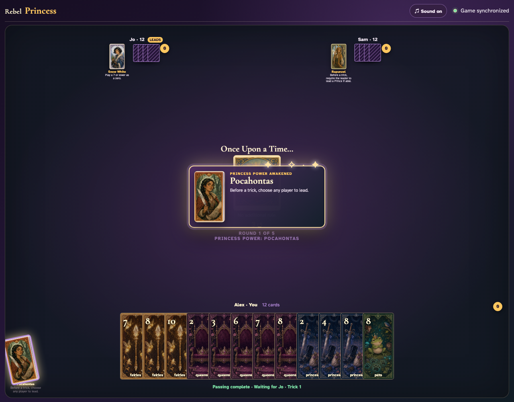
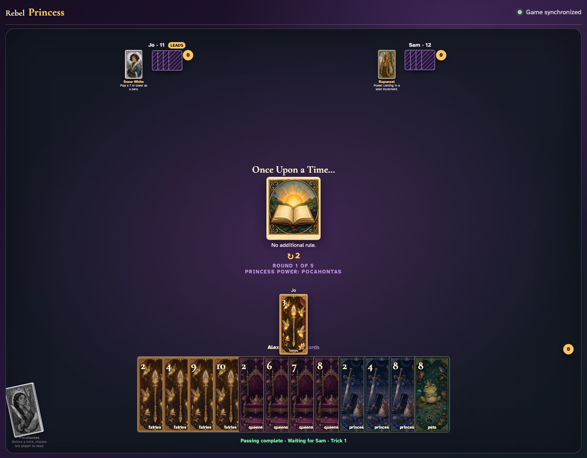

# Pocahontas click activation

Click Pocahontas, then click Jo in the visible lead chooser.

## Clicking Pocahontas opens a leader button for every player

**Verifications:**
- [x] Pocahontas reports pressed
- [x] The chooser contains three leader records

---

## The chooser click changes the shared leader immediately

**Verifications:**
- [x] Jo receives the prominent local lead indicator
- [x] Pocahontas is exhausted for every client

---

## Jo—not Alex—clicks Fairies 3 to lead the next trick

**Verifications:**
- [x] Every player sees Jo’s lead card in the center
- [x] Turn order continues clockwise from Jo to Sam

---
