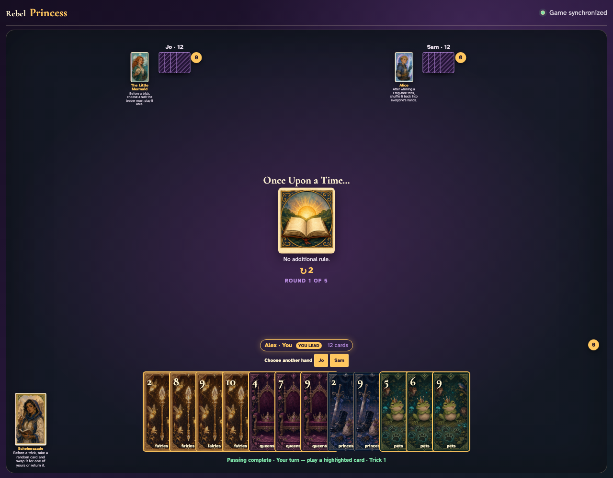
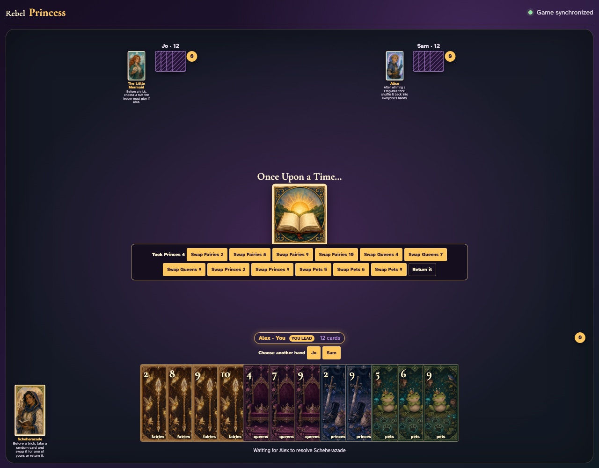
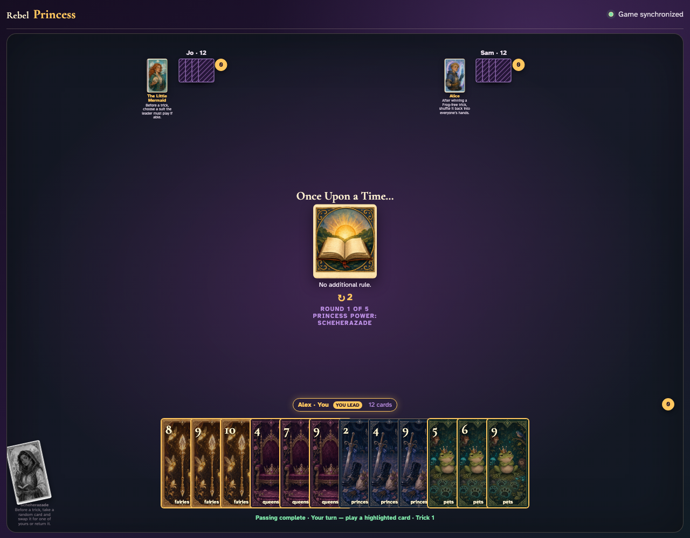

# Scheherazade click activation

Click Scheherazade, Jo, and the card to exchange.

## Clicking Scheherazade opens the other-hand chooser

**Verifications:**
- [x] Only the two opponents are target buttons
- [x] Her Princess button reports pressed

---

## Clicking Jo reveals the taken card and exchange choices

**Verifications:**
- [x] The taken card is named in the chooser data
- [x] At least one Swap button is enabled

---

## The three UI clicks exchange the displayed cards

**Verifications:**
- [x] The inspected card appears in Scheherazade’s hand
- [x] The clicked exchange card leaves her hand

---
