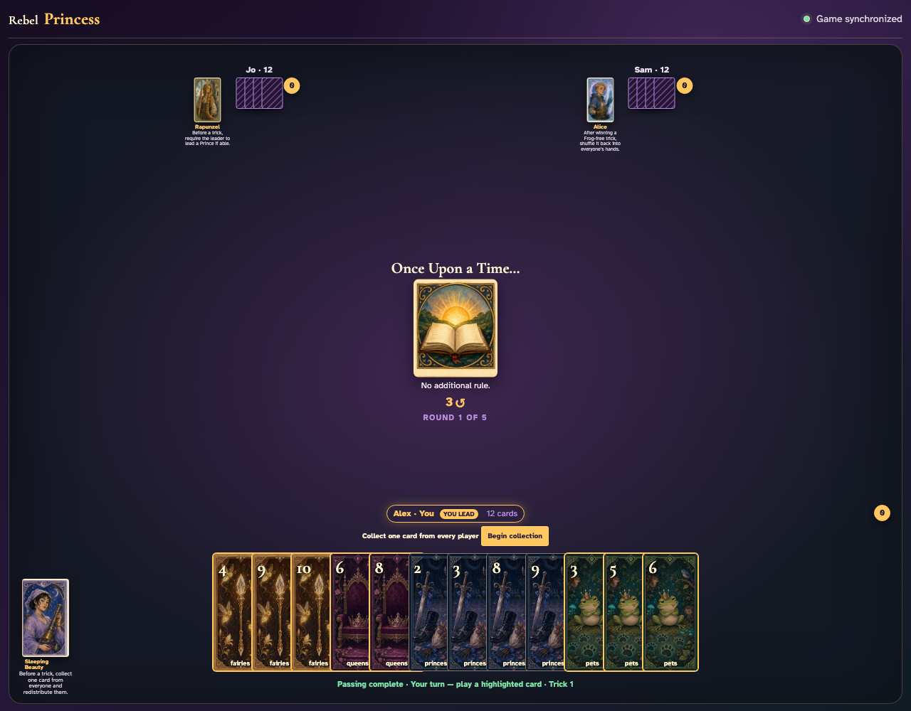
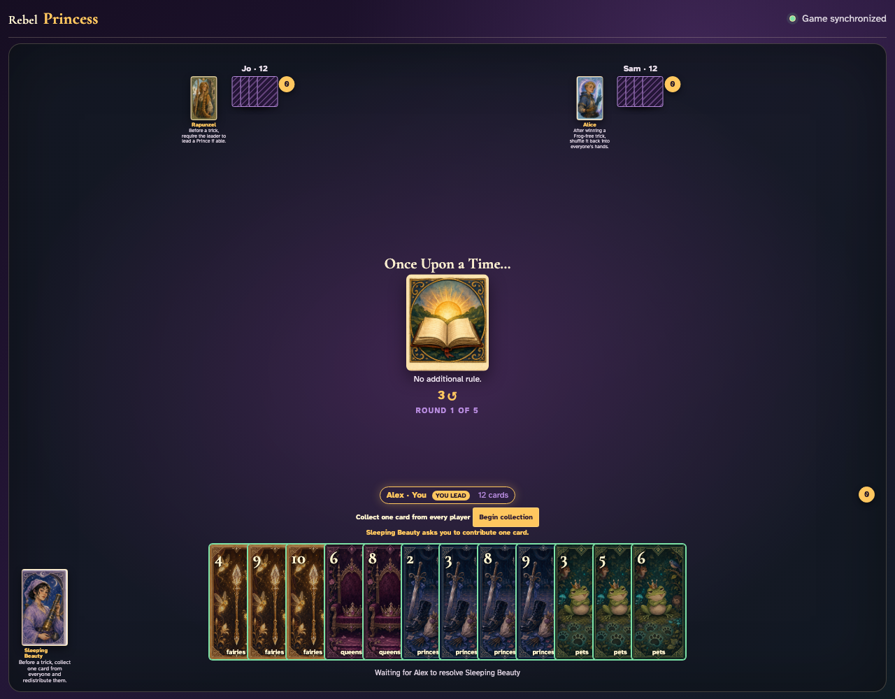
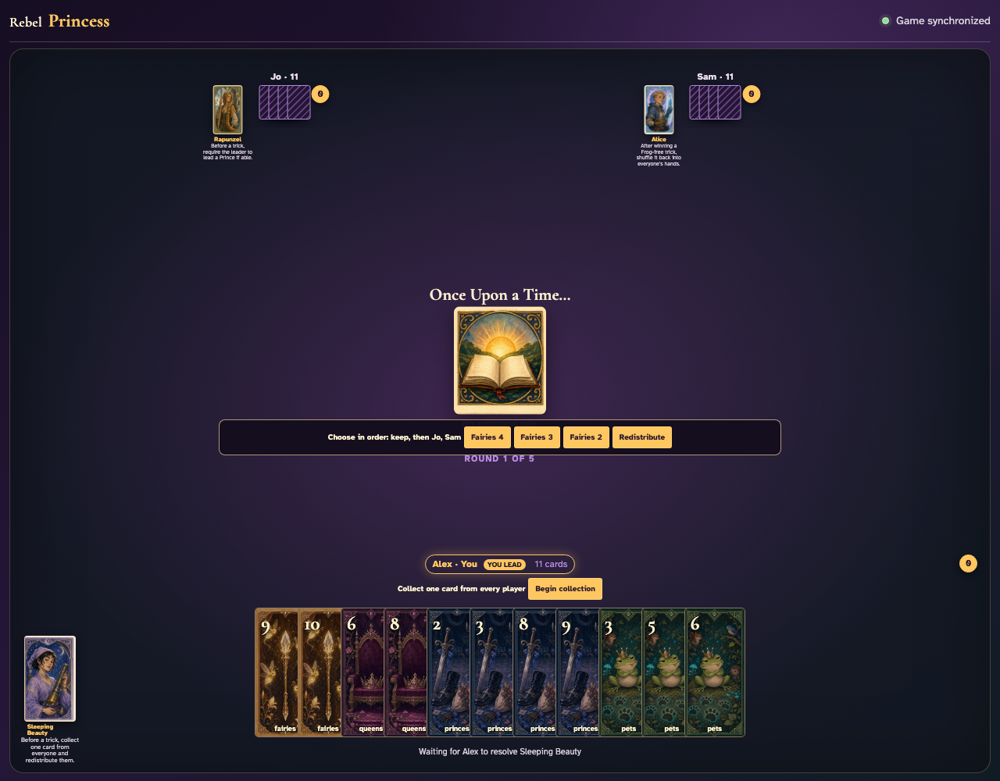
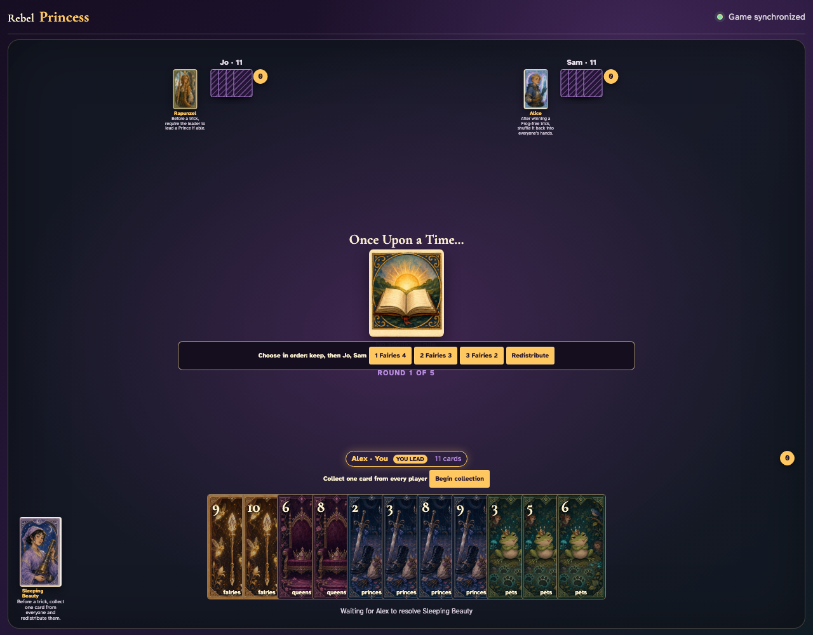
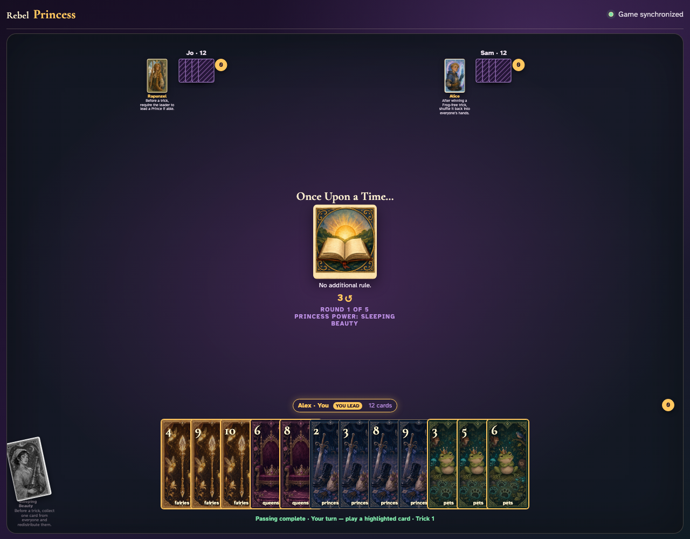

# Sleeping Beauty click activation

Click Sleeping Beauty, collection, every contribution, their order, and redistribution.

## Clicking Sleeping Beauty exposes collection confirmation

**Verifications:**
- [x] The Begin collection button is enabled
- [x] Her Princess card reports pressed

---

## Beginning collection highlights a contribution in every hand

**Verifications:**
- [x] Each client has contributable card records
- [x] Observers see the contribution prompt

---

## Three clicked contributions appear for ordered redistribution

**Verifications:**
- [x] The chooser has exactly three contributed card buttons
- [x] Redistribute remains disabled until ordering is complete

---

## The three clicks visibly number which card Alex keeps and which cards Jo and Sam receive

**Verifications:**
- [x] All three contributed cards have an assignment number
- [x] Redistribute becomes enabled only after the order is complete

---

## The final hands show Alex kept Fairies 4, Jo received Fairies 3, and Sam received Fairies 2

**Verifications:**
- [x] Sleeping Beauty keeps the first clicked contribution
- [x] Jo and Sam receive the next clicked cards

---
