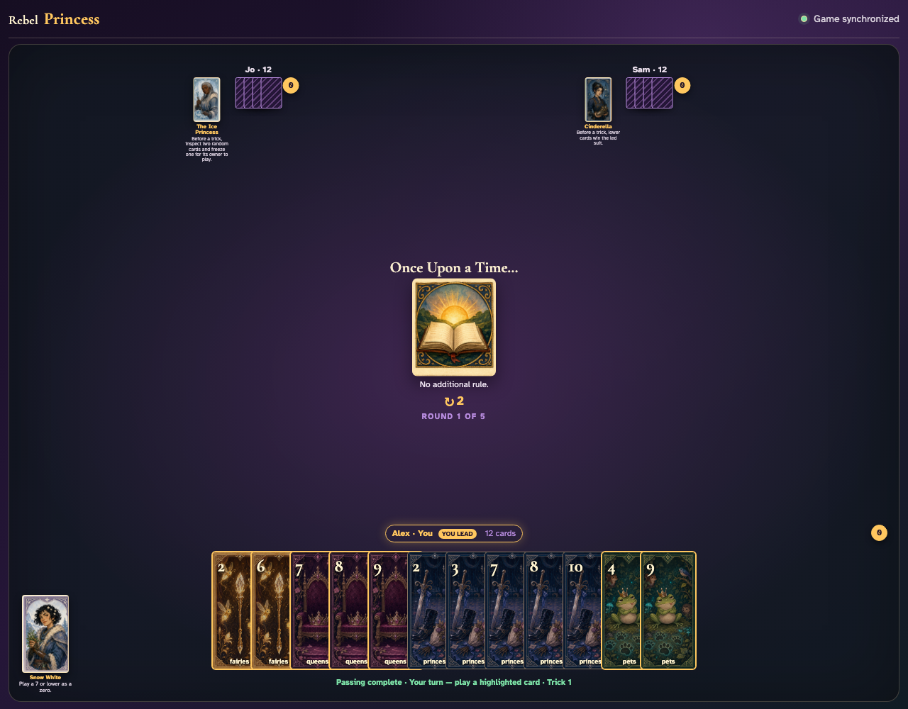
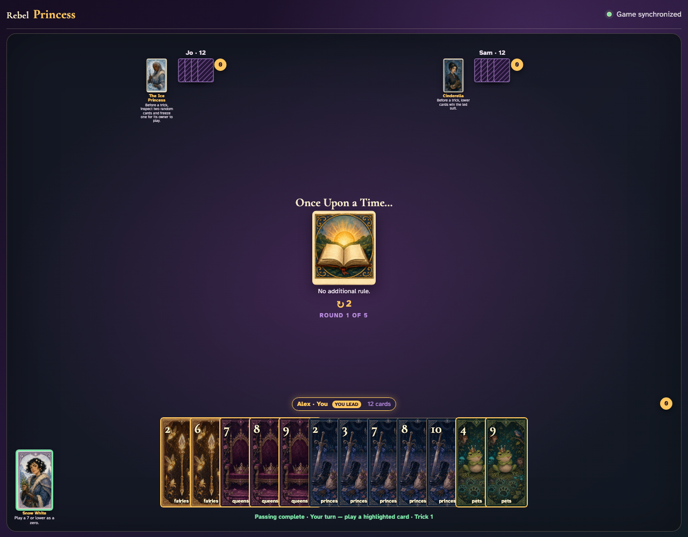
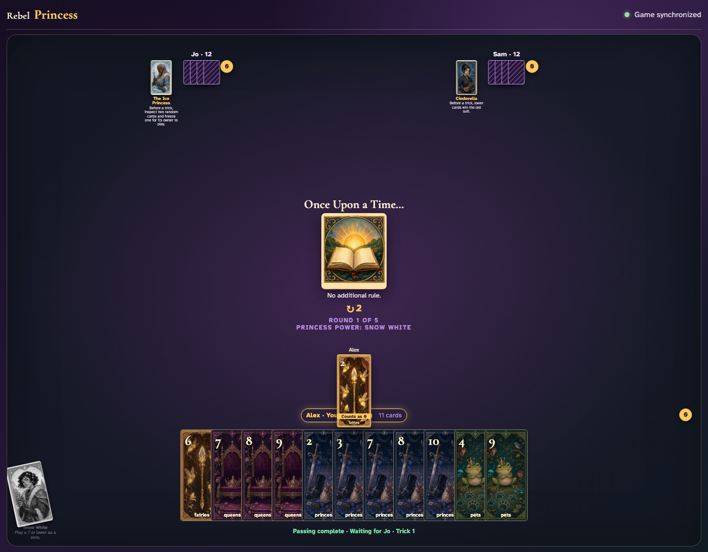

# Snow White click activation

A player clicks Snow White and then clicks a legal low card; no keyboard or direct backend action is used.

## Snow White is available alongside legal low cards

**Verifications:**
- [x] The Princess card is enabled
- [x] The hand exposes playable card records

---

## Clicking Snow White visibly arms the next low card

**Verifications:**
- [x] The Princess button reports pressed
- [x] The selected low card button remains enabled

---

## Clicking the Princess arms her and clicking the card applies zero

**Verifications:**
- [x] The played card visibly counts as zero
- [x] Observers see Snow White exhausted

---
