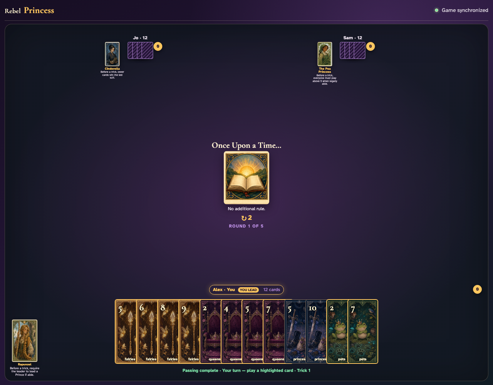
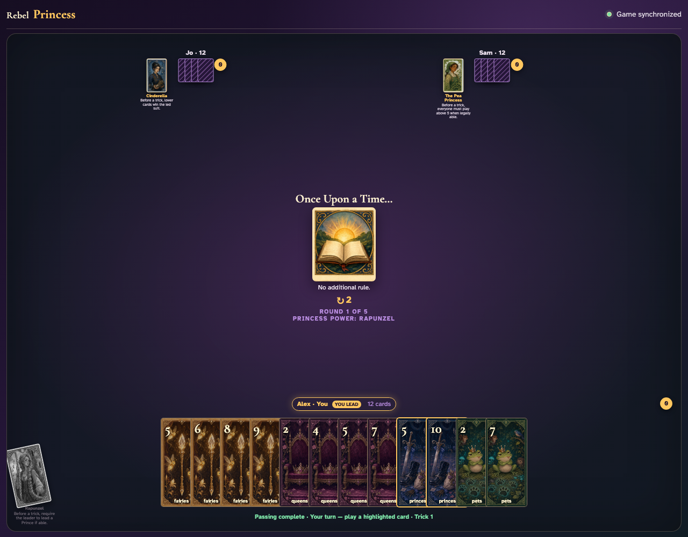
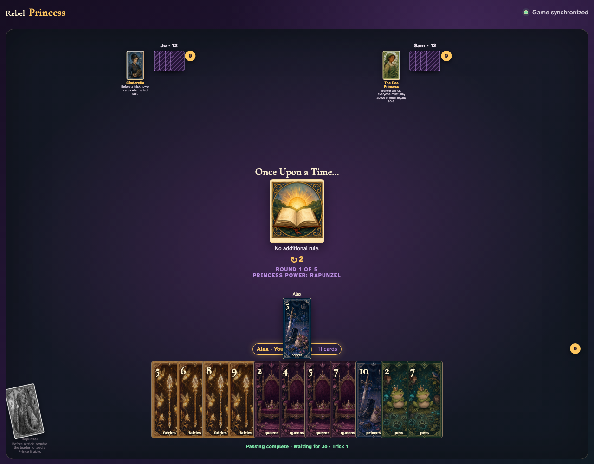

# Rapunzel click activation

Click Rapunzel before a trick, observe the leader’s hand become restricted to Princes, and click the forced Prince into the center.

## Rapunzel is upright and available before Alex leads

**Verifications:**
- [x] Rapunzel’s card is enabled
- [x] The ordinary unopened-Prince lead contains no Princes

---

## Clicking Rapunzel exhausts her and makes only Prince cards clickable

**Verifications:**
- [x] Prince leads are enabled while non-Prince leads are disabled
- [x] Every player sees Rapunzel’s active power and exhausted card

---

## Alex clicks the forced Princes 5, which appears as the actual lead card

**Verifications:**
- [x] The clicked lead is a Prince
- [x] Every player sees Alex’s forced Prince in the center

---
