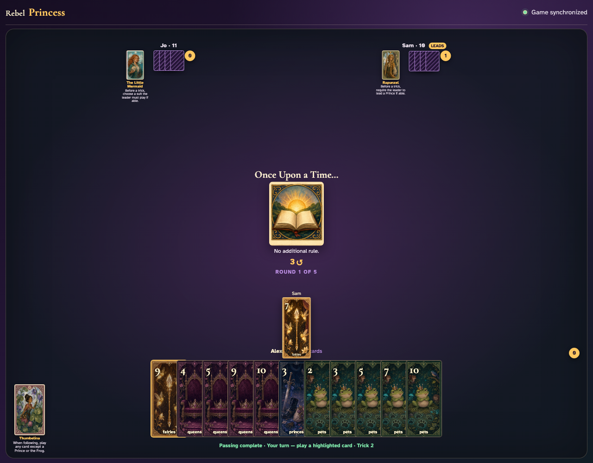
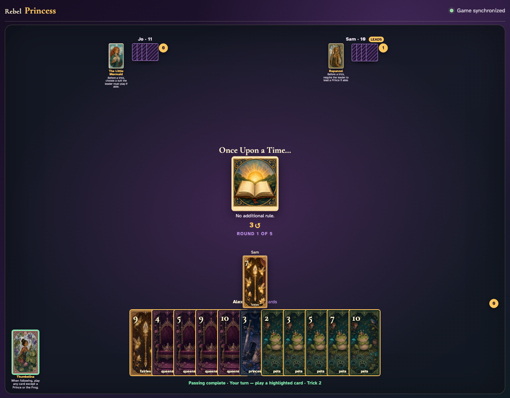
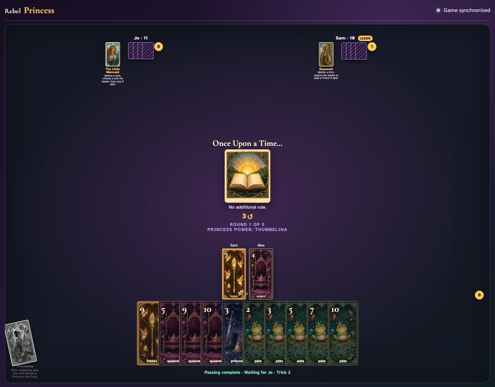

# Thumbelina click activation

Play normally until Thumbelina is following, click her card, then click a non-Prince, non-Frog card outside the led suit.

## Thumbelina is following Fairies; ordinary play exposes only that led suit

**Verifications:**
- [x] At least one card has already established the led suit
- [x] Every ordinarily playable card follows the led suit
- [x] Thumbelina’s card is enabled only while she is following

---

## Clicking Thumbelina exposes Queens 4 outside the led Fairies suit

**Verifications:**
- [x] Thumbelina reports her armed state
- [x] The off-suit alternative is clickable
- [x] Princes and the Frog remain unavailable through her power

---

## Thumbelina clicks Queens 4; the off-suit card appears beside the Fairies lead

**Verifications:**
- [x] The actual off-suit graphic appears in the center
- [x] The played card is neither a Prince nor the Frog
- [x] Every player sees Thumbelina exhausted

---
