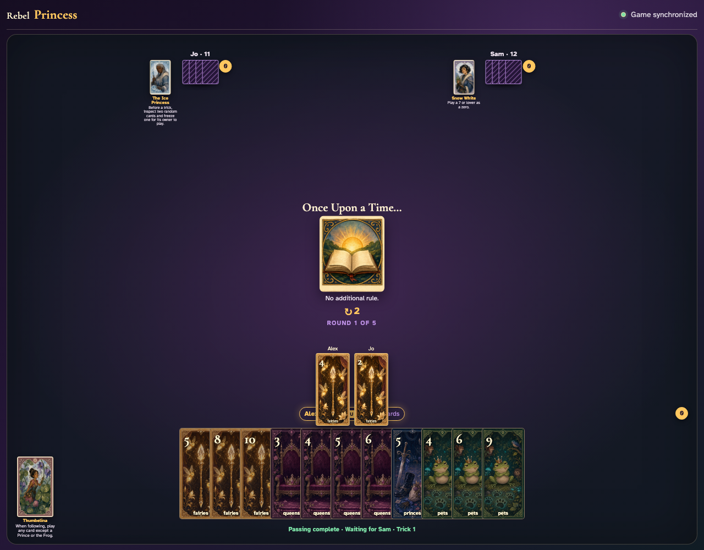
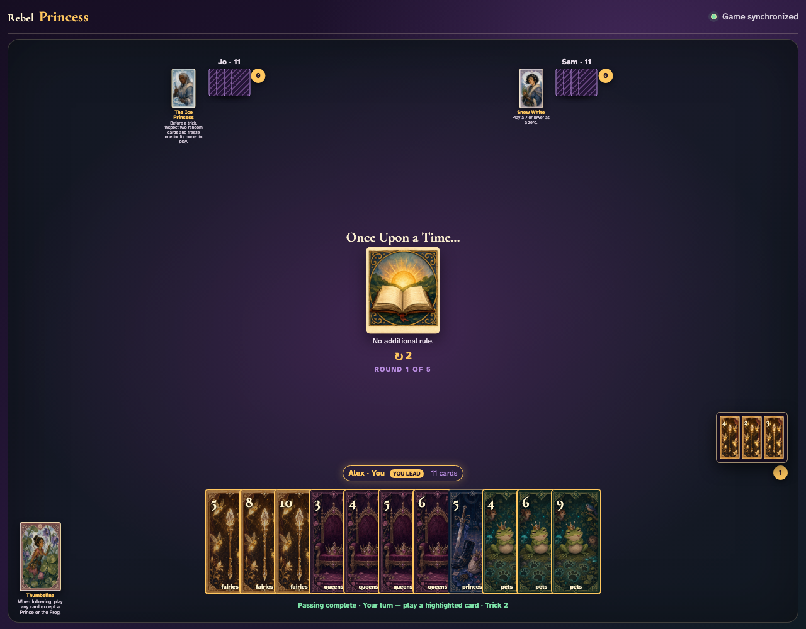

# Once Upon a Time

Reveal the no-rule teaching card, then click and display all three ordinary plays before reviewing the awarded trick.

## Once Upon a Time explicitly announces that no special rule changes ordinary play

**Verifications:**
- [x] The center names the selected Round card
- [x] The printed rule says there is no additional rule

---

## Alex leads Fairies 4 face up

**Verifications:**
- [x] The center contains exactly the clicked lead graphic
- [x] The next clockwise player receives the turn

---

## Jo follows with Fairies 2

**Verifications:**
- [x] Both exact played-card graphics remain visible
- [x] The final clockwise player receives the turn

---

## Alex’s awarded trick opens and shows every ordinary play

**Verifications:**
- [x] The open review contains all three card graphics
- [x] Alex has exactly one captured trick

---
