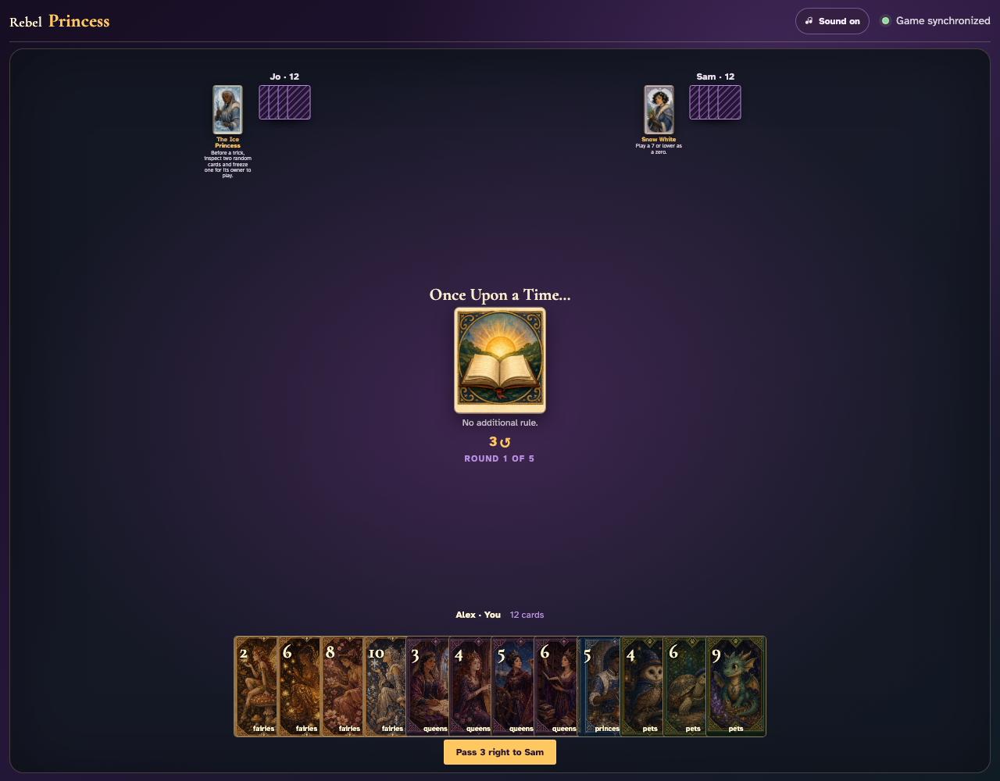
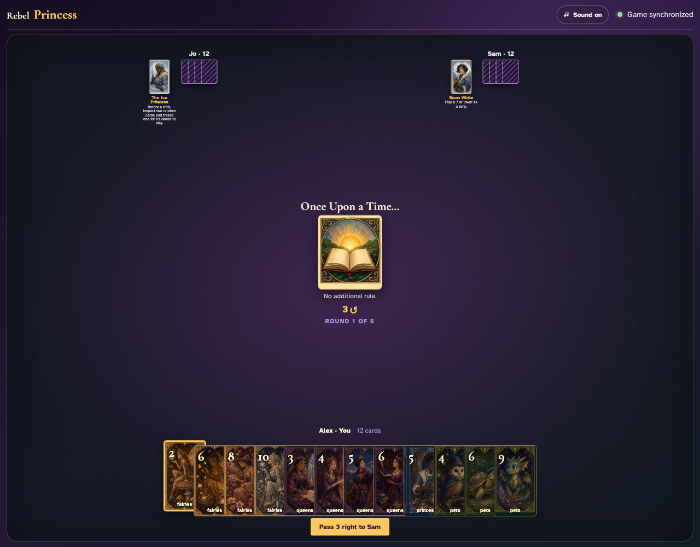
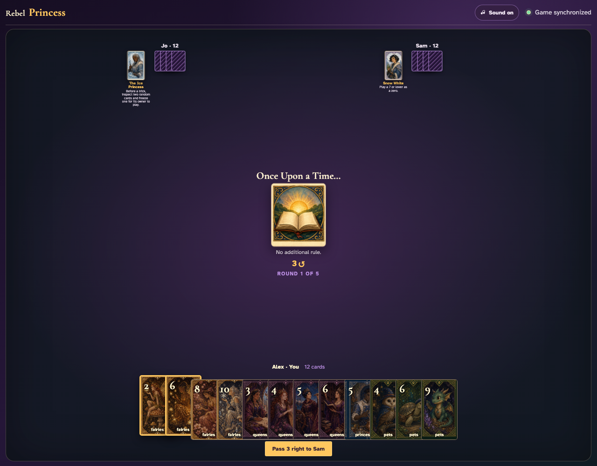
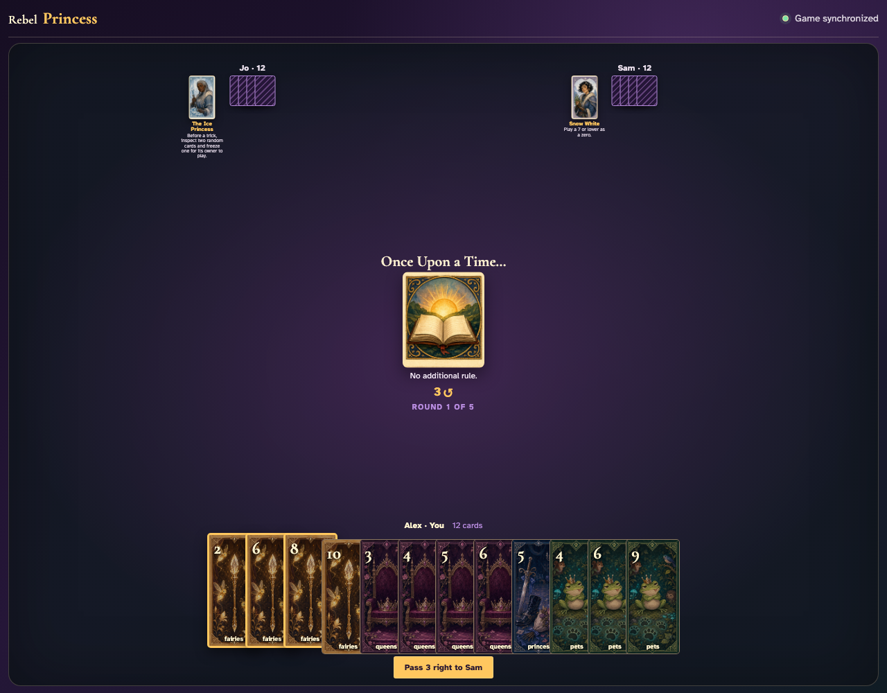
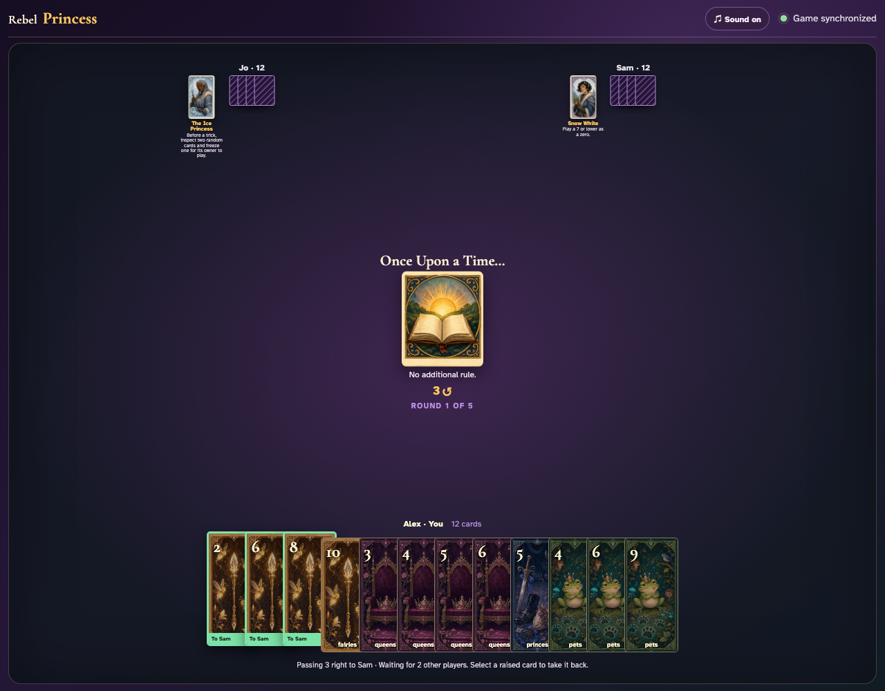
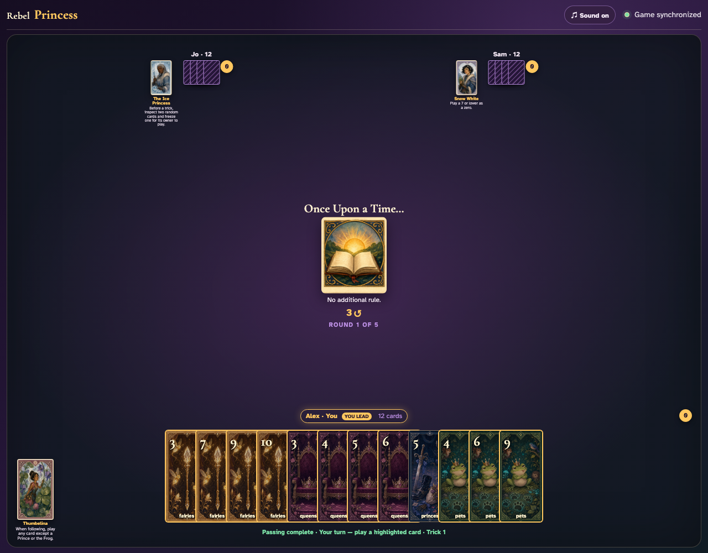
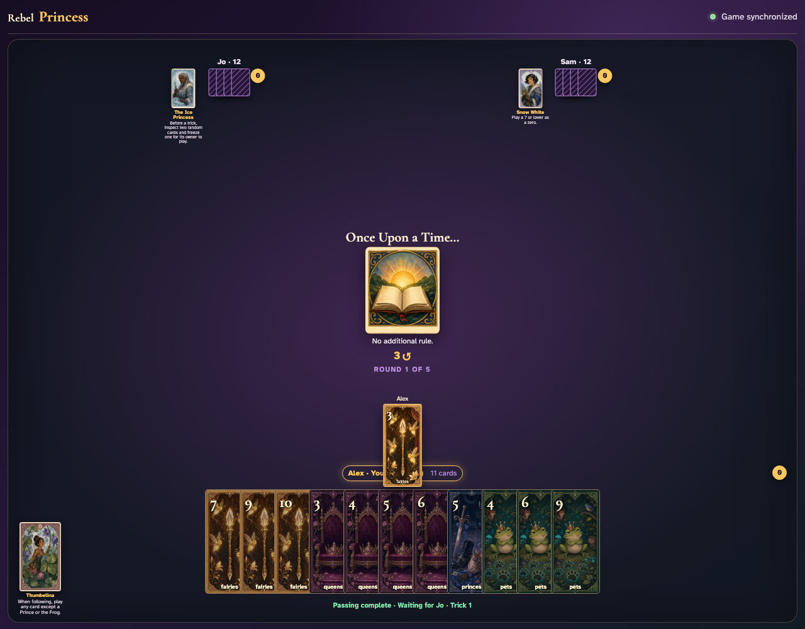
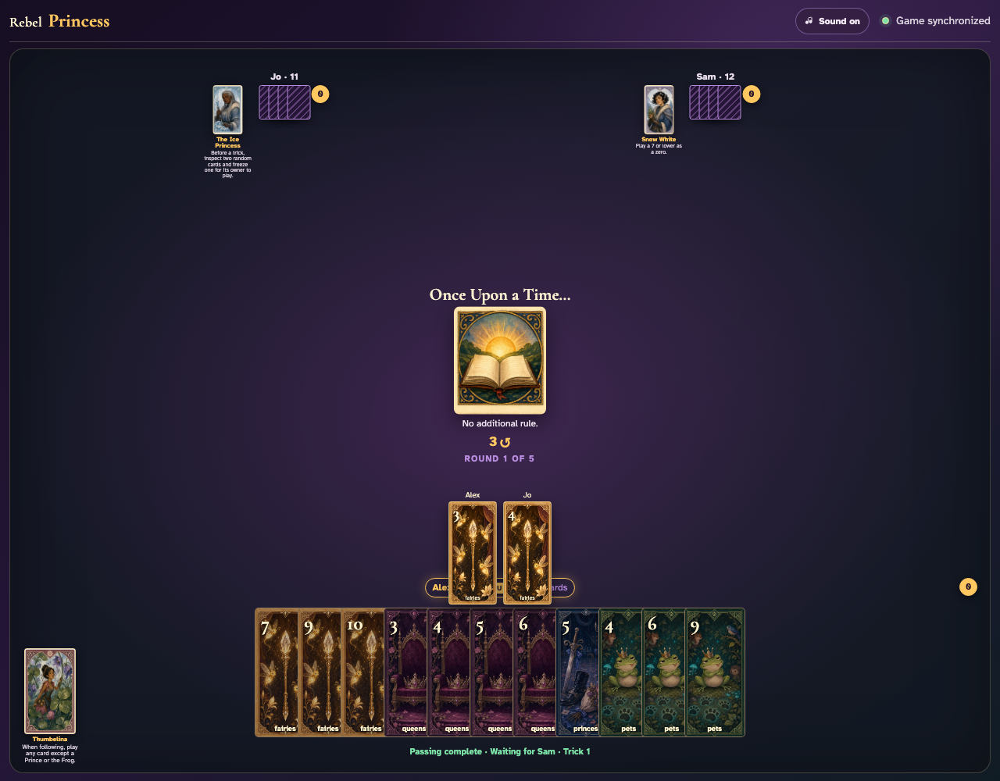
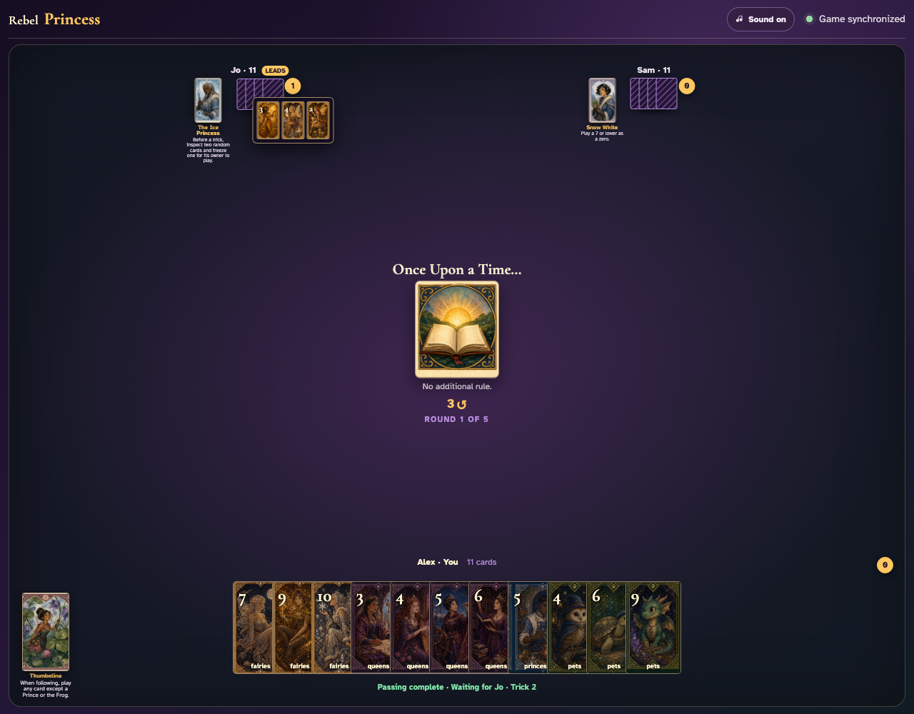

# Once Upon a Time

Reveal the no-rule teaching card, then click and display all three ordinary plays before reviewing the awarded trick.

## Once Upon a Time… prints a 3-card right pass before play begins

**Verifications:**
- [x] The center icon announces Pass 3 right
- [x] The action names Sam as the recipient
- [x] The pass cannot be committed before any card is chosen

---

## Alex clicks Fairies 2; it is assignment 1 of 3 to Sam

**Verifications:**
- [x] Exactly 1 chosen card is raised
- [x] Fairies 2 stays visibly selected
- [x] 2 more selections are still required

---

## Alex clicks Fairies 6; it is assignment 2 of 3 to Sam

**Verifications:**
- [x] Exactly 2 chosen cards are raised
- [x] Fairies 6 stays visibly selected
- [x] 1 more selection is still required

---

## Alex clicks Fairies 8; it is assignment 3 of 3 to Sam

**Verifications:**
- [x] Exactly 3 chosen cards are raised
- [x] Fairies 8 stays visibly selected
- [x] The complete printed pass is ready to commit

---

## Alex commits the 3 cards toward Sam while both other players are still choosing

**Verifications:**
- [x] All 3 outgoing cards remain visible and raised
- [x] The waiting message preserves the printed right direction
- [x] No incoming cards arrive before every player commits

---

## Jo commits next; Alex still sees the cards held until Sam makes the final decision

**Verifications:**
- [x] Exactly one other player remains
- [x] Alex can still identify every outgoing card

---

## Sam commits last; all three right transfers resolve simultaneously and play can begin

**Verifications:**
- [x] Every player again holds twelve cards
- [x] Alex receives the exact right incoming cards
- [x] The table leaves the simultaneous pass phase for play or the Round card’s next action

---

## Once Upon a Time explicitly announces that no special rule changes ordinary play

**Verifications:**
- [x] The center names the selected Round card
- [x] The printed rule says there is no additional rule

---

## Alex leads Fairies 3 face up

**Verifications:**
- [x] The center contains exactly the clicked lead graphic
- [x] The next clockwise player receives the turn

---

## Jo follows with Fairies 4

**Verifications:**
- [x] Both exact played-card graphics remain visible
- [x] The final clockwise player receives the turn

---

## Jo’s awarded trick opens and shows every ordinary play

**Verifications:**
- [x] The open review contains all three card graphics
- [x] Jo has exactly one captured trick

---
