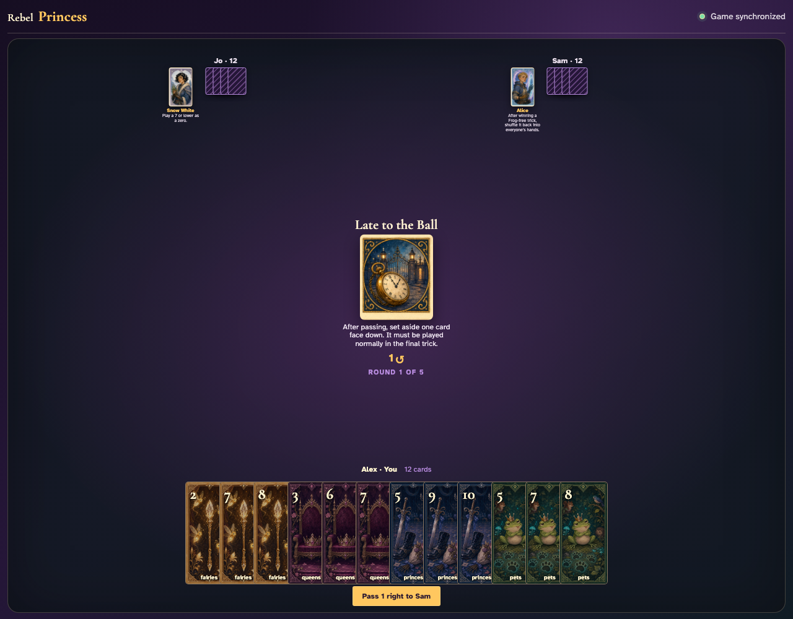
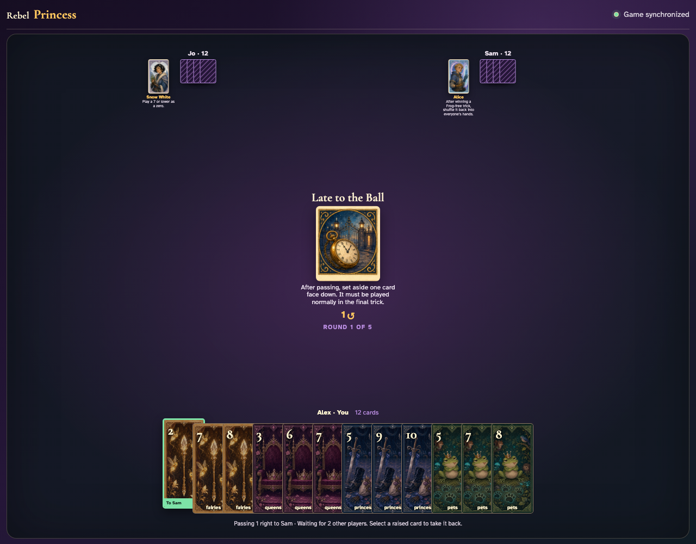
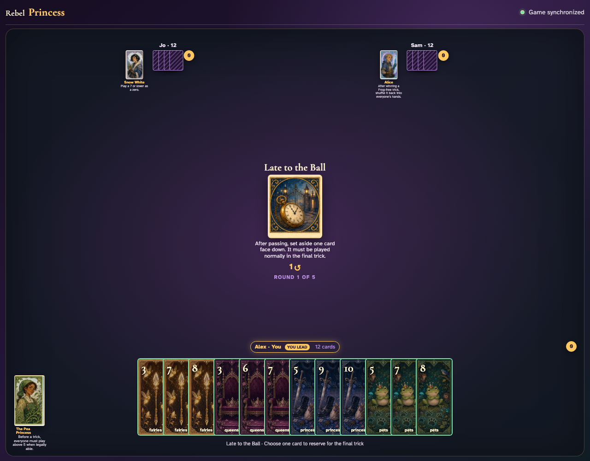
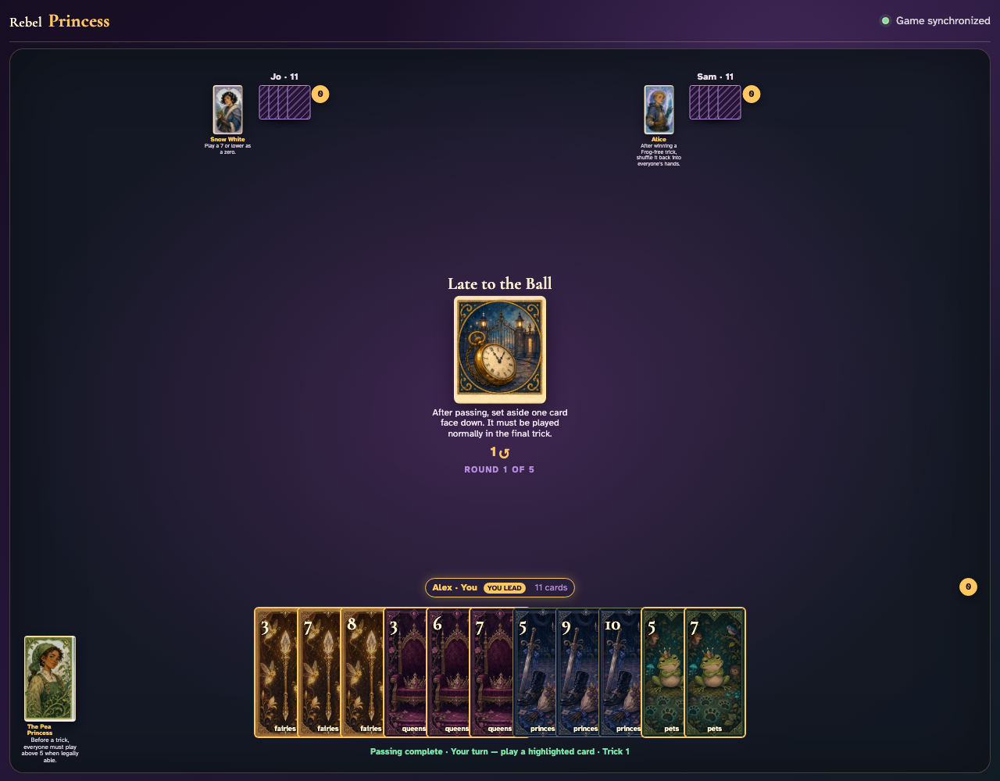
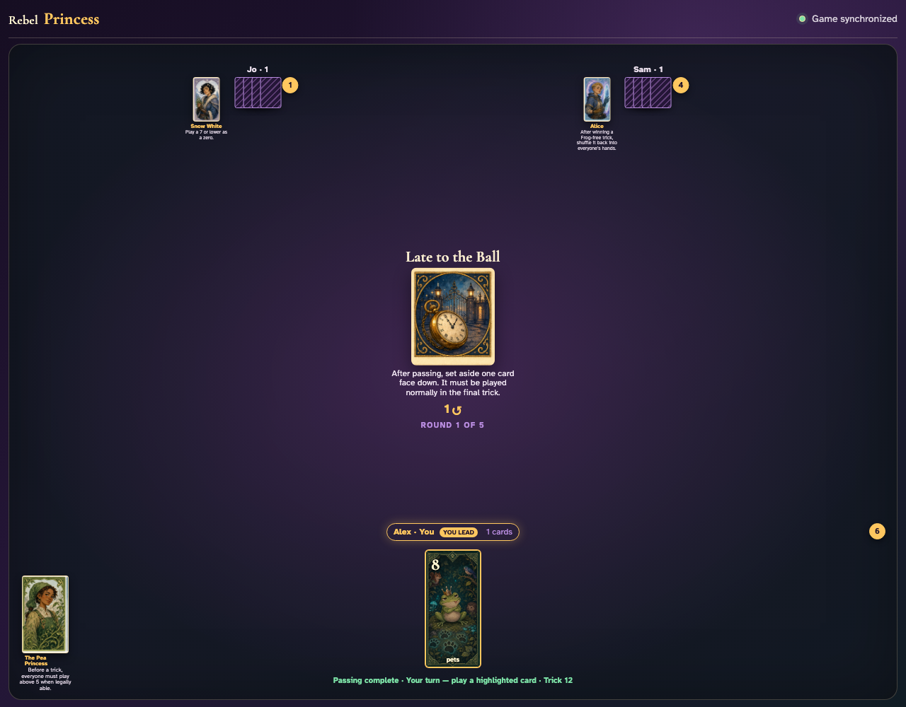
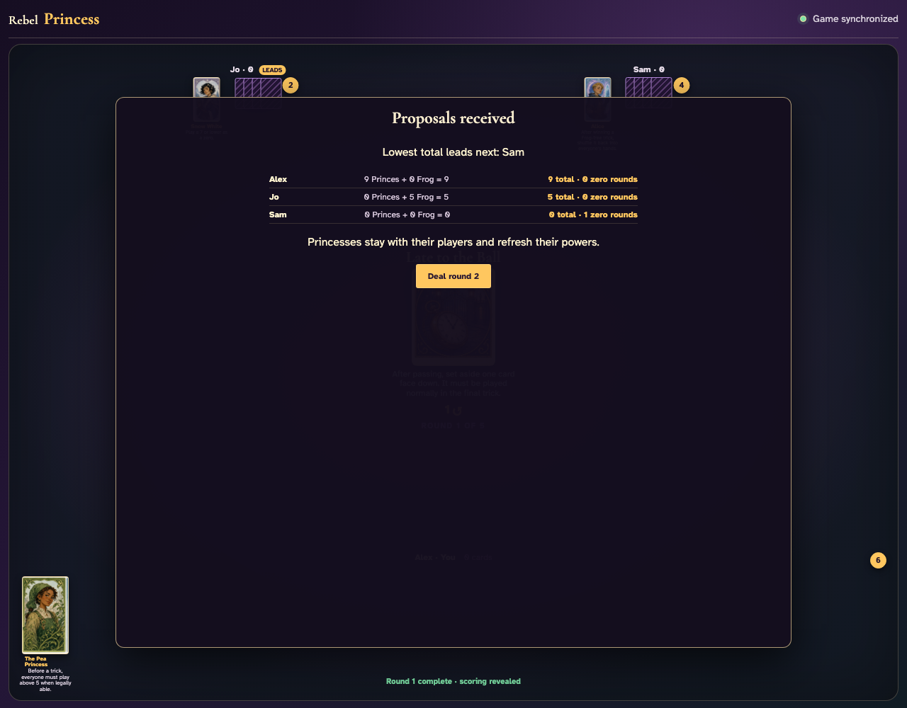

# Late to the Ball

Each player clicks a reserved card, plays every ordinary trick, then sees and clicks that exact card in the final trick.

## Late to the Ball prints a 1-card right pass before play begins

**Verifications:**
- [x] The center icon announces Pass 1 right
- [x] The action names Sam as the recipient
- [x] The pass cannot be committed before any card is chosen

---

## Alex clicks Fairies 2; it is assignment 1 of 1 to Sam

**Verifications:**
- [x] Exactly 1 chosen card is raised
- [x] Fairies 2 stays visibly selected
- [x] The complete printed pass is ready to commit

---

## Alex commits the 1 cards toward Sam while both other players are still choosing

**Verifications:**
- [x] All 1 outgoing cards remain visible and raised
- [x] The waiting message preserves the printed right direction
- [x] No incoming cards arrive before every player commits

---

## Jo commits next; Alex still sees the cards held until Sam makes the final decision

**Verifications:**
- [x] Exactly one other player remains
- [x] Alex can still identify every outgoing card

---

## Sam commits last; all three right transfers resolve simultaneously and play can begin

**Verifications:**
- [x] Every player again holds twelve cards
- [x] Alex receives the exact right incoming card
- [x] The table leaves the simultaneous pass phase for play or the Round card’s next action

---

## After passing, every player is prompted to reserve one card for the final trick

**Verifications:**
- [x] The Round rule is printed in the center
- [x] All clients receive the reserve prompt before anyone can lead

---

## All three card clicks resolve simultaneously and ordinary trick play begins

**Verifications:**
- [x] Each hand has eleven playable-round cards remaining
- [x] Alex receives the first ordinary turn

---

## The final hands reveal the exact reserved cards: Pets 8, Pets 10, Pets 9

**Verifications:**
- [x] Every player has exactly their reserved card
- [x] The status identifies the twelfth and final trick

---

## The three reserved graphics are clicked into the final trick: Pets 8, Pets 10, Pets 9

**Verifications:**
- [x] All hands are empty after the reserved cards are played
- [x] The round reaches its visible scoring result

---
