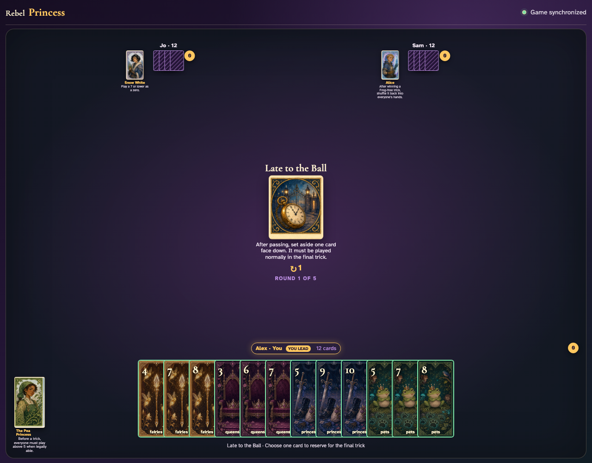
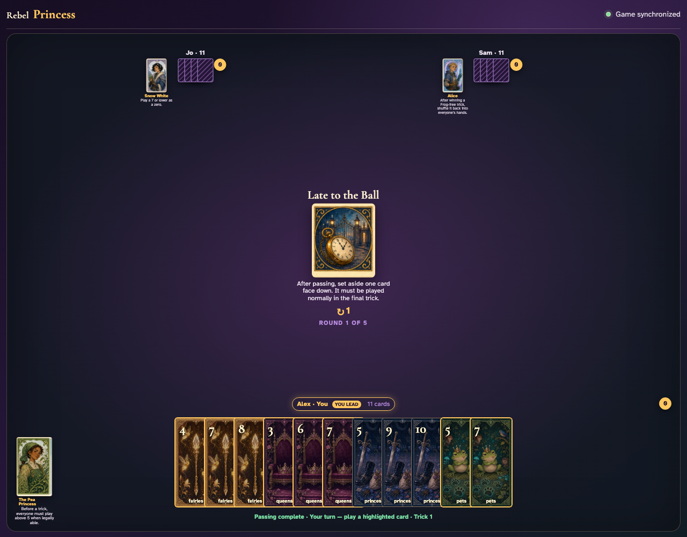
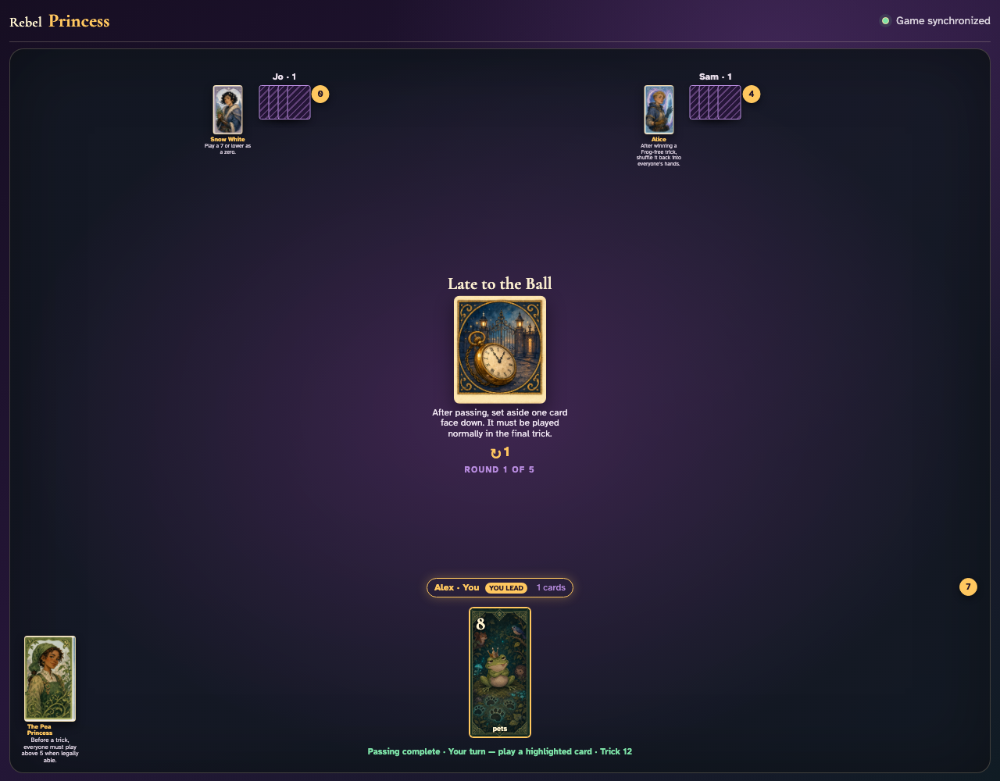
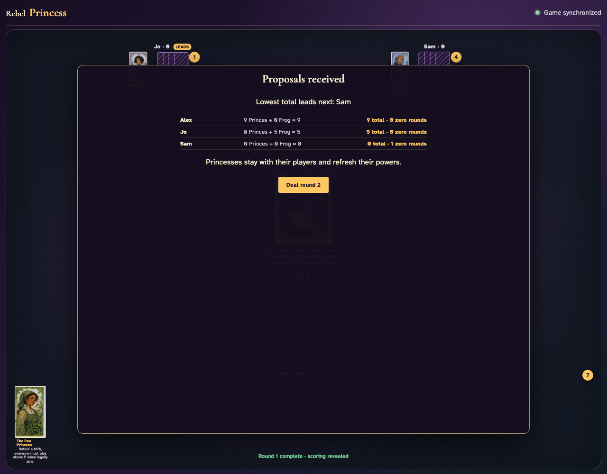

# Late to the Ball

Each player clicks a reserved card, plays every ordinary trick, then sees and clicks that exact card in the final trick.

## After passing, every player is prompted to reserve one card for the final trick

**Verifications:**
- [x] The Round rule is printed in the center
- [x] All clients receive the reserve prompt before anyone can lead

---

## All three card clicks resolve simultaneously and ordinary trick play begins

**Verifications:**
- [x] Each hand has eleven playable-round cards remaining
- [x] Alex receives the first ordinary turn

---

## The final hands reveal the exact reserved cards: Pets 8, Pets 10, Pets 9

**Verifications:**
- [x] Every player has exactly their reserved card
- [x] The status identifies the twelfth and final trick

---

## The three reserved graphics are clicked into the final trick: Pets 8, Pets 10, Pets 9

**Verifications:**
- [x] All hands are empty after the reserved cards are played
- [x] The round reaches its visible scoring result

---
