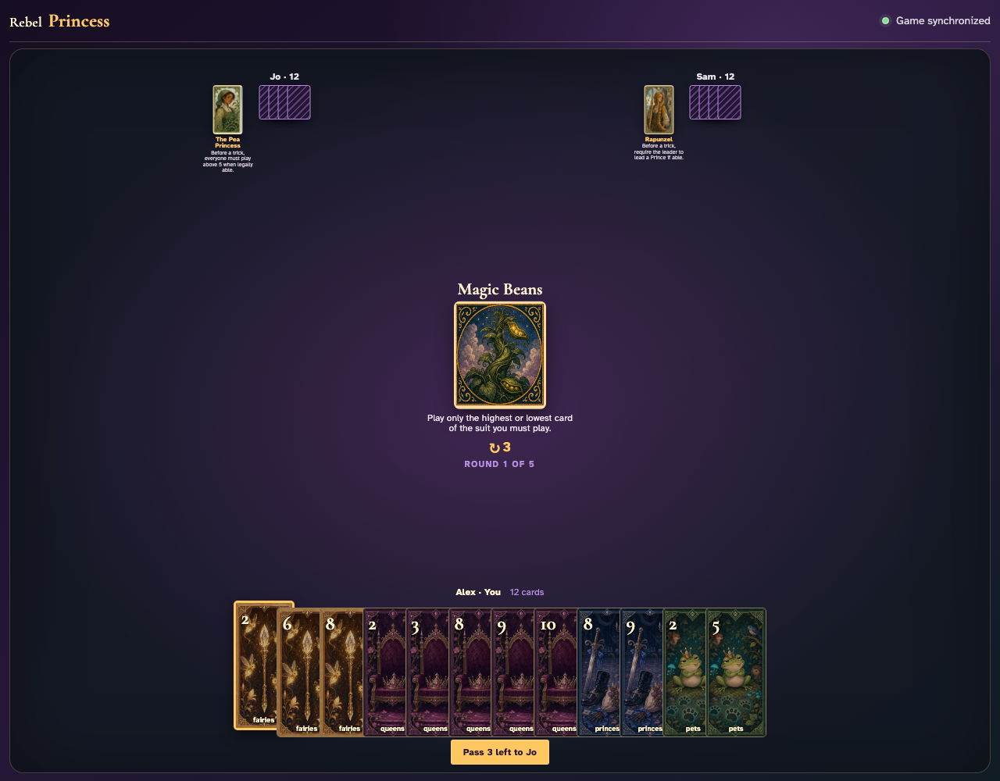
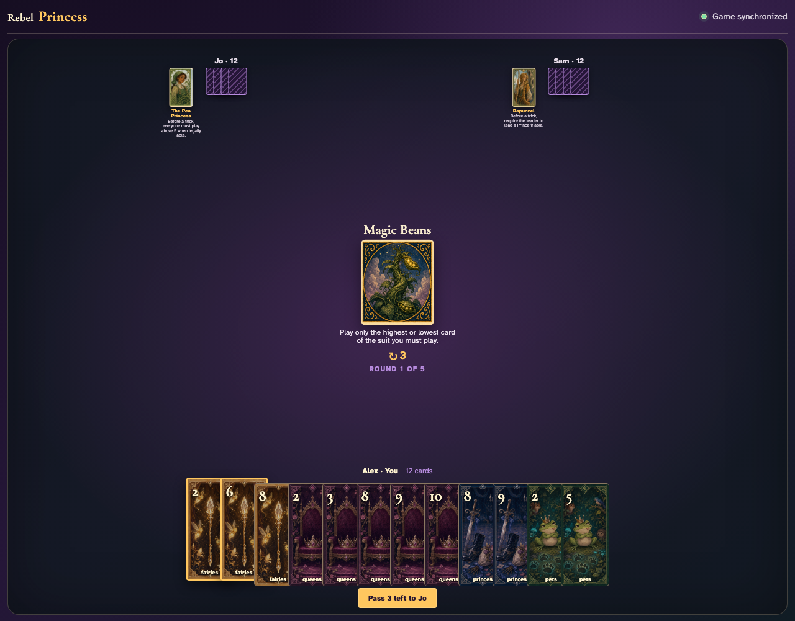
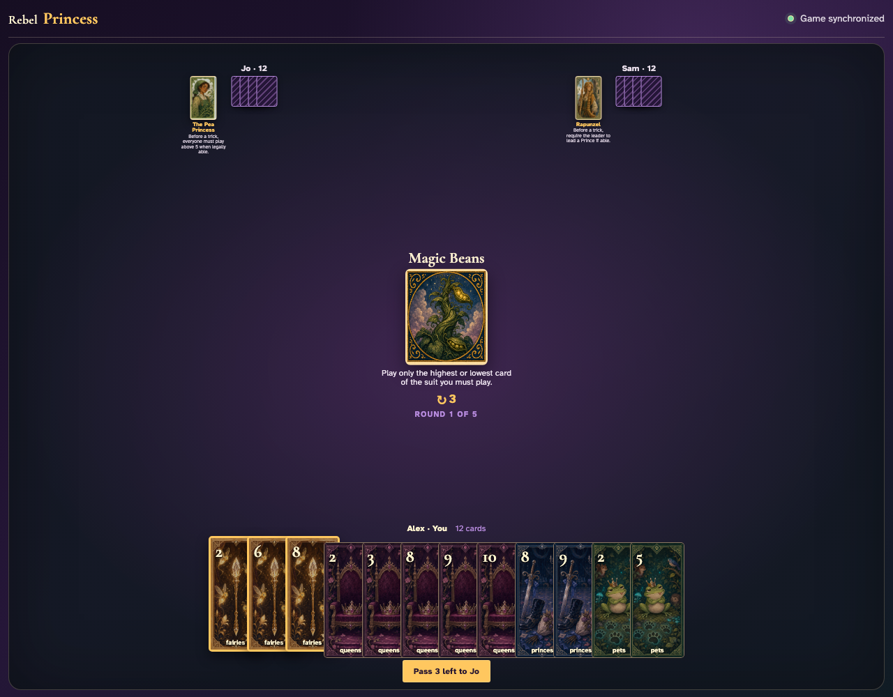
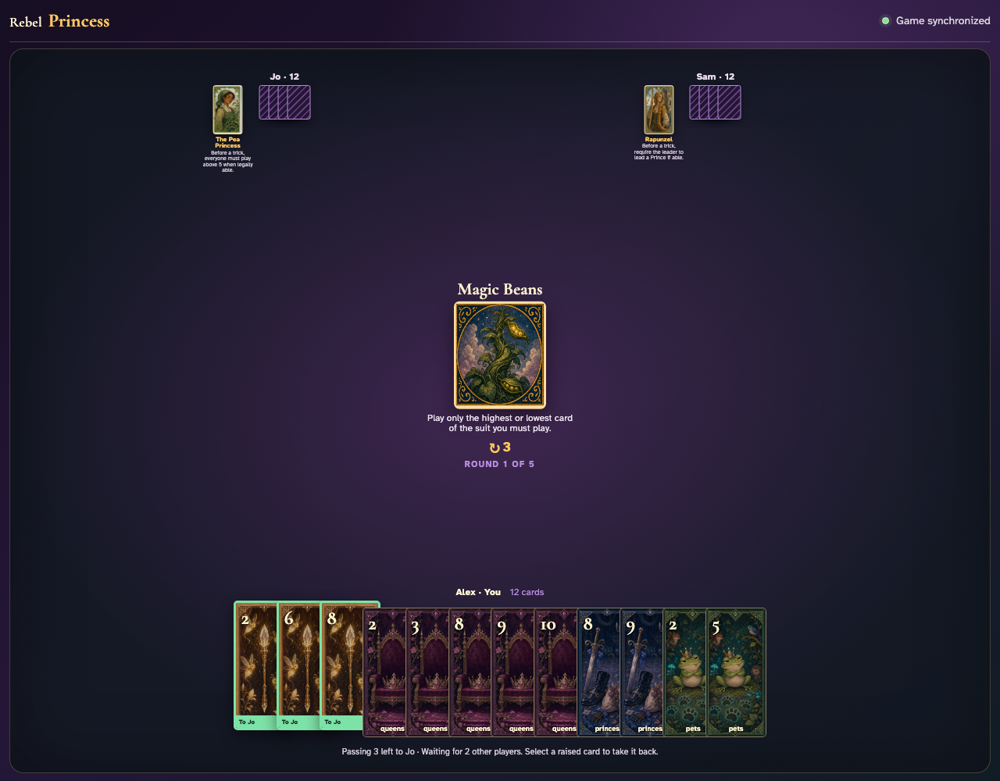
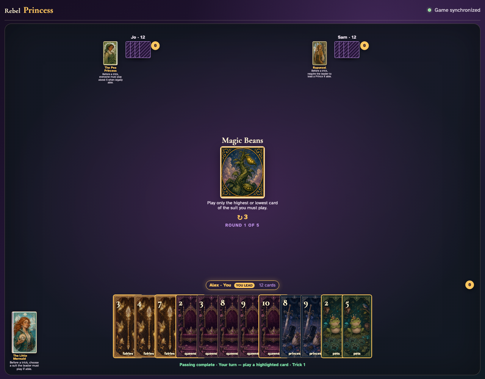
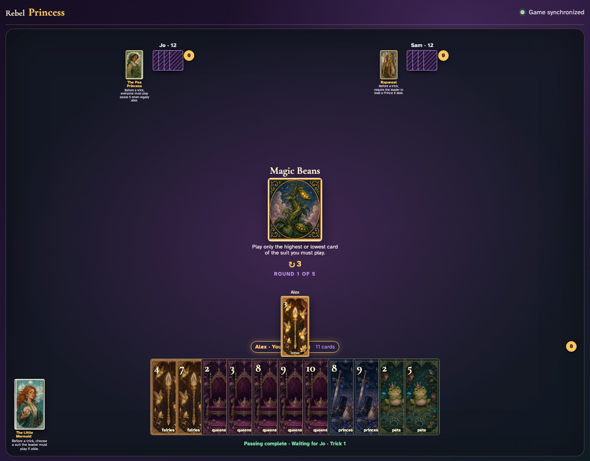
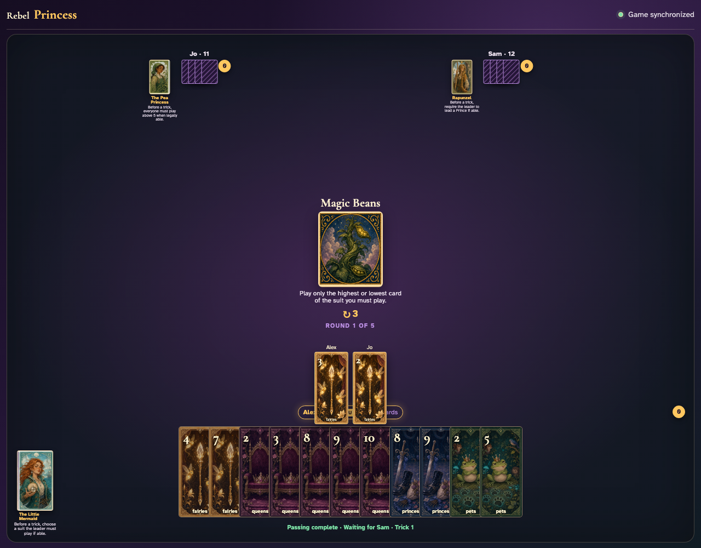

# Magic Beans

Reveal the rule, compare enabled extremes with a disabled middle card, then click a complete constrained trick and review it.

## Magic Beans prints a 3-card left pass before play begins

**Verifications:**
- [x] The center icon announces Pass 3 left
- [x] The action names Jo as the recipient
- [x] The pass cannot be committed before any card is chosen

---

## Alex clicks Fairies 2; it is assignment 1 of 3 to Jo

**Verifications:**
- [x] Exactly 1 chosen card is raised
- [x] Fairies 2 stays visibly selected
- [x] 2 more selections are still required

---

## Alex clicks Fairies 6; it is assignment 2 of 3 to Jo

**Verifications:**
- [x] Exactly 2 chosen cards are raised
- [x] Fairies 6 stays visibly selected
- [x] 1 more selection is still required

---

## Alex clicks Fairies 8; it is assignment 3 of 3 to Jo

**Verifications:**
- [x] Exactly 3 chosen cards are raised
- [x] Fairies 8 stays visibly selected
- [x] The complete printed pass is ready to commit

---

## Alex commits the 3 cards toward Jo while both other players are still choosing

**Verifications:**
- [x] All 3 outgoing cards remain visible and raised
- [x] The waiting message preserves the printed left direction
- [x] No incoming cards arrive before every player commits

---

## Jo commits next; Alex still sees the cards held until Sam makes the final decision

**Verifications:**
- [x] Exactly one other player remains
- [x] Alex can still identify every outgoing card

---

## Sam commits last; all three left transfers resolve simultaneously and play can begin

**Verifications:**
- [x] Every player again holds twelve cards
- [x] Alex receives the exact left incoming cards
- [x] The table leaves the simultaneous pass phase for play or the Round card’s next action

---

## For Fairies, only Fairies 3 and Fairies 7 are enabled; middle card Fairies 4 is disabled

**Verifications:**
- [x] The center prints the highest-or-lowest restriction
- [x] The suit’s lowest and highest cards are enabled
- [x] A middle card of the same suit is disabled

---

## Alex clicks Fairies 3; Jo is offered only the extreme legal followers

**Verifications:**
- [x] The exact lead graphic is visible
- [x] Jo has no more than two enabled cards in the led suit

---

## Jo clicks the constrained Fairies 2

**Verifications:**
- [x] Two exact card graphics are visible in play order
- [x] Sam receives the final turn

---

## Sam’s review shows all three clicked extreme-card plays

**Verifications:**
- [x] The awarded review contains three card graphics
- [x] Magic Beans remains the visible active Round card

---
