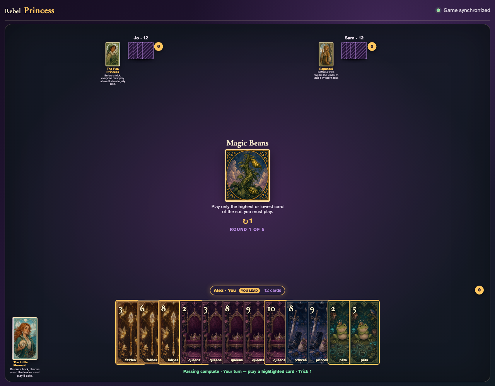
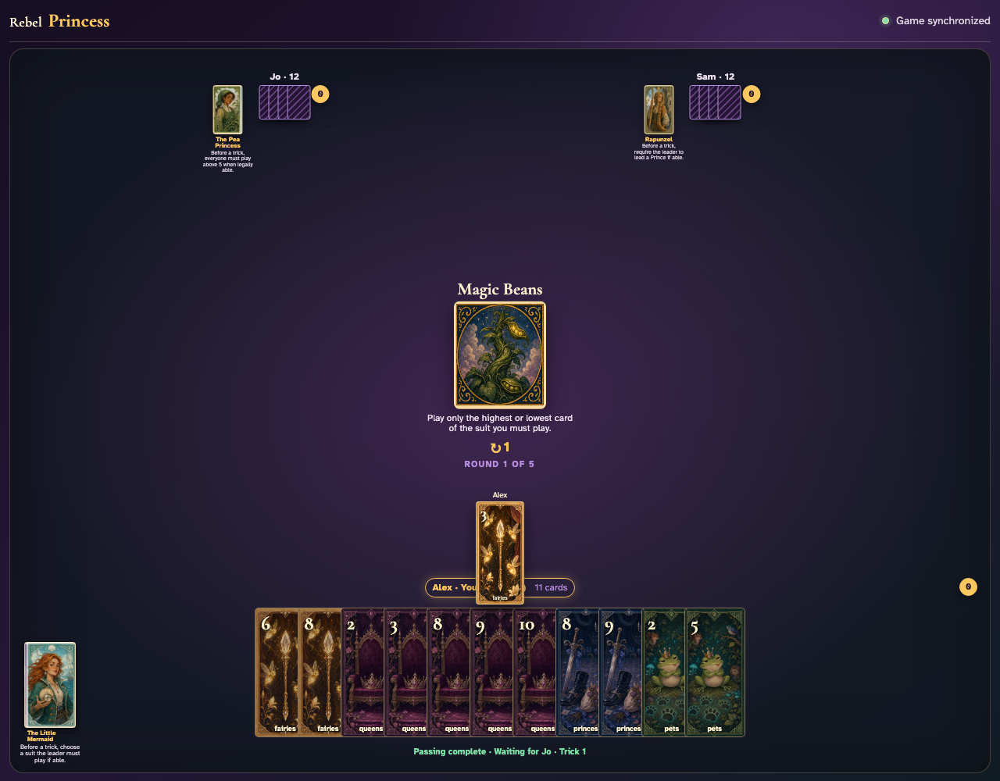
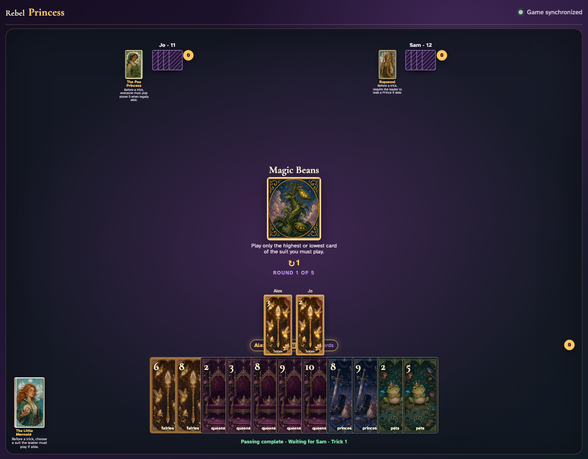
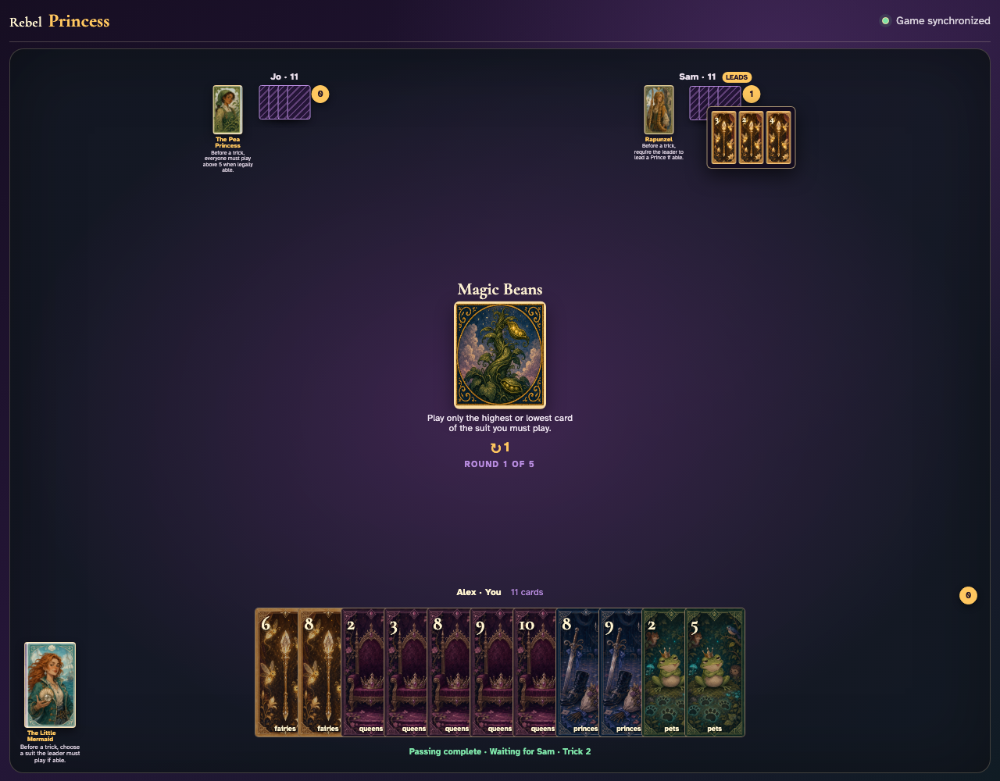

# Magic Beans

Reveal the rule, compare enabled extremes with a disabled middle card, then click a complete constrained trick and review it.

## For Fairies, only Fairies 3 and Fairies 8 are enabled; middle card Fairies 6 is disabled

**Verifications:**
- [x] The center prints the highest-or-lowest restriction
- [x] The suit’s lowest and highest cards are enabled
- [x] A middle card of the same suit is disabled

---

## Alex clicks Fairies 3; Jo is offered only the extreme legal followers

**Verifications:**
- [x] The exact lead graphic is visible
- [x] Jo has no more than two enabled cards in the led suit

---

## Jo clicks the constrained Fairies 2

**Verifications:**
- [x] Two exact card graphics are visible in play order
- [x] Sam receives the final turn

---

## Sam’s review shows all three clicked extreme-card plays

**Verifications:**
- [x] The awarded review contains three card graphics
- [x] Magic Beans remains the visible active Round card

---
