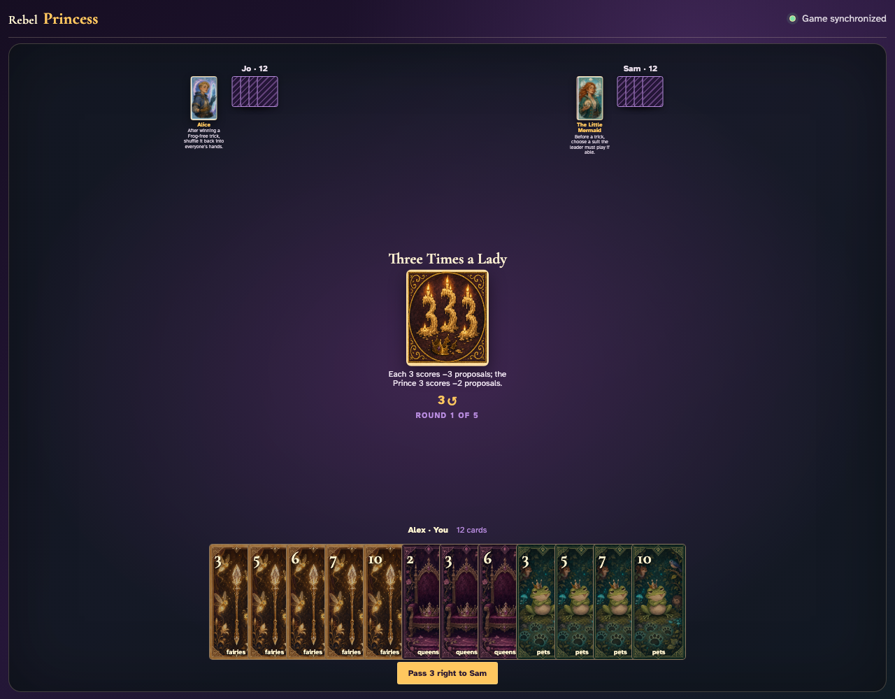
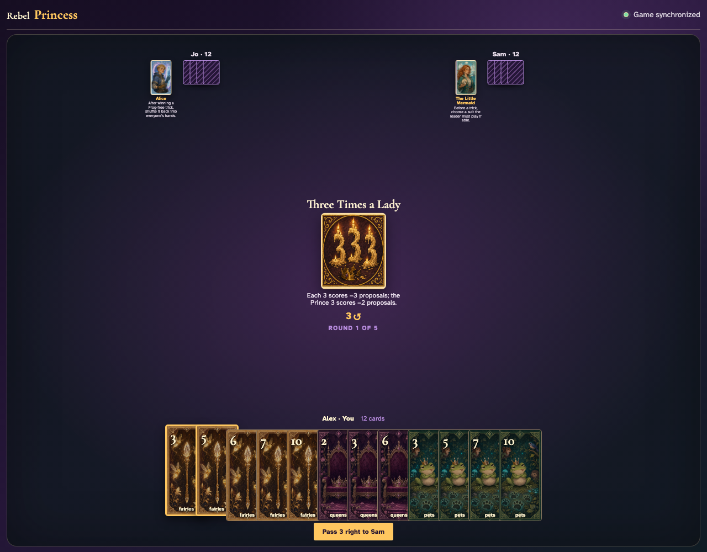
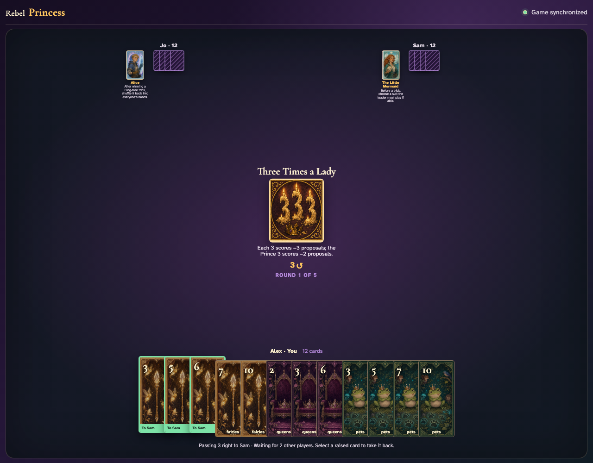
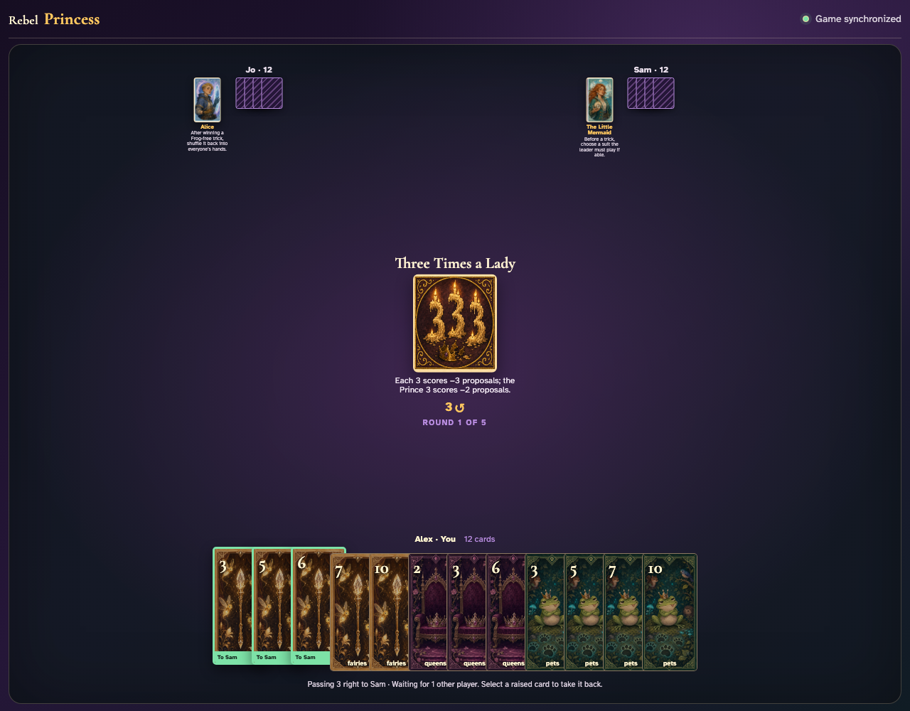
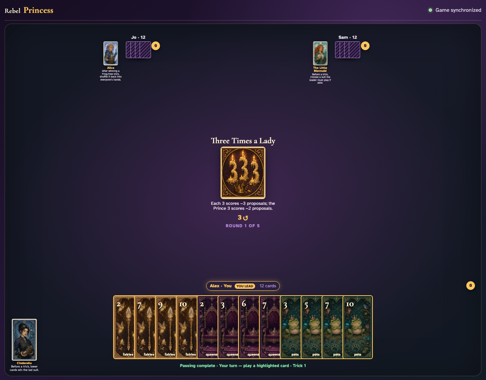
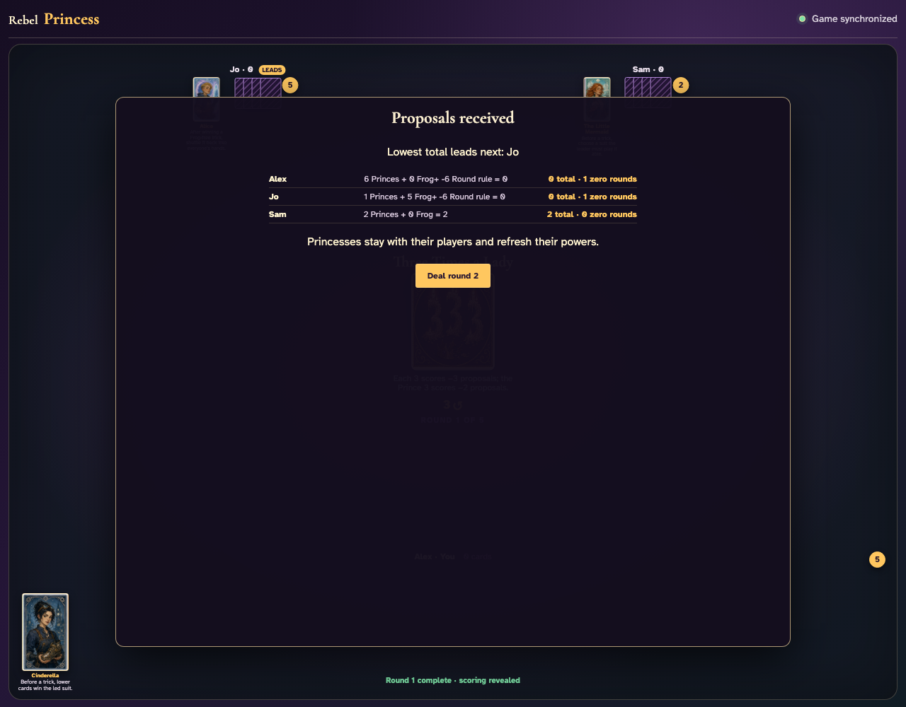

# Three Times a Lady

Reveal the negative-three rule, play every card through the regular UI, and inspect the exact scoring modifiers.

## Three Times a Lady prints a 3-card right pass before play begins

**Verifications:**
- [x] The center icon announces Pass 3 right
- [x] The action names Sam as the recipient
- [x] The pass cannot be committed before any card is chosen

---

## Alex clicks Fairies 3; it is assignment 1 of 3 to Sam

**Verifications:**
- [x] Exactly 1 chosen card is raised
- [x] Fairies 3 stays visibly selected
- [x] 2 more selections are still required

---

## Alex clicks Fairies 5; it is assignment 2 of 3 to Sam

**Verifications:**
- [x] Exactly 2 chosen cards are raised
- [x] Fairies 5 stays visibly selected
- [x] 1 more selection is still required

---

## Alex clicks Fairies 6; it is assignment 3 of 3 to Sam

**Verifications:**
- [x] Exactly 3 chosen cards are raised
- [x] Fairies 6 stays visibly selected
- [x] The complete printed pass is ready to commit

---

## Alex commits the 3 cards toward Sam while both other players are still choosing

**Verifications:**
- [x] All 3 outgoing cards remain visible and raised
- [x] The waiting message preserves the printed right direction
- [x] No incoming cards arrive before every player commits

---

## Jo commits next; Alex still sees the cards held until Sam makes the final decision

**Verifications:**
- [x] Exactly one other player remains
- [x] Alex can still identify every outgoing card

---

## Sam commits last; all three right transfers resolve simultaneously and play can begin

**Verifications:**
- [x] Every player again holds twelve cards
- [x] Alex receives the exact right incoming cards
- [x] The table leaves the simultaneous pass phase for play or the Round card’s next action

---

## The Round card announces that every rank 3 subtracts three proposals

**Verifications:**
- [x] The exact negative scoring rule is printed
- [x] All four rank-3 cards exist across the complete shared deal

---

## After all 36 ordinary card clicks, the scoring panel applies every captured 3 as a negative modifier

**Verifications:**
- [x] The round completes with all hands empty
- [x] The scoring panel visibly contains negative Round modifiers
- [x] Each negative modifier is arithmetically reflected in the round and cumulative totals

---
