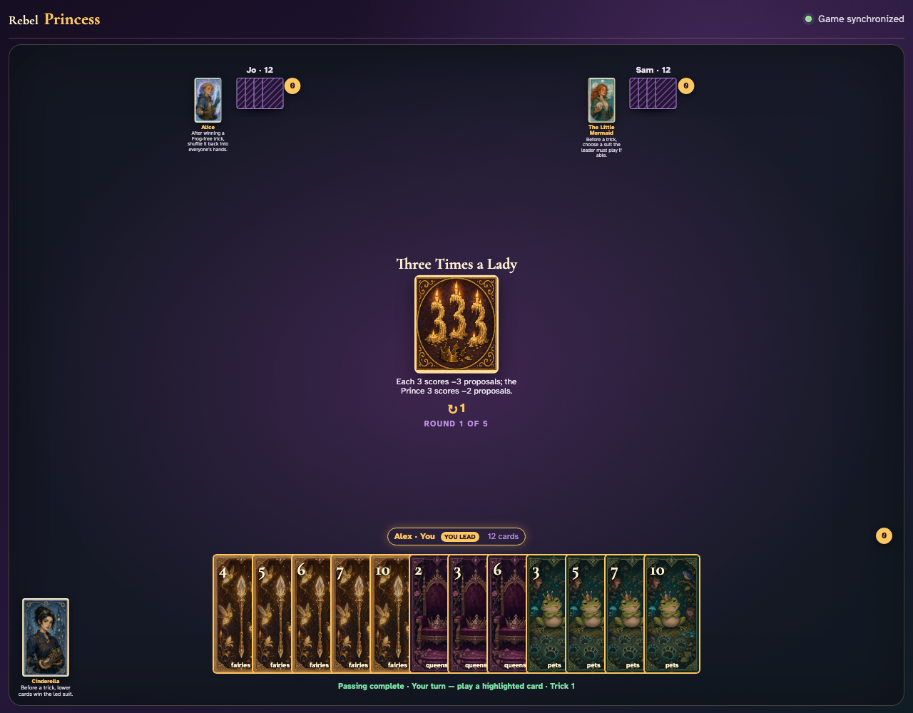
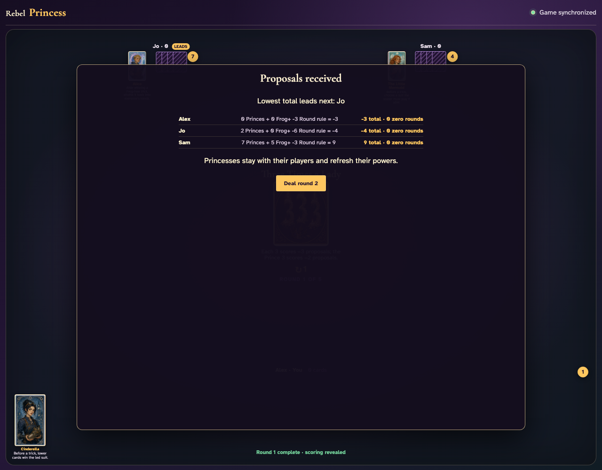

# Three Times a Lady

Reveal the negative-three rule, play every card through the regular UI, and inspect the exact scoring modifiers.

## The Round card announces that every rank 3 subtracts three proposals

**Verifications:**
- [x] The exact negative scoring rule is printed
- [x] All four rank-3 cards exist across the complete shared deal

---

## After all 36 ordinary card clicks, the scoring panel applies every captured 3 as a negative modifier

**Verifications:**
- [x] The round completes with all hands empty
- [x] The scoring panel visibly contains negative Round modifiers
- [x] The negative scores are reflected in cumulative totals

---
