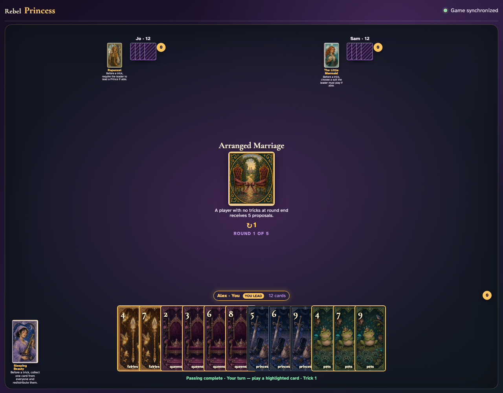
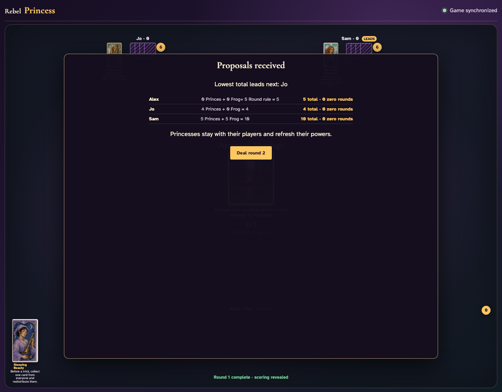

# Arranged Marriage

Reveal the trickless penalty, play all 36 cards through the UI, and compare a trickless player’s five proposals with a player who captured a trick.

## Arranged Marriage warns that ending the round without a trick costs five proposals

**Verifications:**
- [x] The exact trickless penalty is printed
- [x] Every player begins with zero captured tricks

---

## Alex captured no tricks and receives the visible five-proposal Round penalty

**Verifications:**
- [x] Alex still has zero captured tricks
- [x] The scoring row contains the +5 Round rule modifier
- [x] At least one player with a captured trick avoids that modifier

---
