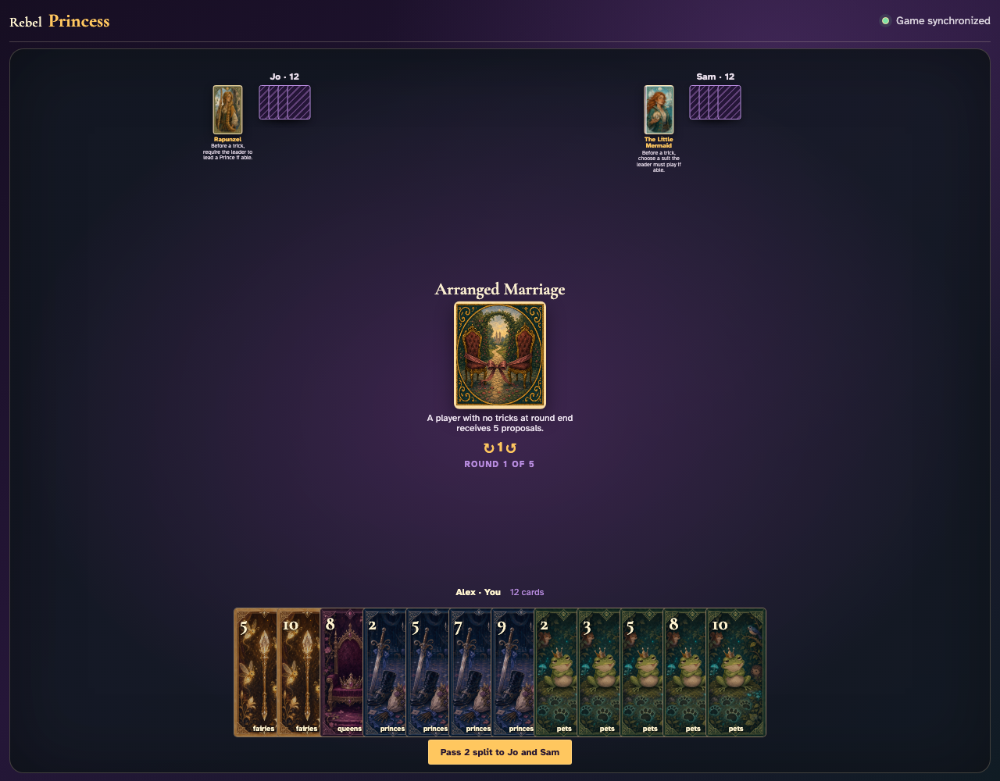
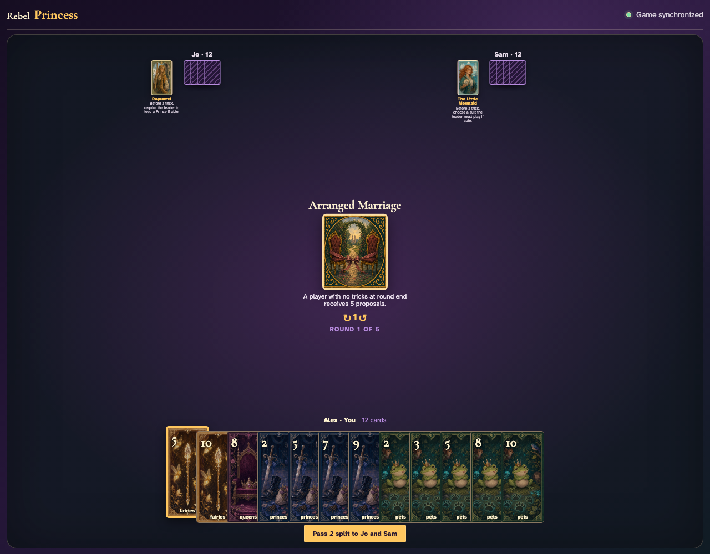
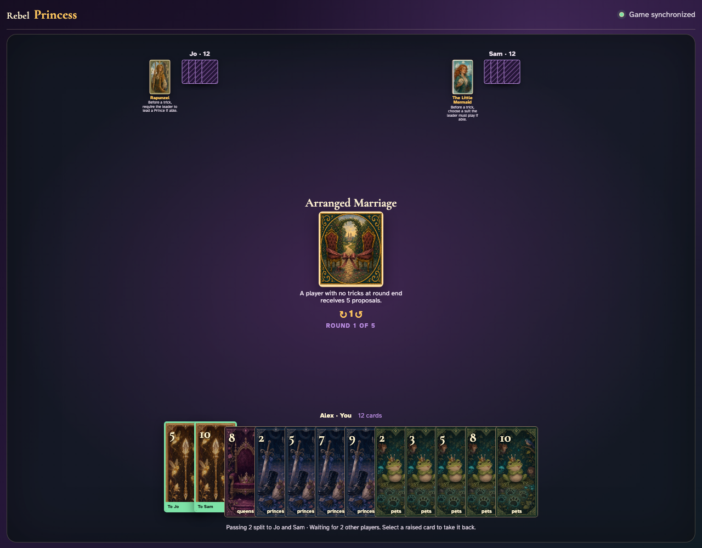
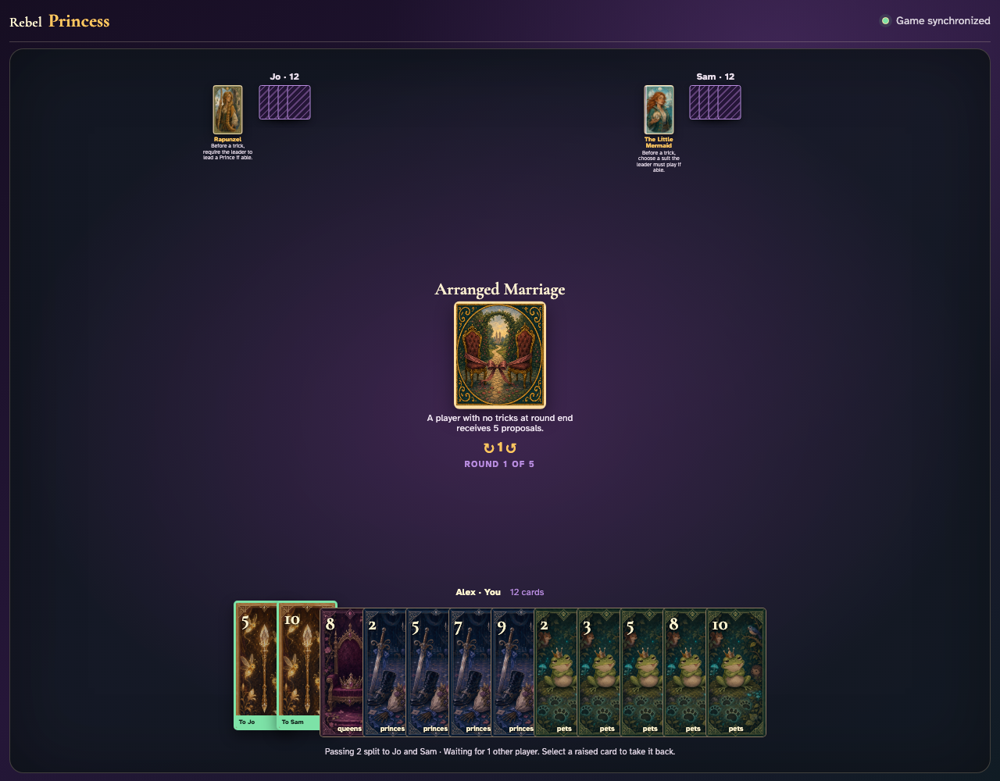
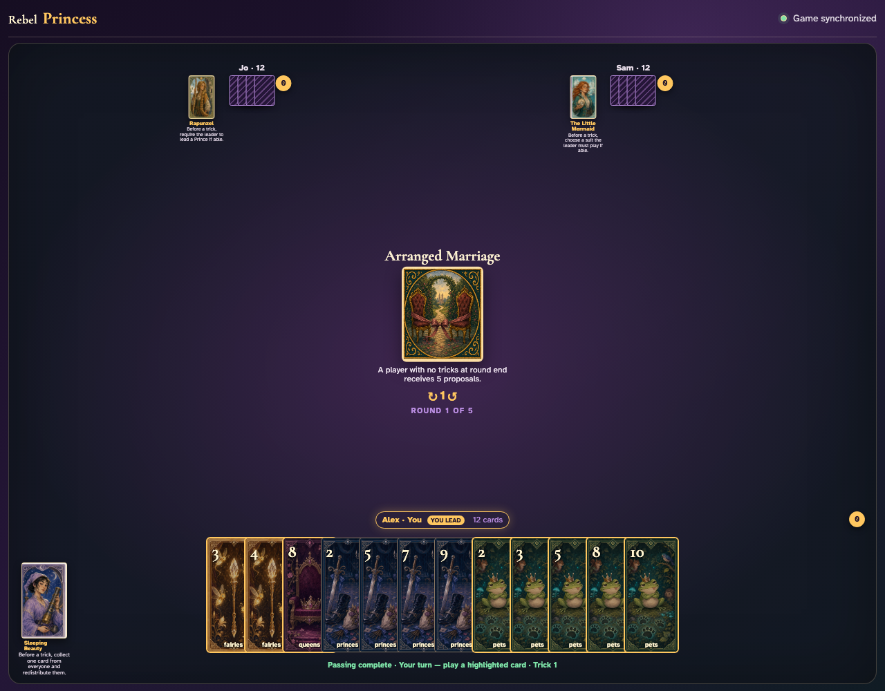
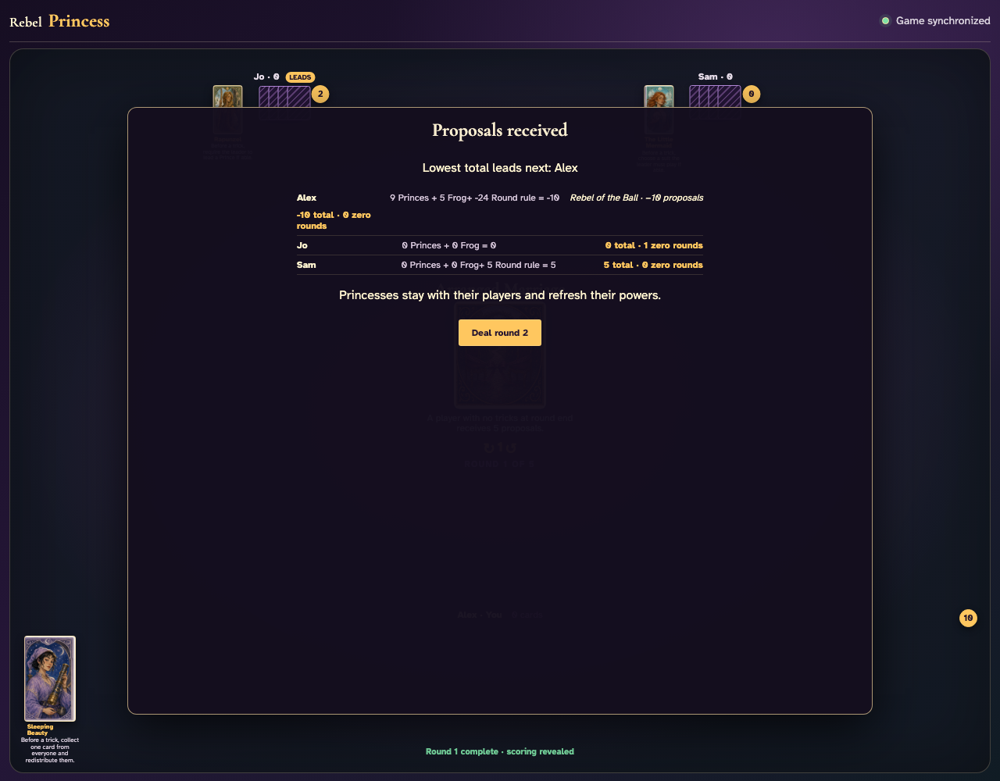

# Arranged Marriage

Reveal the trickless penalty, play all 36 cards through the UI, and compare a trickless player’s five proposals with a player who captured a trick.

## Arranged Marriage prints a 2-card split pass before play begins

**Verifications:**
- [x] The center icon announces Pass 2 split
- [x] The action names Jo and Sam as the recipients
- [x] The pass cannot be committed before any card is chosen

---

## Alex clicks Fairies 5; it is assignment 1 of 2 to Jo

**Verifications:**
- [x] Exactly 1 chosen card is raised
- [x] Fairies 5 stays visibly selected
- [x] 1 more selection is still required

---

## Alex clicks Fairies 10; it is assignment 2 of 2 to Sam

**Verifications:**
- [x] Exactly 2 chosen cards are raised
- [x] Fairies 10 stays visibly selected
- [x] The complete printed pass is ready to commit

---

## Alex commits the 2 cards toward Jo and Sam while both other players are still choosing

**Verifications:**
- [x] All 2 outgoing cards remain visible and raised
- [x] The waiting message preserves the printed split direction
- [x] No incoming cards arrive before every player commits

---

## Jo commits next; Alex still sees the cards held until Sam makes the final decision

**Verifications:**
- [x] Exactly one other player remains
- [x] Alex can still identify every outgoing card

---

## Sam commits last; all three split transfers resolve simultaneously and play can begin

**Verifications:**
- [x] Every player again holds twelve cards
- [x] Alex receives the exact split incoming cards
- [x] The table leaves the simultaneous pass phase for play or the Round card’s next action

---

## Arranged Marriage warns that ending the round without a trick costs five proposals

**Verifications:**
- [x] The exact trickless penalty is printed
- [x] Every player begins with zero captured tricks

---

## Sam captured no tricks and receives the visible five-proposal Round penalty

**Verifications:**
- [x] Sam still has zero captured tricks
- [x] The scoring row contains the +5 Round rule modifier
- [x] At least one player with a captured trick avoids that modifier

---
