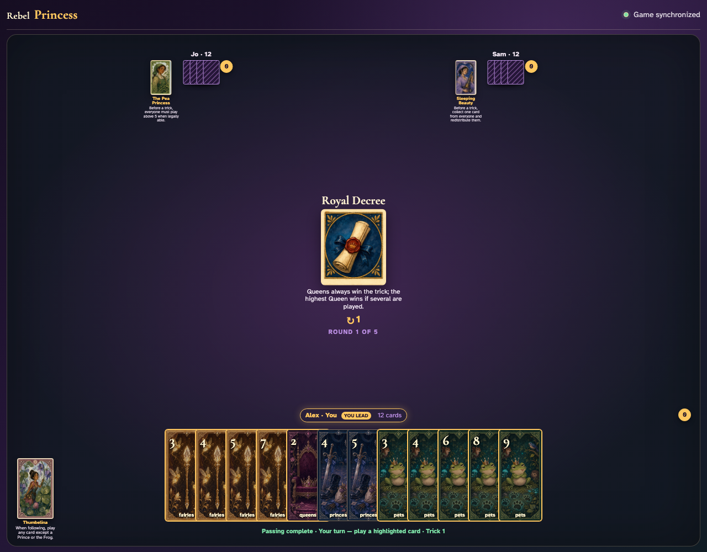
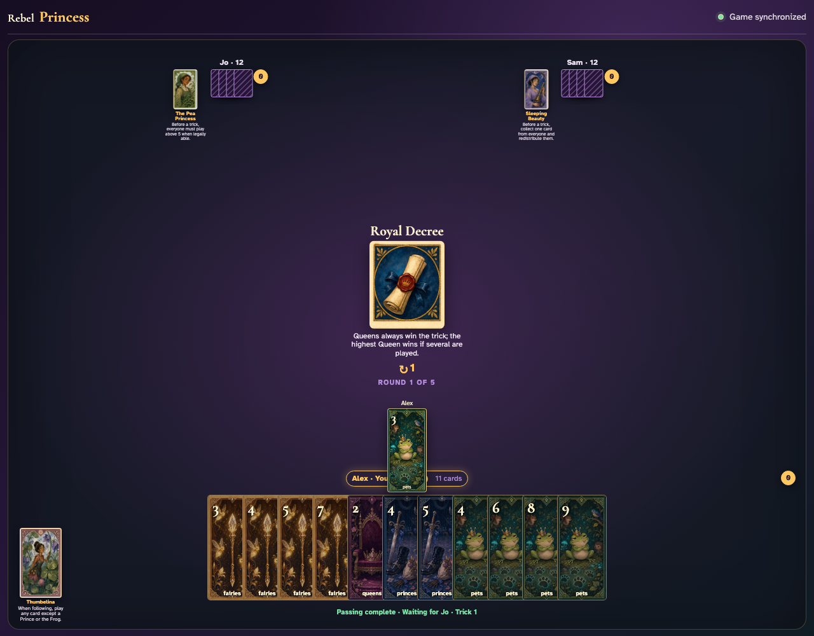
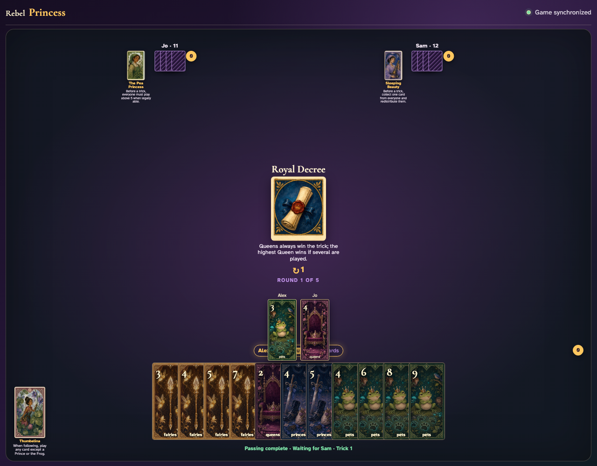

# Royal Decree

Lead a Pet, click an off-suit Queen, complete the trick, and open Jo’s awarded cards to prove Queens are trump.

## Royal Decree is visible before Alex leads Pets 3

**Verifications:**
- [x] The center states that Queens always win
- [x] Pets 3 is a legal non-Queen lead

---

## Alex clicks Pets 3, establishing Pets as the ordinary led suit

**Verifications:**
- [x] The Pet graphic is alone in the center
- [x] Jo is void and receives the next turn

---

## Jo clicks off-suit Queens 4; its Queen graphic remains visible beside the Pet lead

**Verifications:**
- [x] The center shows both exact cards
- [x] Sam receives the final turn

---

## Jo’s awarded review proves Queens 4 trumped the led Pet

**Verifications:**
- [x] Jo has exactly one captured trick
- [x] The open review includes Jo’s Queen and Alex’s Pet

---
