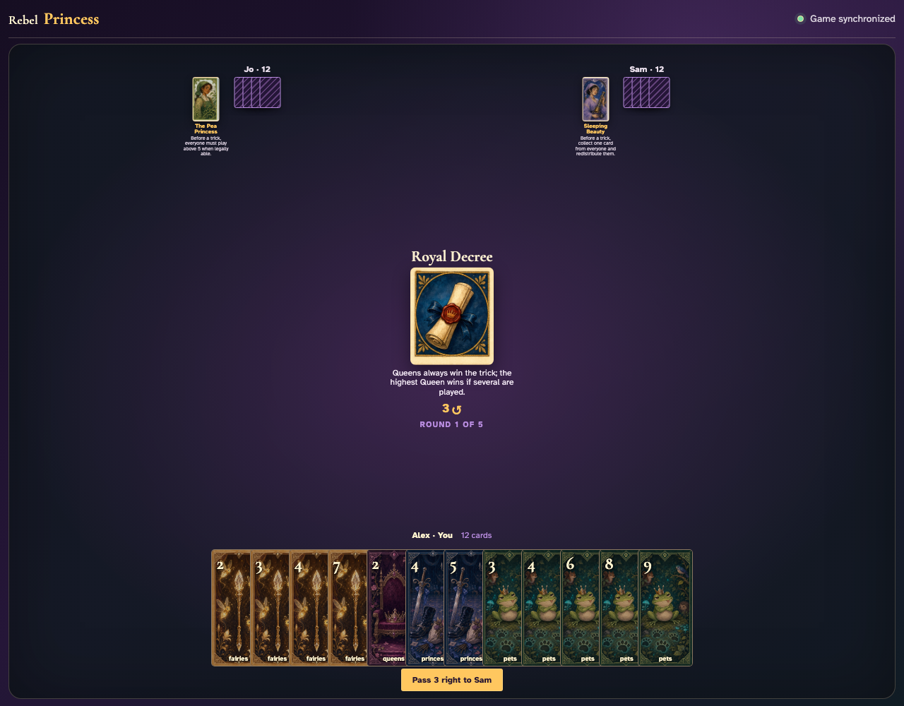
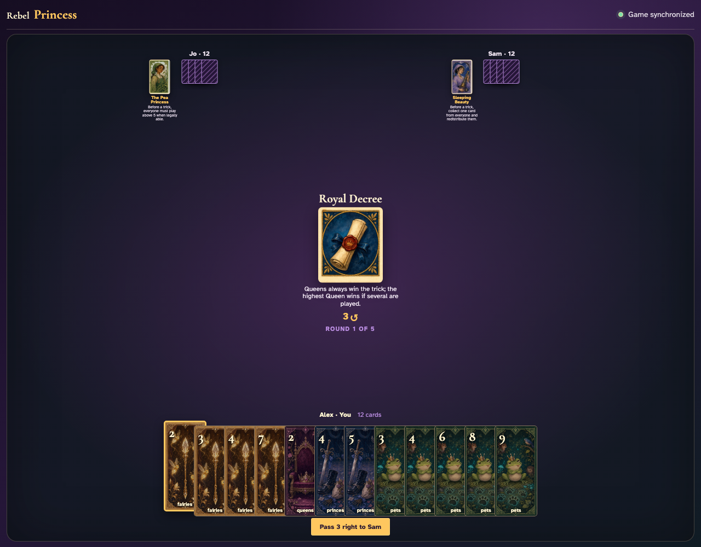
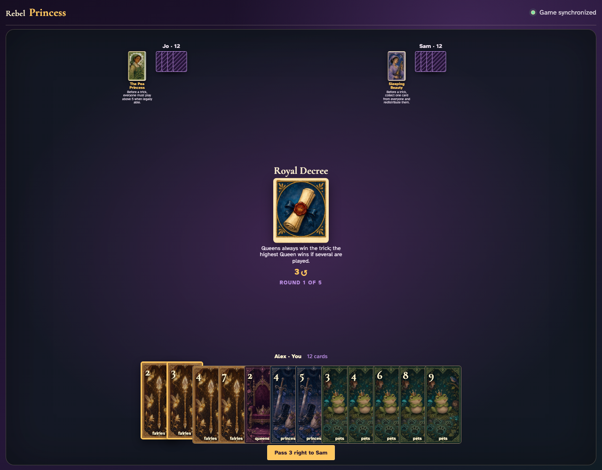
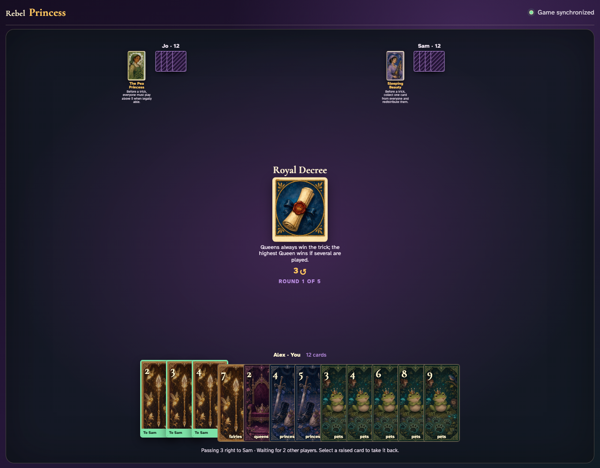
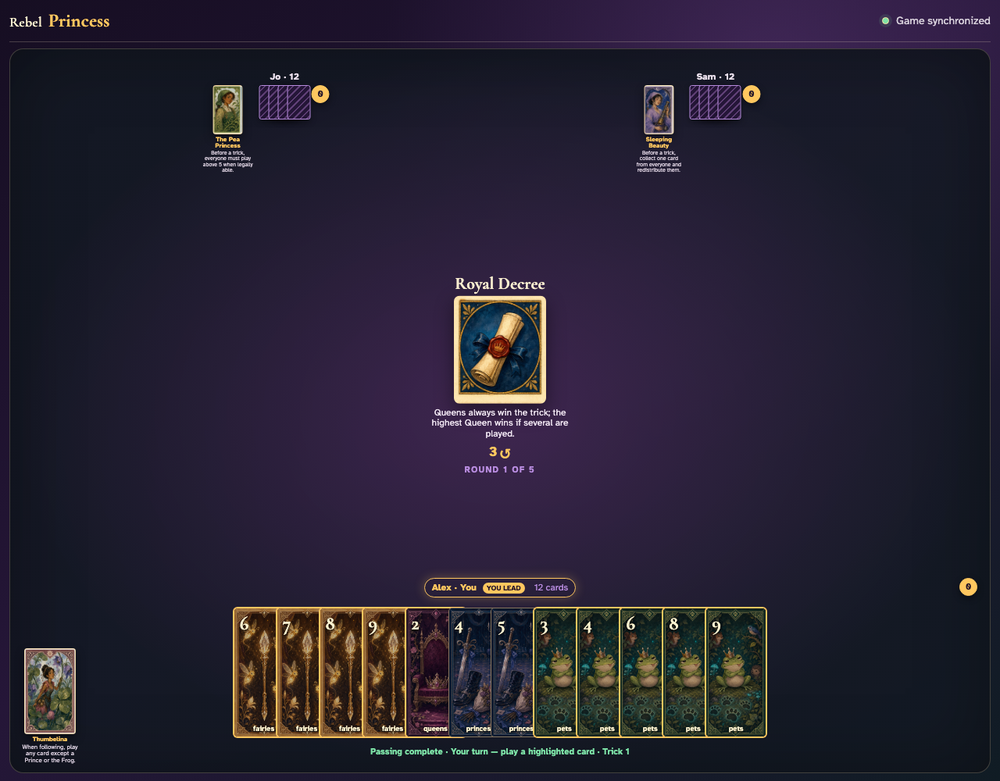
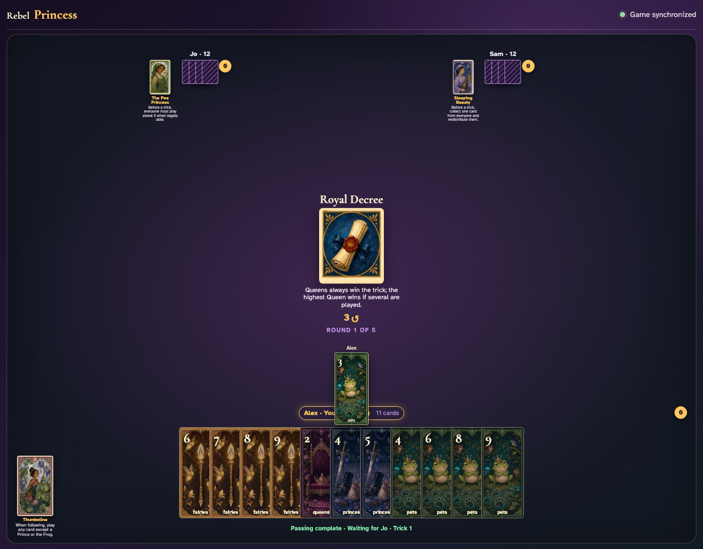
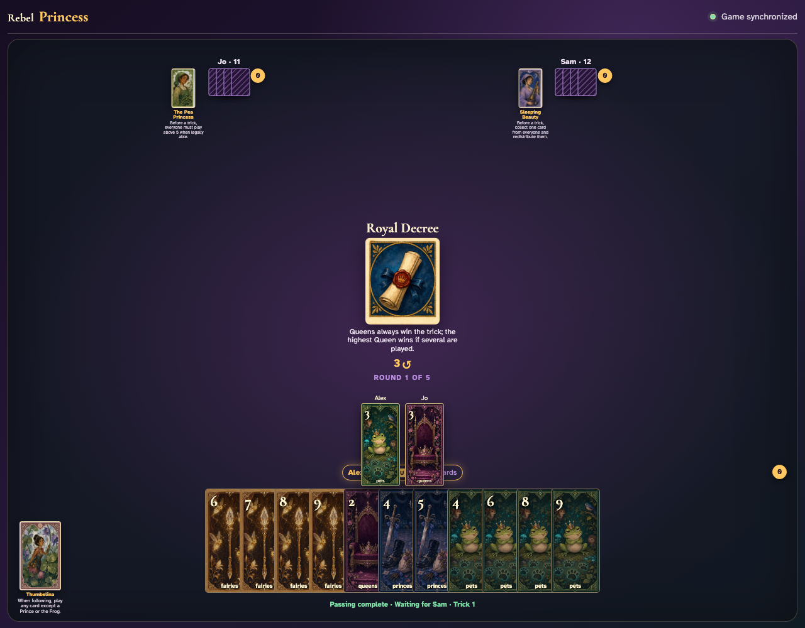
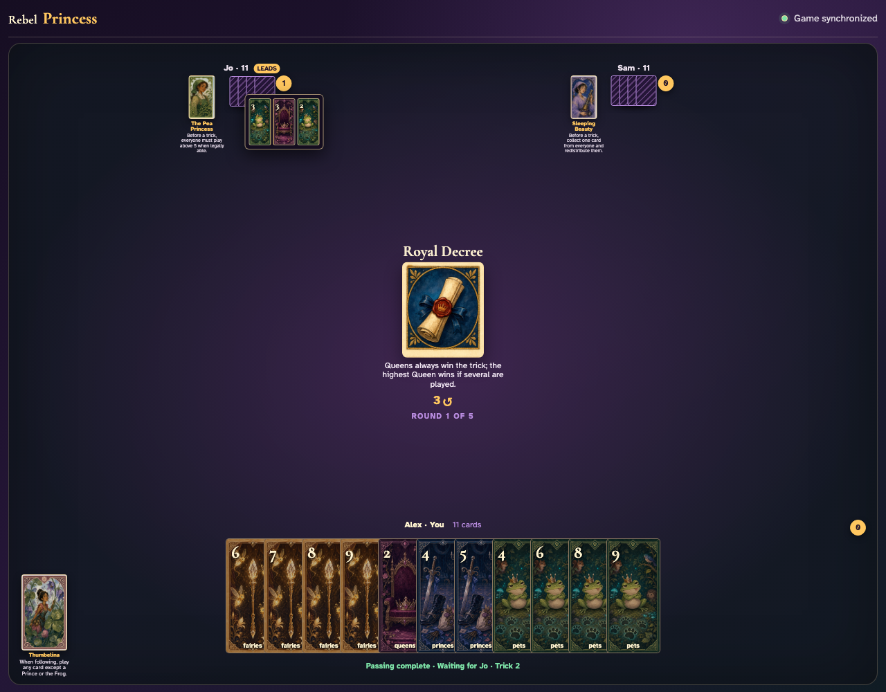

# Royal Decree

Lead a Pet, click an off-suit Queen, complete the trick, and open Jo’s awarded cards to prove Queens are trump.

## Royal Decree prints a 3-card right pass before play begins

**Verifications:**
- [x] The center icon announces Pass 3 right
- [x] The action names Sam as the recipient
- [x] The pass cannot be committed before any card is chosen

---

## Alex clicks Fairies 2; it is assignment 1 of 3 to Sam

**Verifications:**
- [x] Exactly 1 chosen card is raised
- [x] Fairies 2 stays visibly selected
- [x] 2 more selections are still required

---

## Alex clicks Fairies 3; it is assignment 2 of 3 to Sam

**Verifications:**
- [x] Exactly 2 chosen cards are raised
- [x] Fairies 3 stays visibly selected
- [x] 1 more selection is still required

---

## Alex clicks Fairies 4; it is assignment 3 of 3 to Sam

**Verifications:**
- [x] Exactly 3 chosen cards are raised
- [x] Fairies 4 stays visibly selected
- [x] The complete printed pass is ready to commit

---

## Alex commits the 3 cards toward Sam while both other players are still choosing

**Verifications:**
- [x] All 3 outgoing cards remain visible and raised
- [x] The waiting message preserves the printed right direction
- [x] No incoming cards arrive before every player commits

---

## Jo commits next; Alex still sees the cards held until Sam makes the final decision

**Verifications:**
- [x] Exactly one other player remains
- [x] Alex can still identify every outgoing card

---

## Sam commits last; all three right transfers resolve simultaneously and play can begin

**Verifications:**
- [x] Every player again holds twelve cards
- [x] Alex receives the exact right incoming cards
- [x] The table leaves the simultaneous pass phase for play or the Round card’s next action

---

## Royal Decree is visible before Alex leads Pets 3

**Verifications:**
- [x] The center states that Queens always win
- [x] Pets 3 is a legal non-Queen lead

---

## Alex clicks Pets 3, establishing Pets as the ordinary led suit

**Verifications:**
- [x] The Pet graphic is alone in the center
- [x] Jo is void and receives the next turn

---

## Jo clicks off-suit Queens 3; its Queen graphic remains visible beside the Pet lead

**Verifications:**
- [x] The center shows both exact cards
- [x] Sam receives the final turn

---

## Jo’s awarded review proves Queens 3 trumped the led Pet

**Verifications:**
- [x] Jo has exactly one captured trick
- [x] The open review includes Jo’s Queen and Alex’s Pet

---
