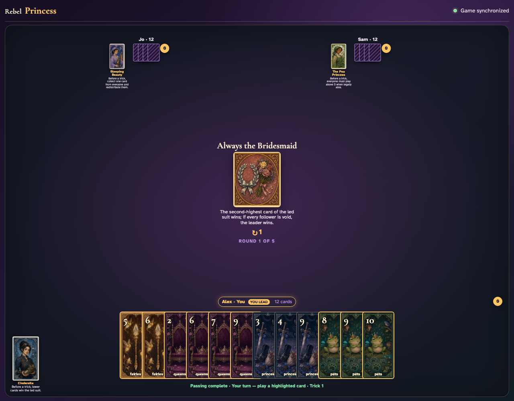
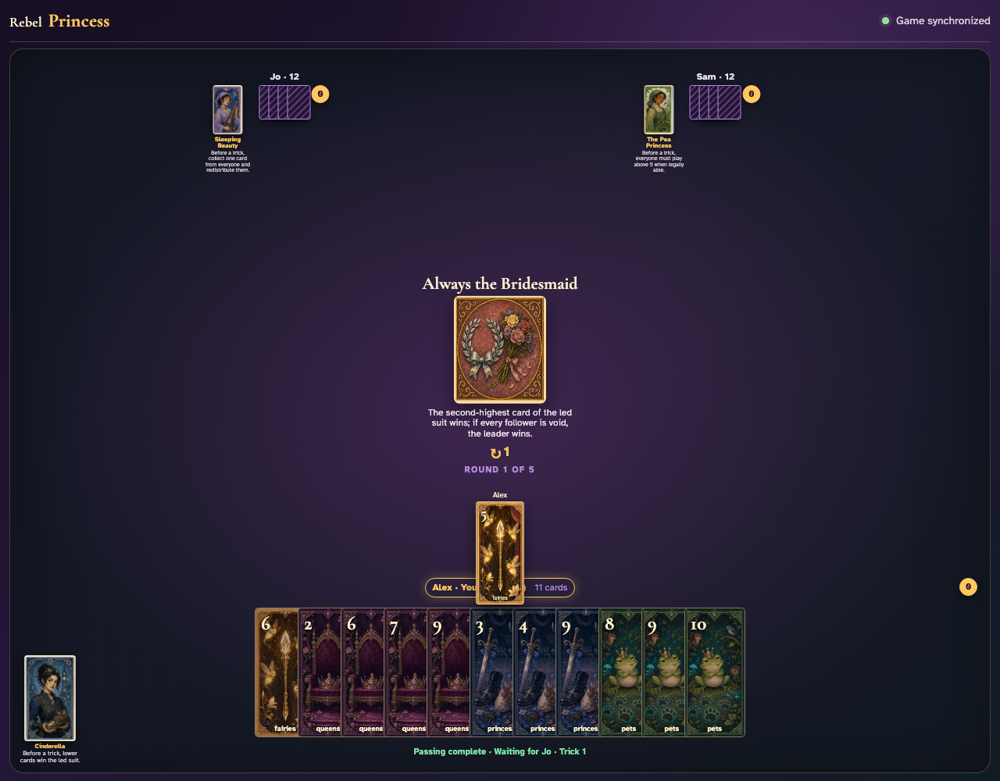
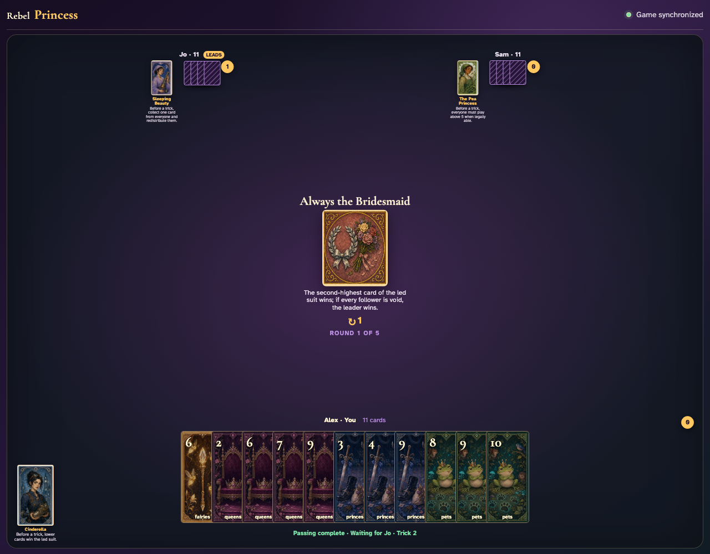
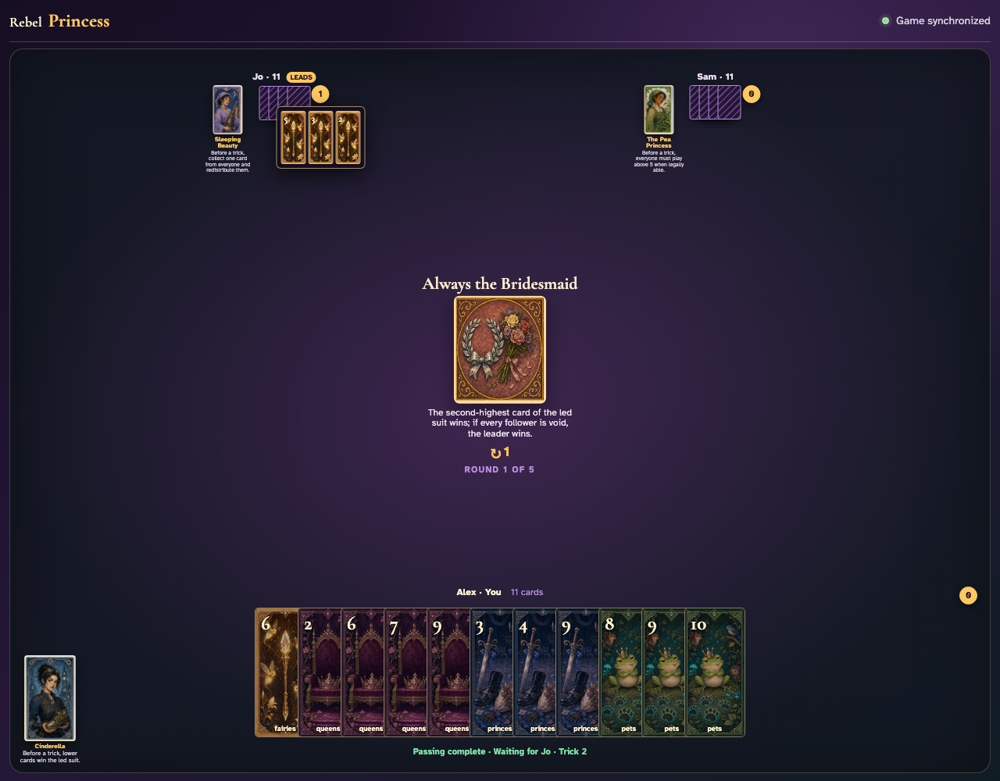

# Always the Bridesmaid

Play a complete visible trick and prove the second-highest card—not the highest—takes it.

## The center announces the second-highest winning rule before anyone plays

**Verifications:**
- [x] The exact rule is readable
- [x] The leader has a playable card

---

## Alex leads Fairies 5, making its suit the one that matters

**Verifications:**
- [x] The exact lead is visible at the table center
- [x] The next player is prompted through the normal UI

---

## The completed trick increments Jo rather than the player of the highest card

**Verifications:**
- [x] The trick counter awards Jo
- [x] Every other player remains at zero tricks

---

## Jo opens all three captured cards: Fairies 5 is highest, but Fairies 3 is the second-highest winner

**Verifications:**
- [x] The review contains the highest card that deliberately lost
- [x] The review contains the second-highest winning card

---
