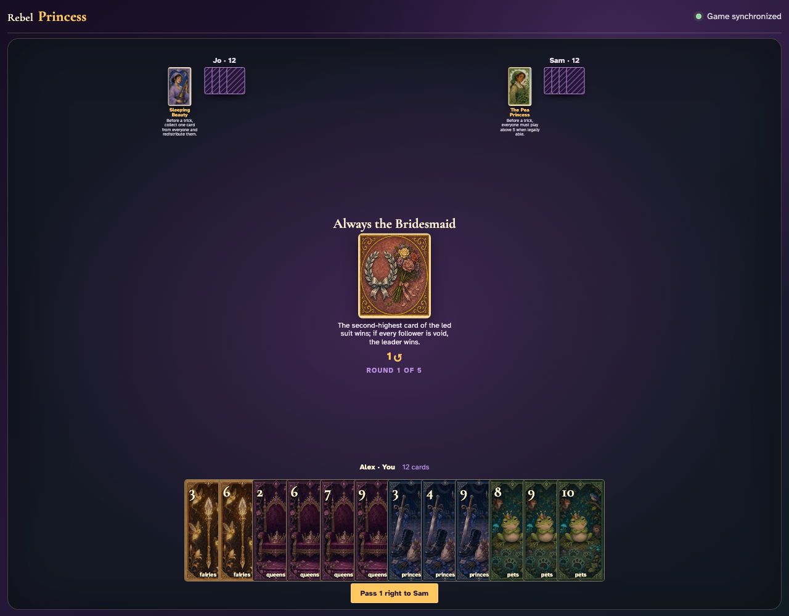
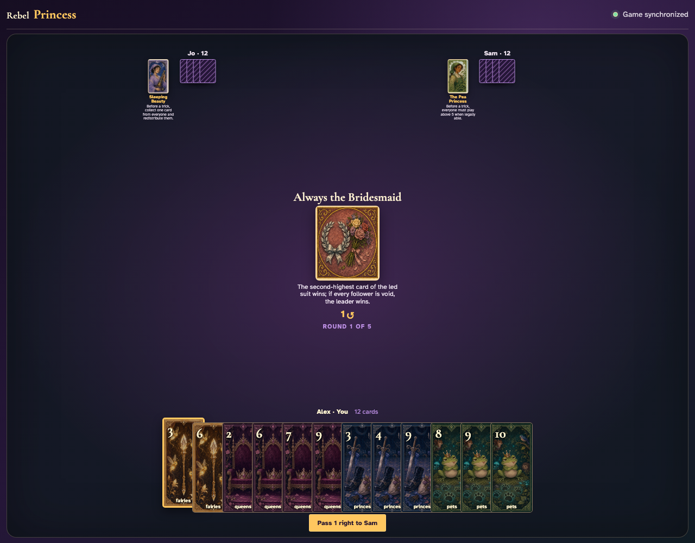
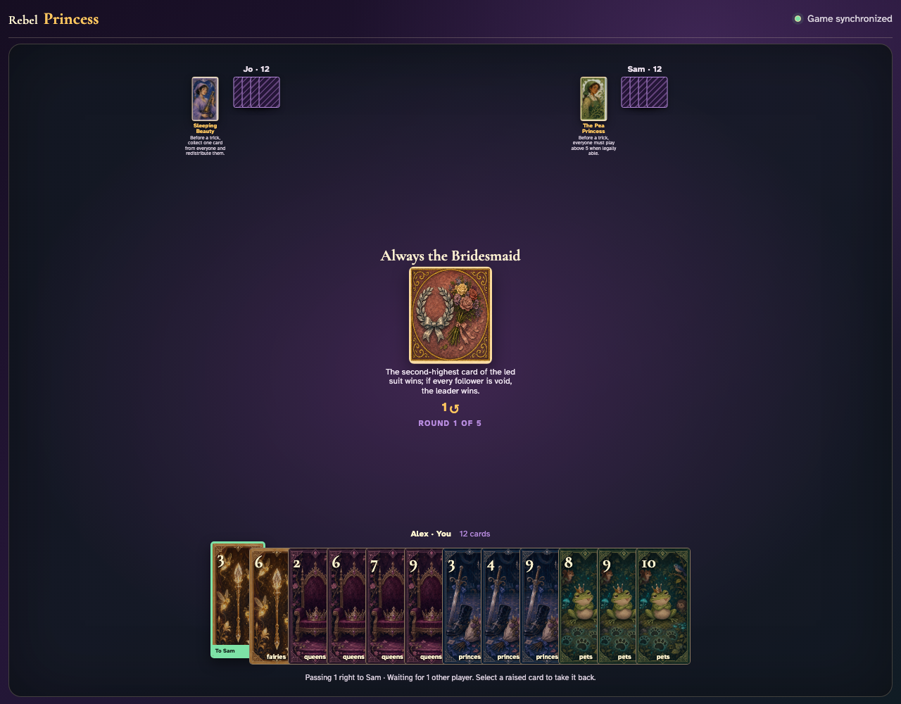
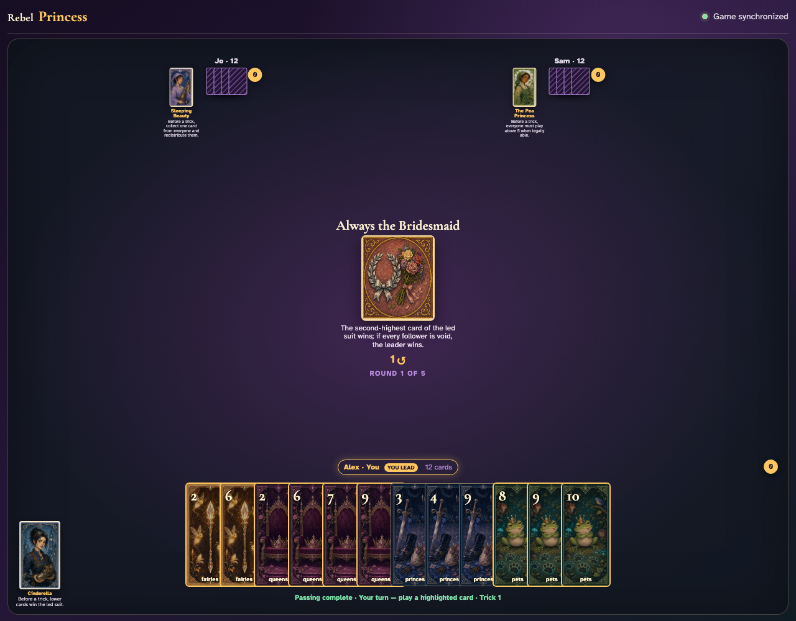
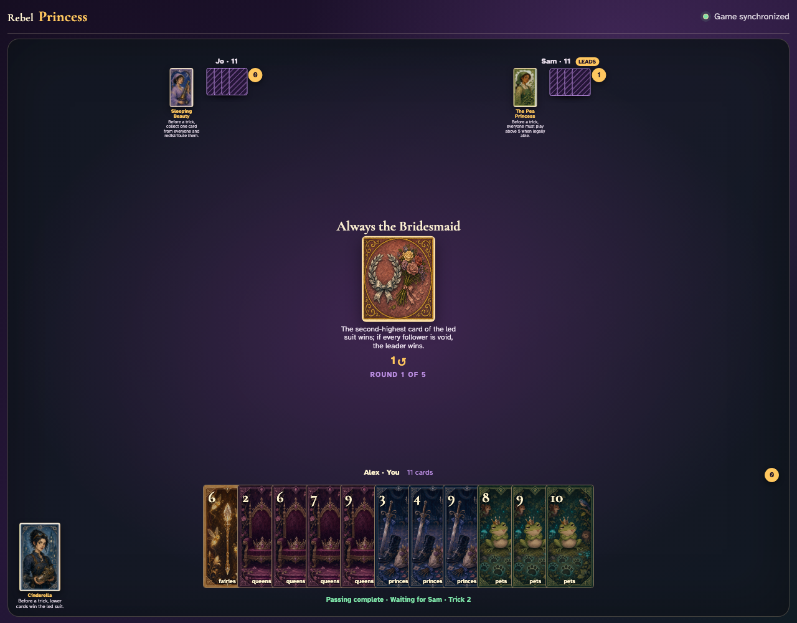
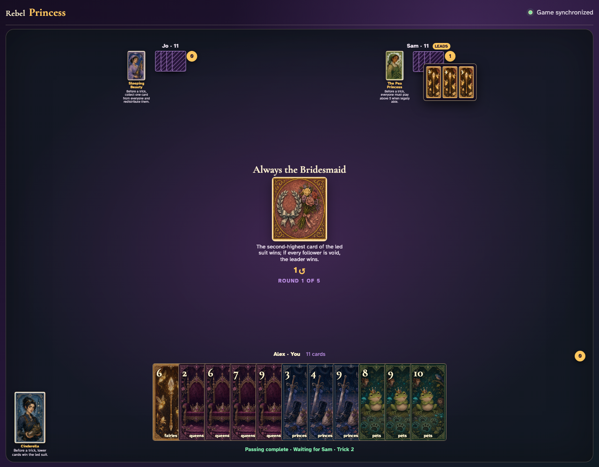

# Always the Bridesmaid

Play a complete visible trick and prove the second-highest card—not the highest—takes it.

## Always the Bridesmaid prints a 1-card right pass before play begins

**Verifications:**
- [x] The center icon announces Pass 1 right
- [x] The action names Sam as the recipient
- [x] The pass cannot be committed before any card is chosen

---

## Alex clicks Fairies 3; it is assignment 1 of 1 to Sam

**Verifications:**
- [x] Exactly 1 chosen card is raised
- [x] Fairies 3 stays visibly selected
- [x] The complete printed pass is ready to commit

---

## Alex commits the 1 cards toward Sam while both other players are still choosing

**Verifications:**
- [x] All 1 outgoing cards remain visible and raised
- [x] The waiting message preserves the printed right direction
- [x] No incoming cards arrive before every player commits

---

## Jo commits next; Alex still sees the cards held until Sam makes the final decision

**Verifications:**
- [x] Exactly one other player remains
- [x] Alex can still identify every outgoing card

---

## Sam commits last; all three right transfers resolve simultaneously and play can begin

**Verifications:**
- [x] Every player again holds twelve cards
- [x] Alex receives the exact right incoming card
- [x] The table leaves the simultaneous pass phase for play or the Round card’s next action

---

## The center announces the second-highest winning rule before anyone plays

**Verifications:**
- [x] The exact rule is readable
- [x] The leader has a playable card

---

## Alex leads Fairies 2, making its suit the one that matters

**Verifications:**
- [x] The exact lead is visible at the table center
- [x] The next player is prompted through the normal UI

---

## The completed trick increments Sam rather than the player of the highest card

**Verifications:**
- [x] The trick counter awards Sam
- [x] Every other player remains at zero tricks

---

## Sam opens all three captured cards: Fairies 4 is highest, but Fairies 3 is the second-highest winner

**Verifications:**
- [x] The review contains the highest card that deliberately lost
- [x] The review contains the second-highest winning card

---
