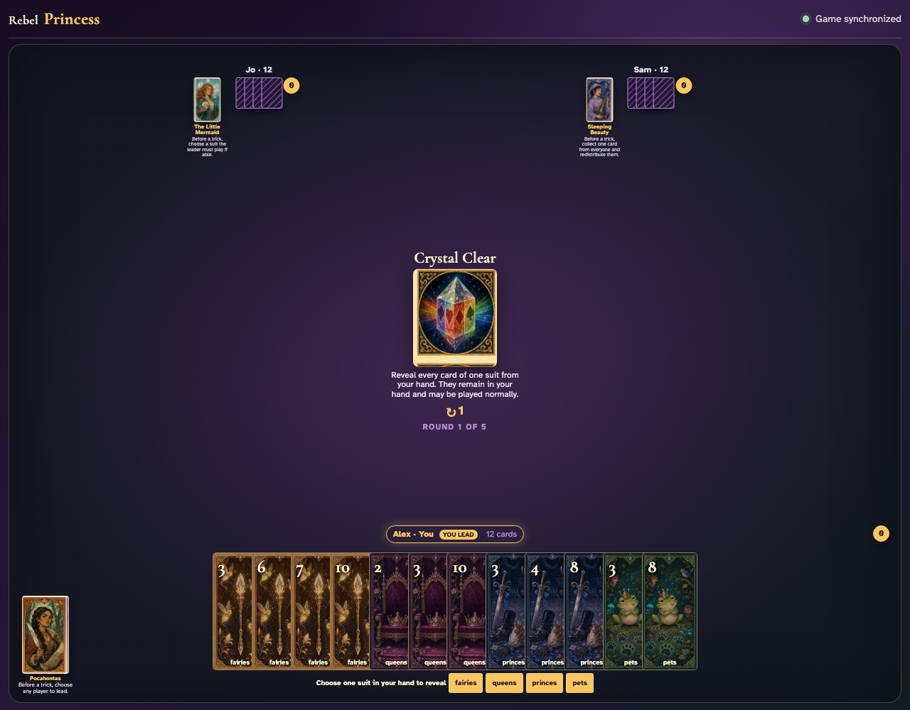
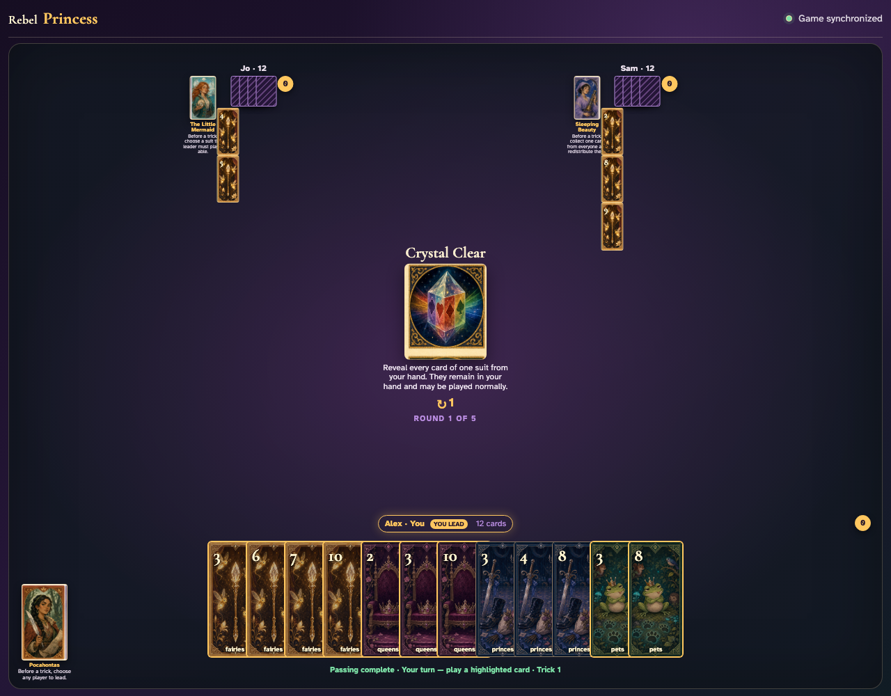
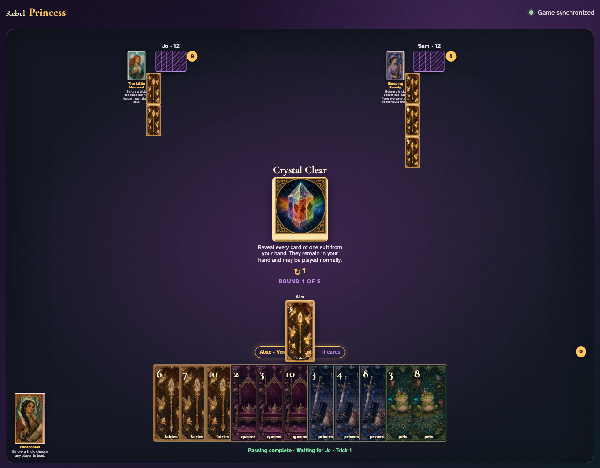

# Crystal Clear

Each player chooses through the UI, everyone sees the original revealed cards, and the leader plays one normally.

## After passing, every client is prompted to reveal a suit they actually hold

**Verifications:**
- [x] The center explains that revealed cards remain in hand
- [x] All three clients have suit-choice buttons

---

## Jo reveals fairies and Sam reveals fairies; their exact original cards are face up to Alex

**Verifications:**
- [x] Every Jo card selected by the reveal is publicly labelled
- [x] Every Sam card selected by the reveal is publicly labelled

---

## Alex clicks the revealed Fairies 3; revealing gave information but never removed or disabled it

**Verifications:**
- [x] The actual revealed card graphic is now in the trick
- [x] The next clockwise player receives a normal turn

---
