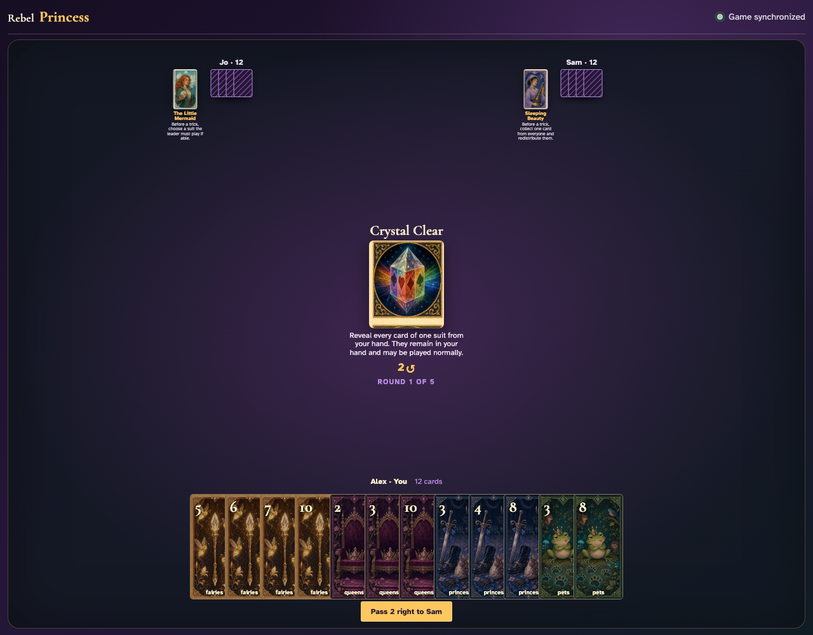
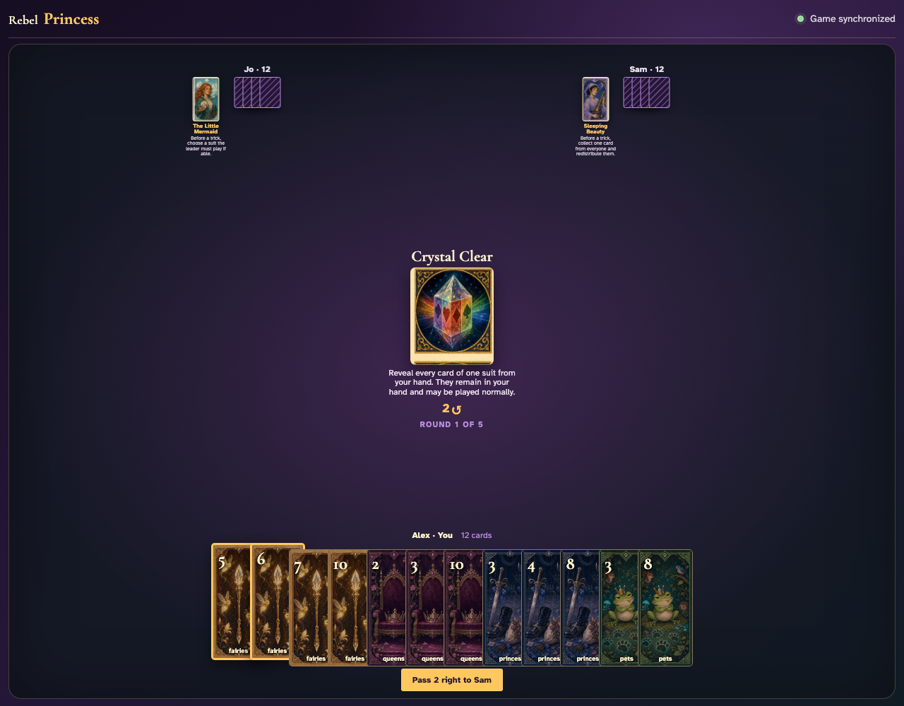
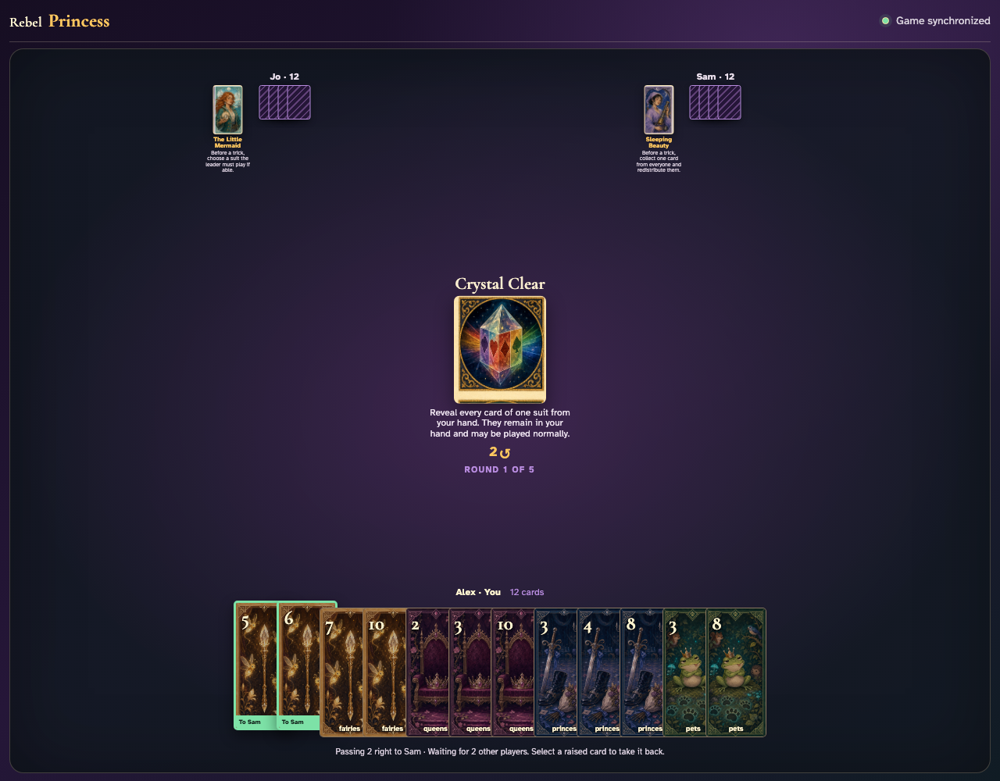
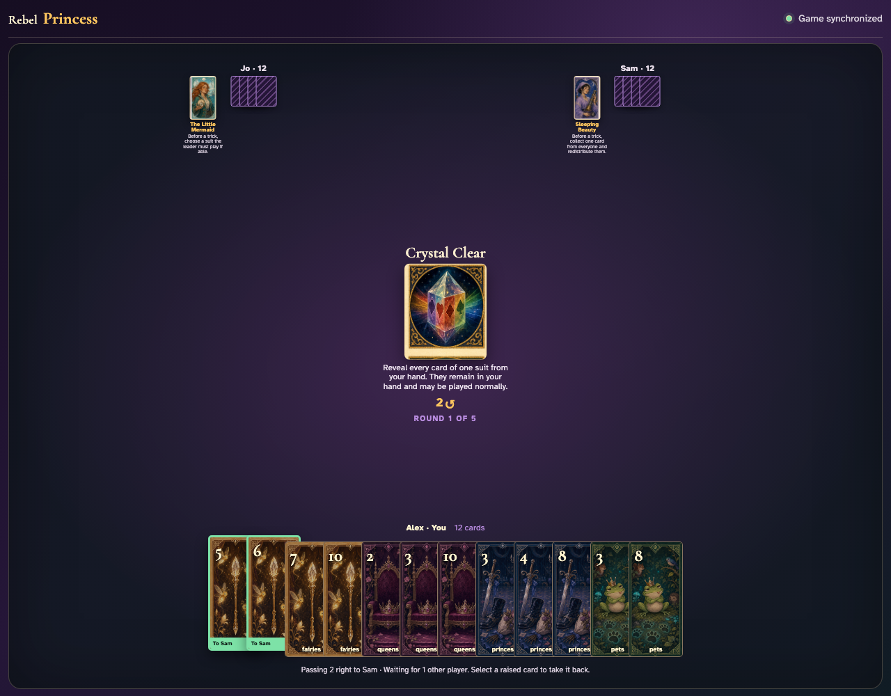
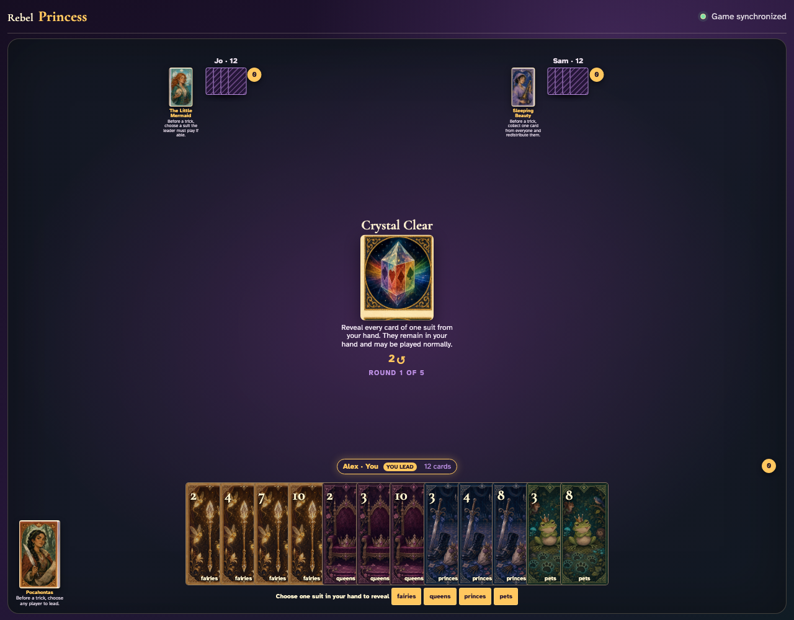
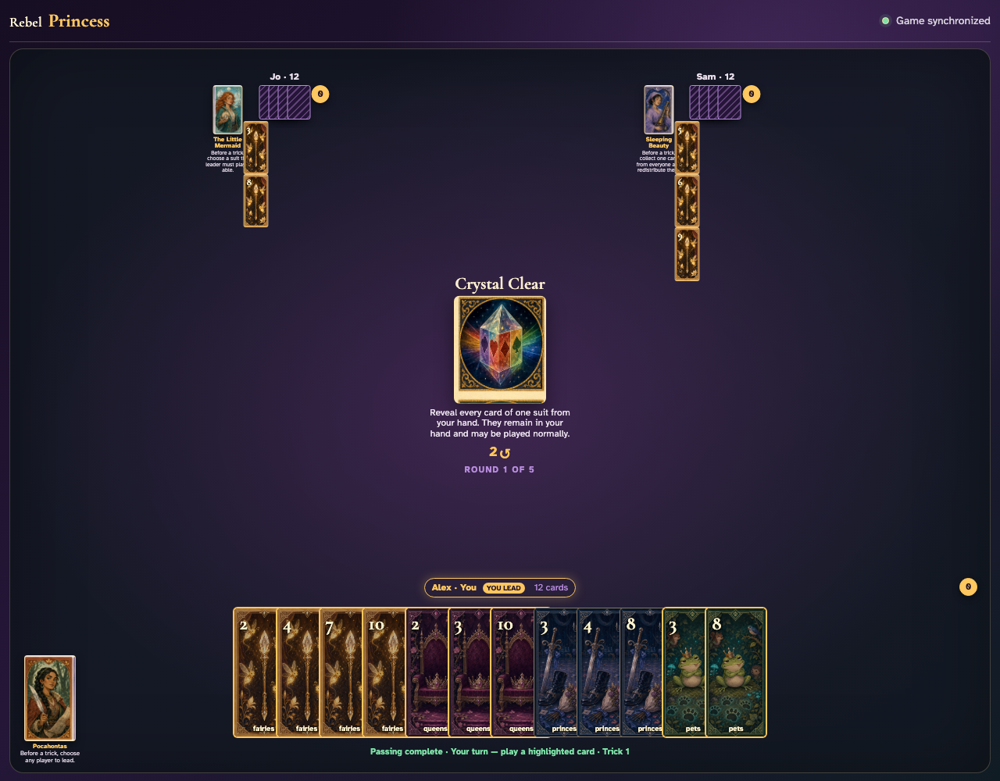
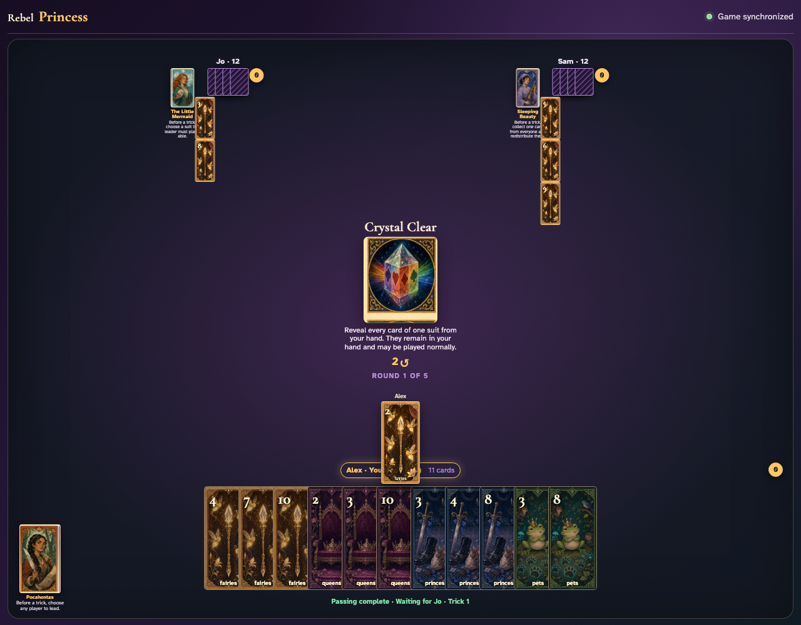

# Crystal Clear

Each player chooses through the UI, everyone sees the original revealed cards, and the leader plays one normally.

## Crystal Clear prints a 2-card right pass before play begins

**Verifications:**
- [x] The center icon announces Pass 2 right
- [x] The action names Sam as the recipient
- [x] The pass cannot be committed before any card is chosen

---

## Alex clicks Fairies 5; it is assignment 1 of 2 to Sam

**Verifications:**
- [x] Exactly 1 chosen card is raised
- [x] Fairies 5 stays visibly selected
- [x] 1 more selection is still required

---

## Alex clicks Fairies 6; it is assignment 2 of 2 to Sam

**Verifications:**
- [x] Exactly 2 chosen cards are raised
- [x] Fairies 6 stays visibly selected
- [x] The complete printed pass is ready to commit

---

## Alex commits the 2 cards toward Sam while both other players are still choosing

**Verifications:**
- [x] All 2 outgoing cards remain visible and raised
- [x] The waiting message preserves the printed right direction
- [x] No incoming cards arrive before every player commits

---

## Jo commits next; Alex still sees the cards held until Sam makes the final decision

**Verifications:**
- [x] Exactly one other player remains
- [x] Alex can still identify every outgoing card

---

## Sam commits last; all three right transfers resolve simultaneously and play can begin

**Verifications:**
- [x] Every player again holds twelve cards
- [x] Alex receives the exact right incoming cards
- [x] The table leaves the simultaneous pass phase for play or the Round card’s next action

---

## After passing, every client is prompted to reveal a suit they actually hold

**Verifications:**
- [x] The center explains that revealed cards remain in hand
- [x] All three clients have suit-choice buttons

---

## Jo reveals fairies and Sam reveals fairies; their exact original cards are face up to Alex

**Verifications:**
- [x] Every Jo card selected by the reveal is publicly labelled
- [x] Every Sam card selected by the reveal is publicly labelled

---

## Alex clicks the revealed Fairies 2; revealing gave information but never removed or disabled it

**Verifications:**
- [x] The actual revealed card graphic is now in the trick
- [x] The next clockwise player receives a normal turn

---
