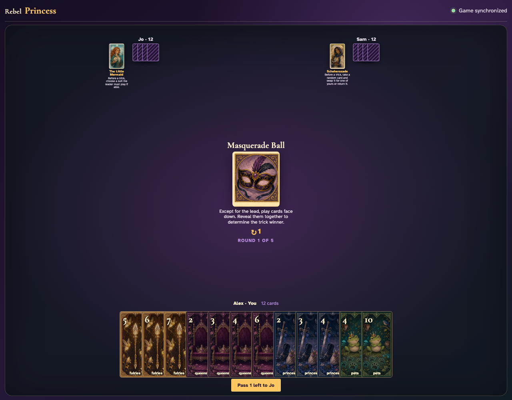
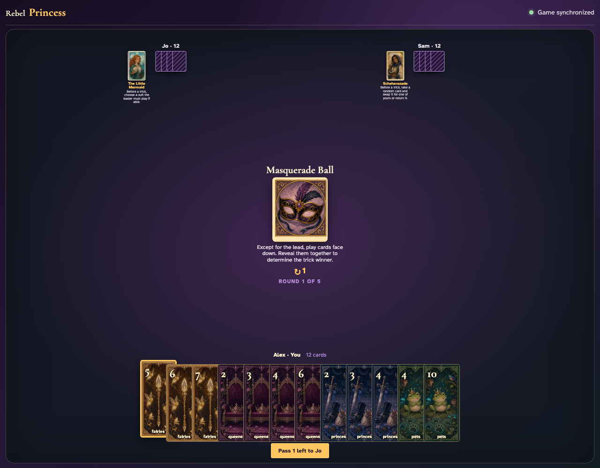
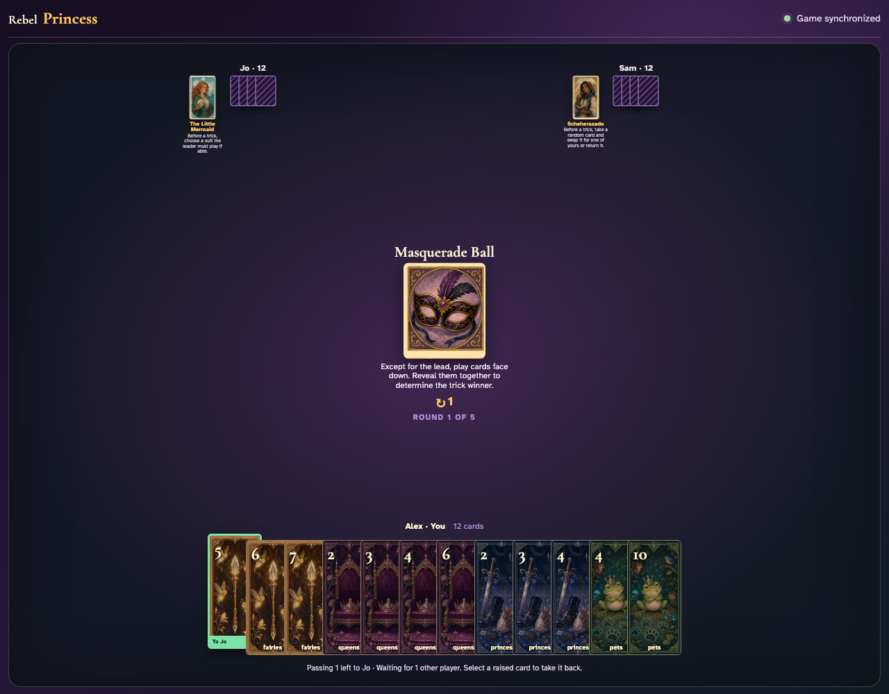
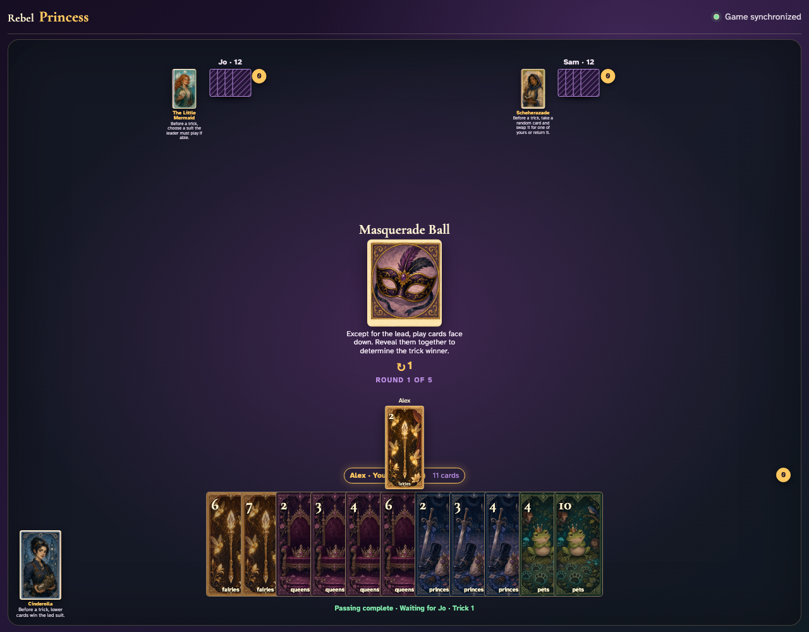
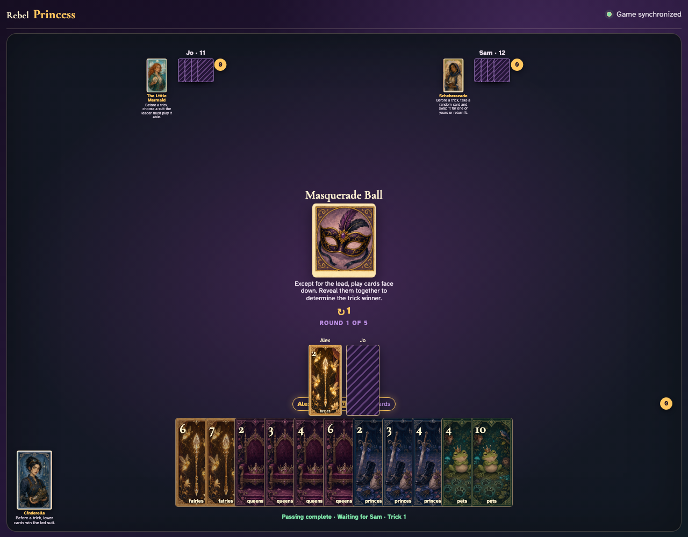
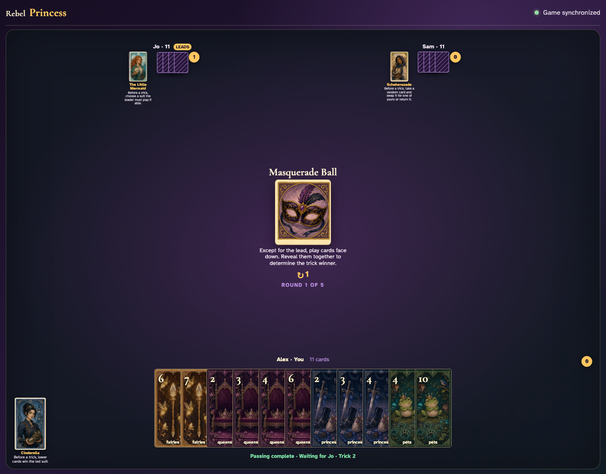

# Masquerade Ball

Watch the lead face up, both followers commit hidden cards through clicks, then review every revealed card in the awarded trick.

## Masquerade Ball prints a 1-card left pass before play begins

**Verifications:**
- [x] The center icon announces Pass 1 left
- [x] The action names Jo as the recipient
- [x] The pass cannot be committed before any card is chosen

---

## Alex clicks Fairies 5; it is assignment 1 of 1 to Jo

**Verifications:**
- [x] Exactly 1 chosen card is raised
- [x] Fairies 5 stays visibly selected
- [x] The complete printed pass is ready to commit

---

## Alex commits the 1 cards toward Jo while both other players are still choosing

**Verifications:**
- [x] All 1 outgoing cards remain visible and raised
- [x] The waiting message preserves the printed left direction
- [x] No incoming cards arrive before every player commits

---

## Jo commits next; Alex still sees the cards held until Sam makes the final decision

**Verifications:**
- [x] Exactly one other player remains
- [x] Alex can still identify every outgoing card

---

## Sam commits last; all three left transfers resolve simultaneously and play can begin

**Verifications:**
- [x] Every player again holds twelve cards
- [x] Alex receives the exact left incoming card
- [x] The table leaves the simultaneous pass phase for play or the Round card’s next action

---

## The round card announces that only the lead stays face up while followers commit

**Verifications:**
- [x] The conceal-and-reveal rule is readable
- [x] A leader is visibly ready to click

---

## Alex leads Fairies 2 face up so everyone knows which suit to follow

**Verifications:**
- [x] The exact lead graphic is public
- [x] Only one card is currently committed

---

## Jo clicks a legal card, but opponents see a face-down card rather than Fairies 5

**Verifications:**
- [x] The follower is explicitly announced as face down
- [x] The private card label is not exposed in the center yet

---

## Sam commits the final hidden card; all three actual graphics reveal together before collection

**Verifications:**
- [x] Jo’s concealed Fairies 5 is now visible
- [x] Sam’s final Fairies 3 is now visible

---
