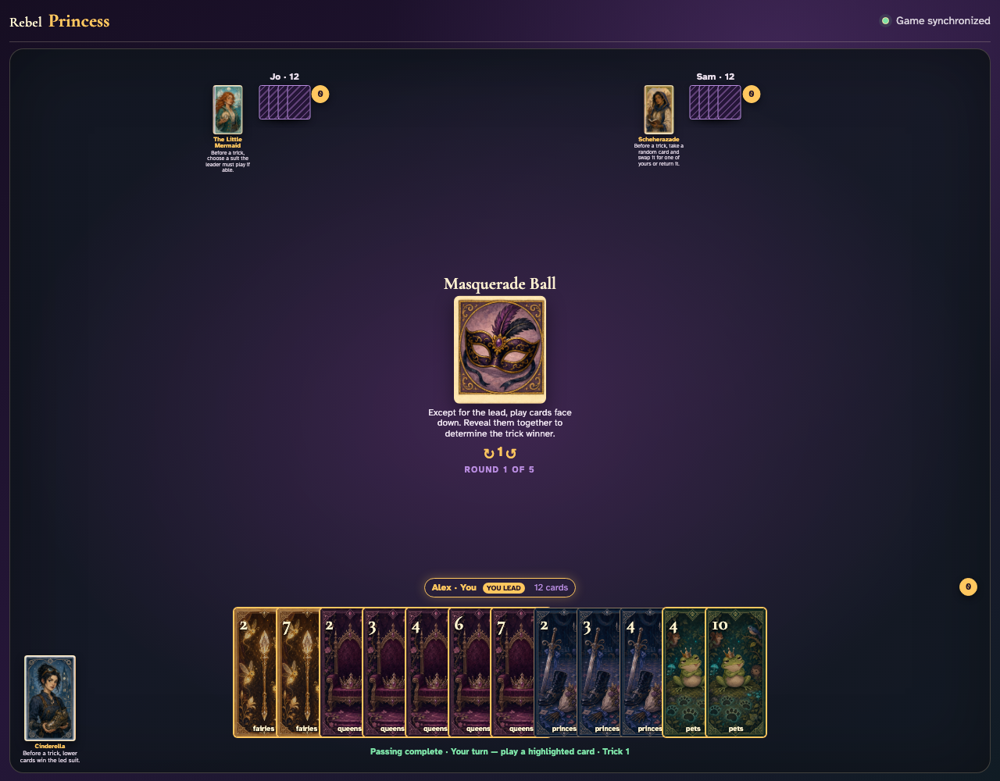
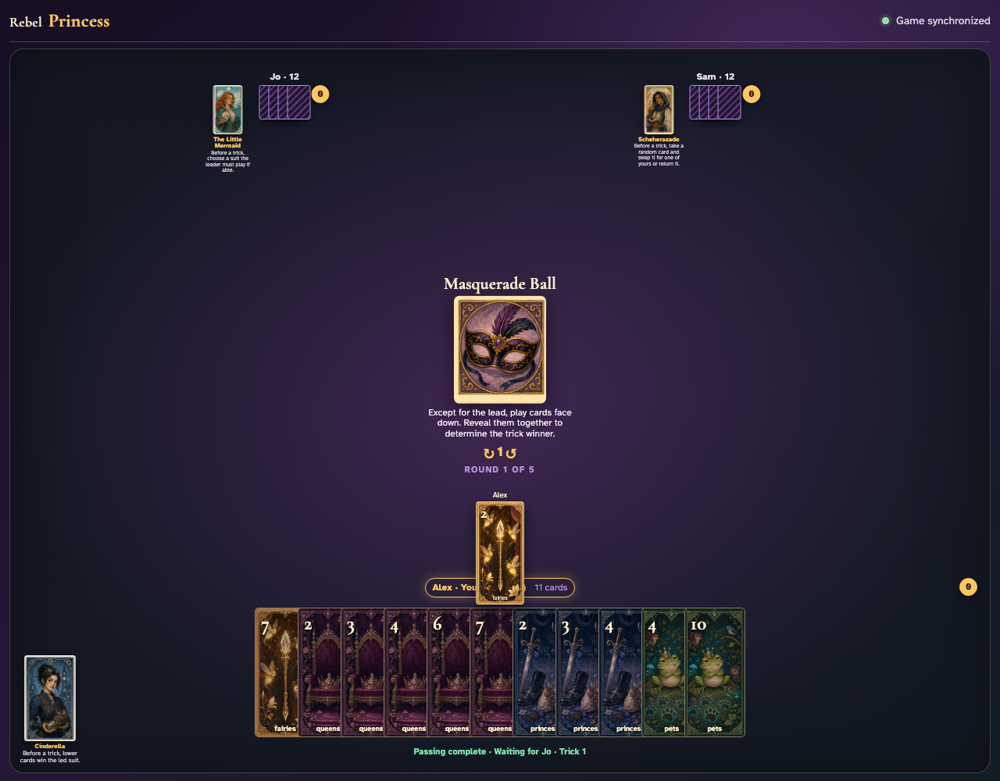
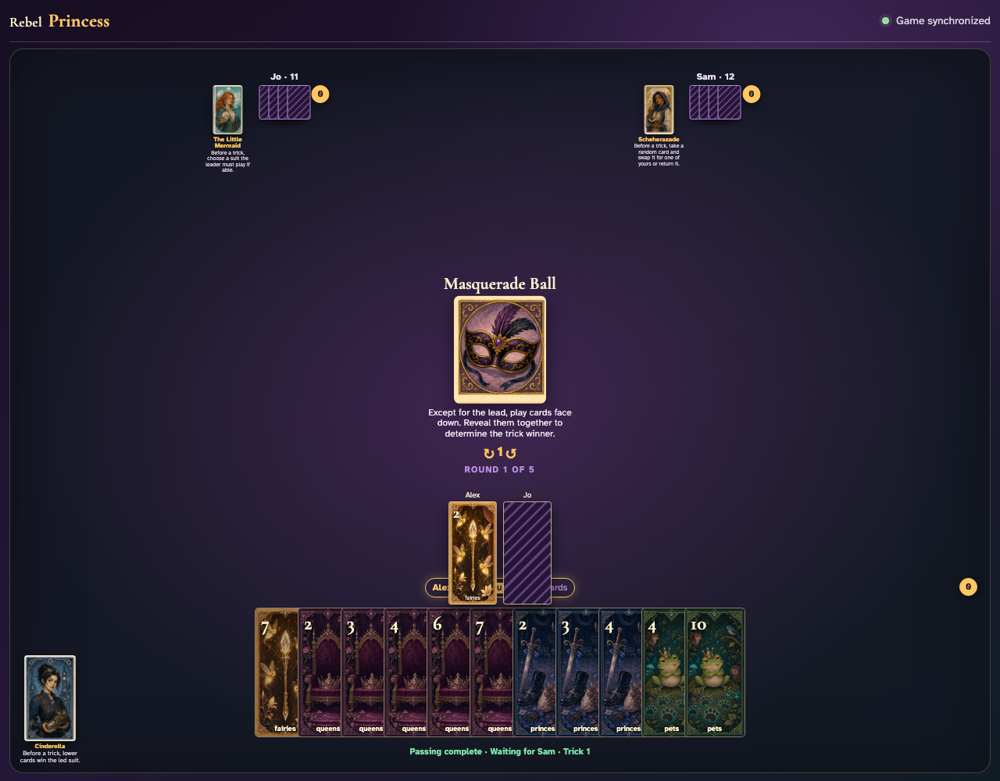
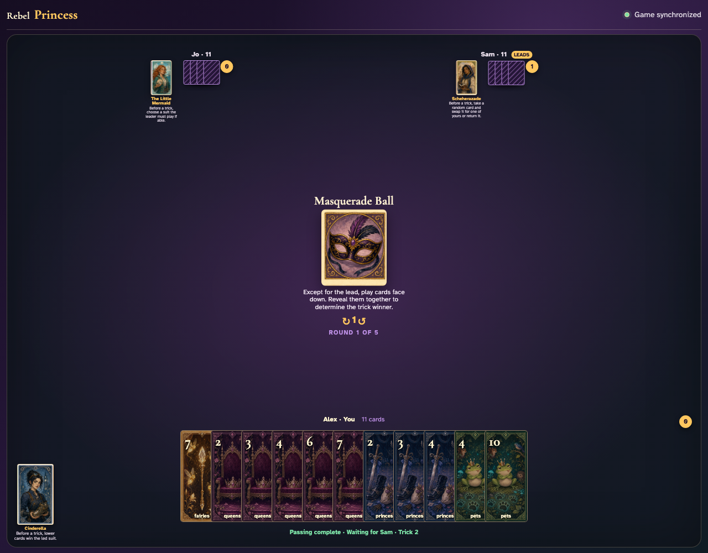

# Masquerade Ball

Watch the lead face up, both followers commit hidden cards through clicks, then review every revealed card in the awarded trick.

## The round card announces that only the lead stays face up while followers commit

**Verifications:**
- [x] The conceal-and-reveal rule is readable
- [x] A leader is visibly ready to click

---

## Alex leads Fairies 2 face up so everyone knows which suit to follow

**Verifications:**
- [x] The exact lead graphic is public
- [x] Only one card is currently committed

---

## Jo clicks a legal card, but opponents see a face-down card rather than Fairies 3

**Verifications:**
- [x] The follower is explicitly announced as face down
- [x] The private card label is not exposed in the center yet

---

## Sam commits the final hidden card; all three actual graphics reveal together before collection

**Verifications:**
- [x] Jo’s concealed Fairies 3 is now visible
- [x] Sam’s final Fairies 4 is now visible

---
