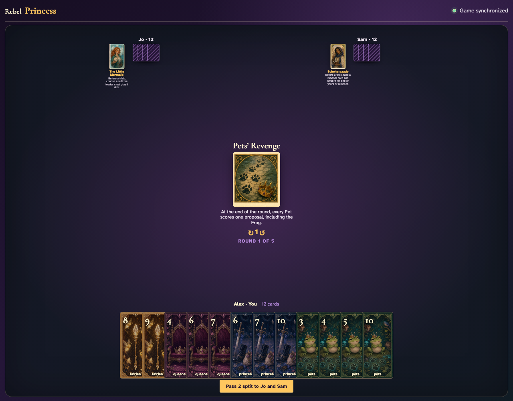
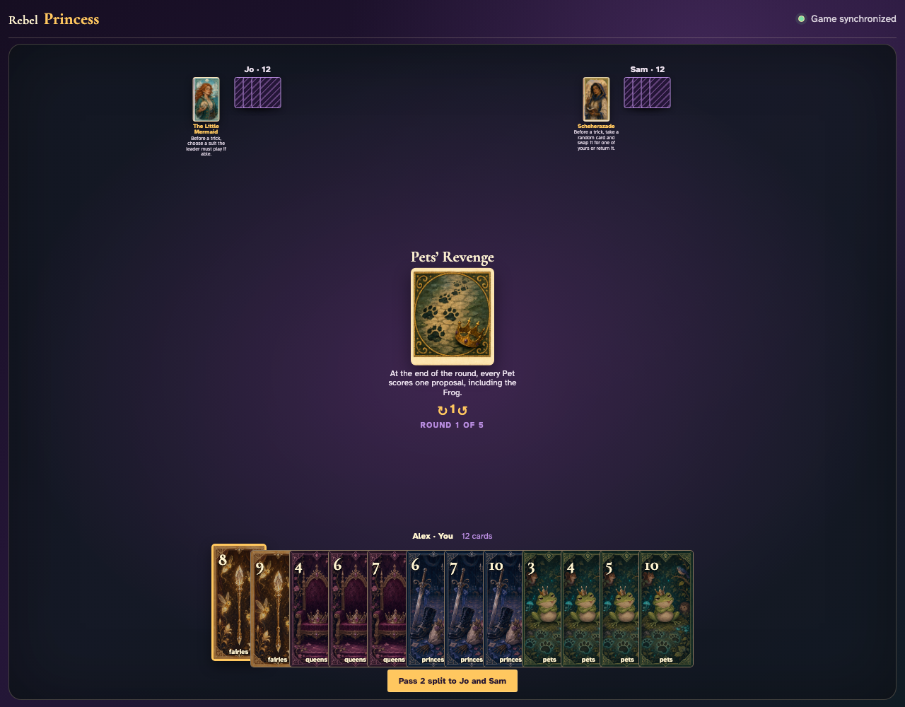
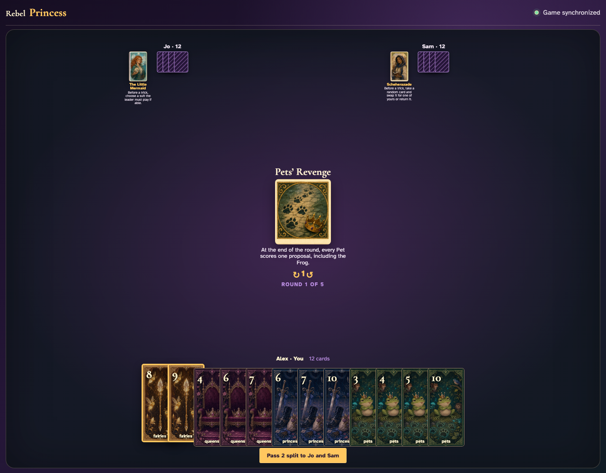
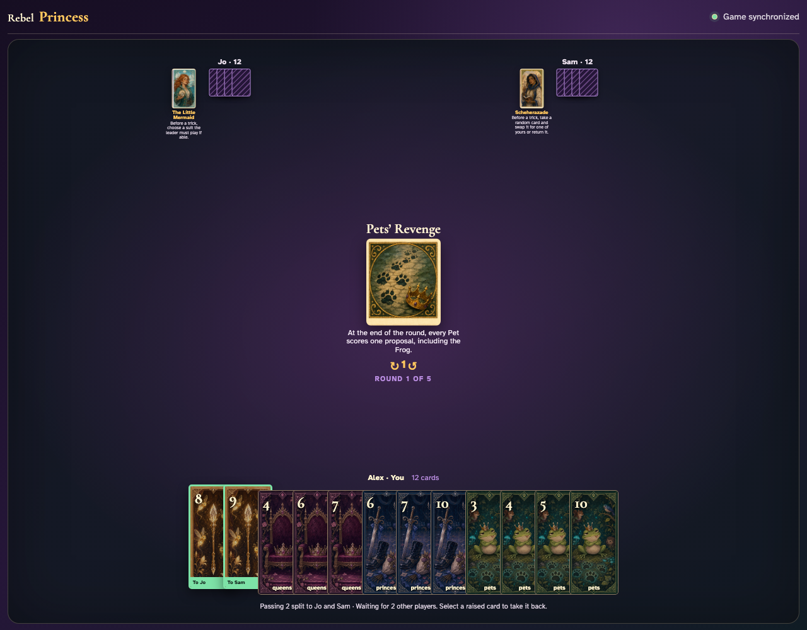
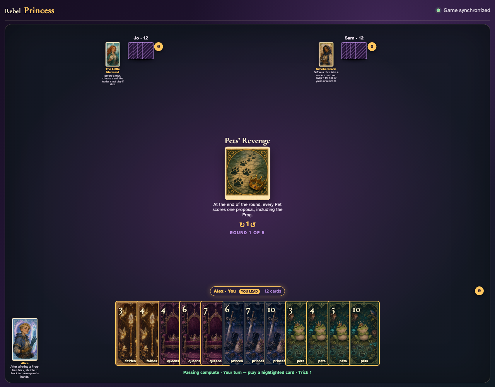
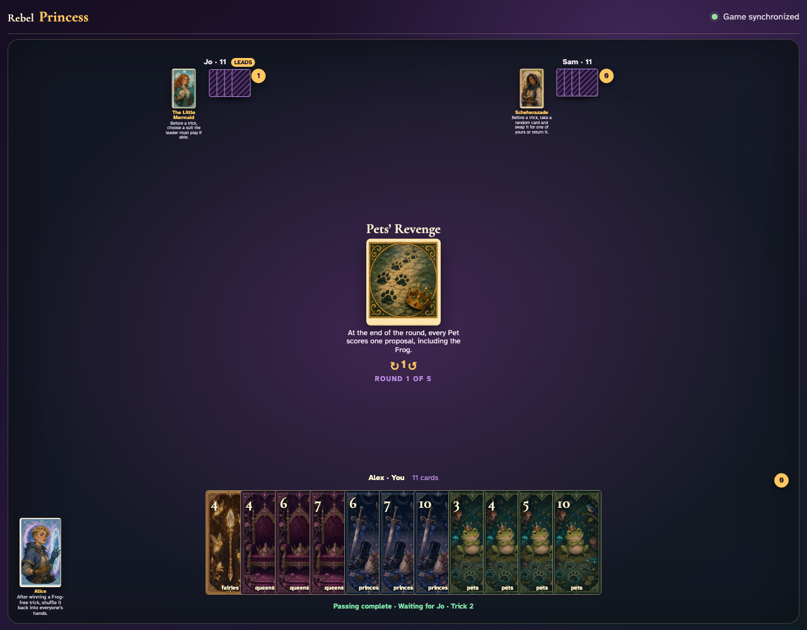
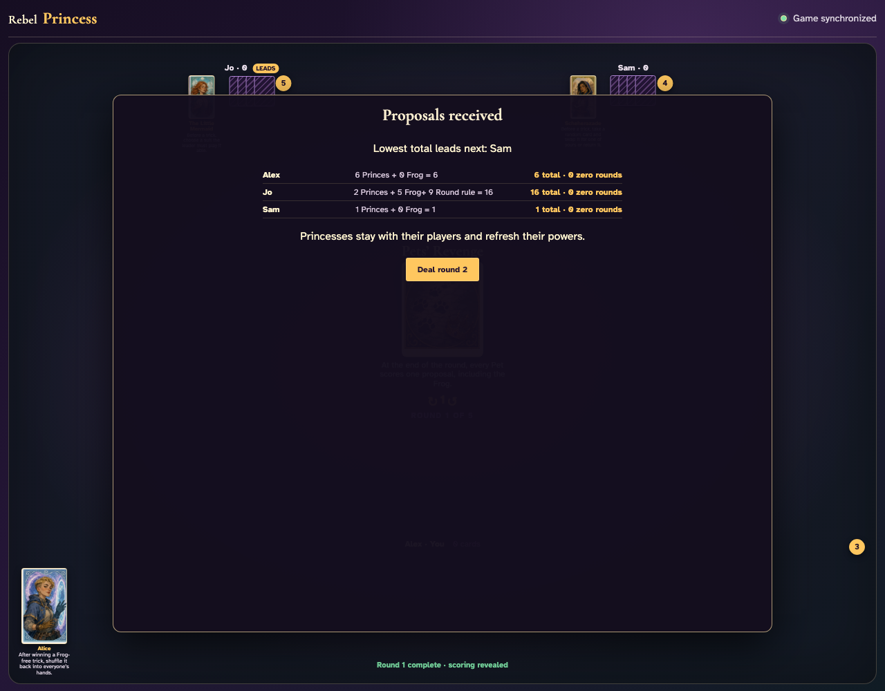

# Pets’ Revenge

Count the nine Pets in the shared deal, play all twelve tricks through card clicks, and reconcile every Pet in the scoring panel.

## Pets’ Revenge prints a 2-card split pass before play begins

**Verifications:**
- [x] The center icon announces Pass 2 split
- [x] The action names Jo and Sam as the recipients
- [x] The pass cannot be committed before any card is chosen

---

## Alex clicks Fairies 8; it is assignment 1 of 2 to Jo

**Verifications:**
- [x] Exactly 1 chosen card is raised
- [x] Fairies 8 stays visibly selected
- [x] 1 more selection is still required

---

## Alex clicks Fairies 9; it is assignment 2 of 2 to Sam

**Verifications:**
- [x] Exactly 2 chosen cards are raised
- [x] Fairies 9 stays visibly selected
- [x] The complete printed pass is ready to commit

---

## Alex commits the 2 cards toward Jo and Sam while both other players are still choosing

**Verifications:**
- [x] All 2 outgoing cards remain visible and raised
- [x] The waiting message preserves the printed split direction
- [x] No incoming cards arrive before every player commits

---

## Jo commits next; Alex still sees the cards held until Sam makes the final decision

**Verifications:**
- [x] Exactly one other player remains
- [x] Alex can still identify every outgoing card

---

## Sam commits last; all three split transfers resolve simultaneously and play can begin

**Verifications:**
- [x] Every player again holds twelve cards
- [x] Alex receives the exact split incoming cards
- [x] The table leaves the simultaneous pass phase for play or the Round card’s next action

---

## The round begins with all nine three-player Pets present and a visible one-proposal rule

**Verifications:**
- [x] The exact Pet scoring rule is readable
- [x] The shared deal contains exactly nine Pets

---

## The first trick is played normally with the actual graphics: Fairies 3, Fairies 5, Fairies 2

**Verifications:**
- [x] Exactly one player receives the first trick
- [x] Every hand now contains eleven cards

---

## After all 36 card clicks, the three visible Round-rule modifiers reconcile to all nine captured Pets

**Verifications:**
- [x] All hands are empty after twelve complete tricks
- [x] All nine Pets are counted exactly once
- [x] The round completion alert is visible

---
