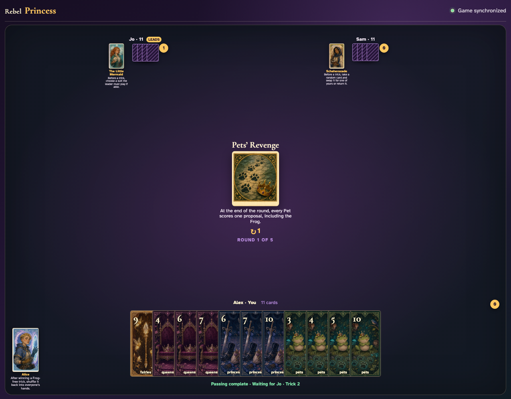
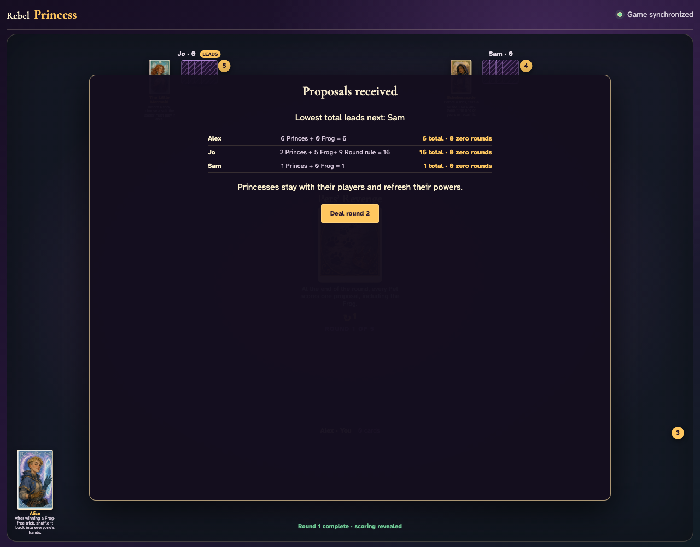

# Pets’ Revenge

Count the nine Pets in the shared deal, play all twelve tricks through card clicks, and reconcile every Pet in the scoring panel.

## The round begins with all nine three-player Pets present and a visible one-proposal rule

**Verifications:**
- [x] The exact Pet scoring rule is readable
- [x] The shared deal contains exactly nine Pets

---

## The first trick is played normally with the actual graphics: Fairies 3, Fairies 4, Fairies 2

**Verifications:**
- [x] Exactly one player receives the first trick
- [x] Every hand now contains eleven cards

---

## After all 36 card clicks, the three visible Round-rule modifiers reconcile to all nine captured Pets

**Verifications:**
- [x] All hands are empty after twelve complete tricks
- [x] All nine Pets are counted exactly once
- [x] The round completion alert is visible

---
