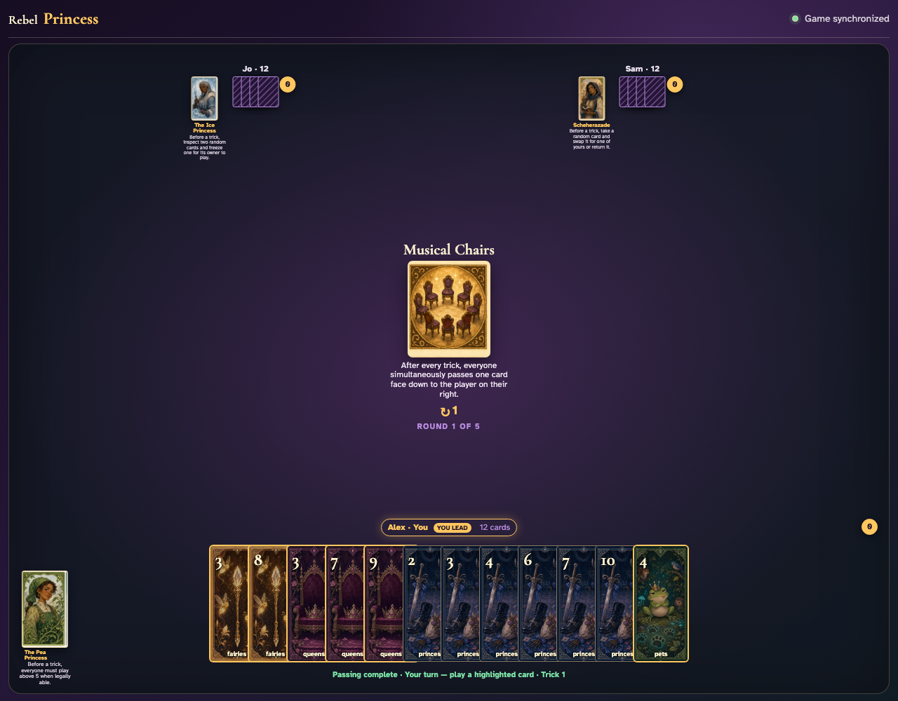
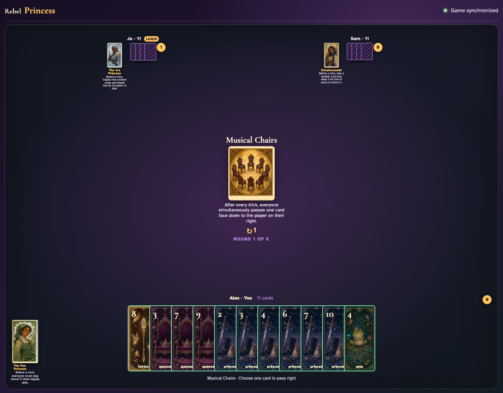
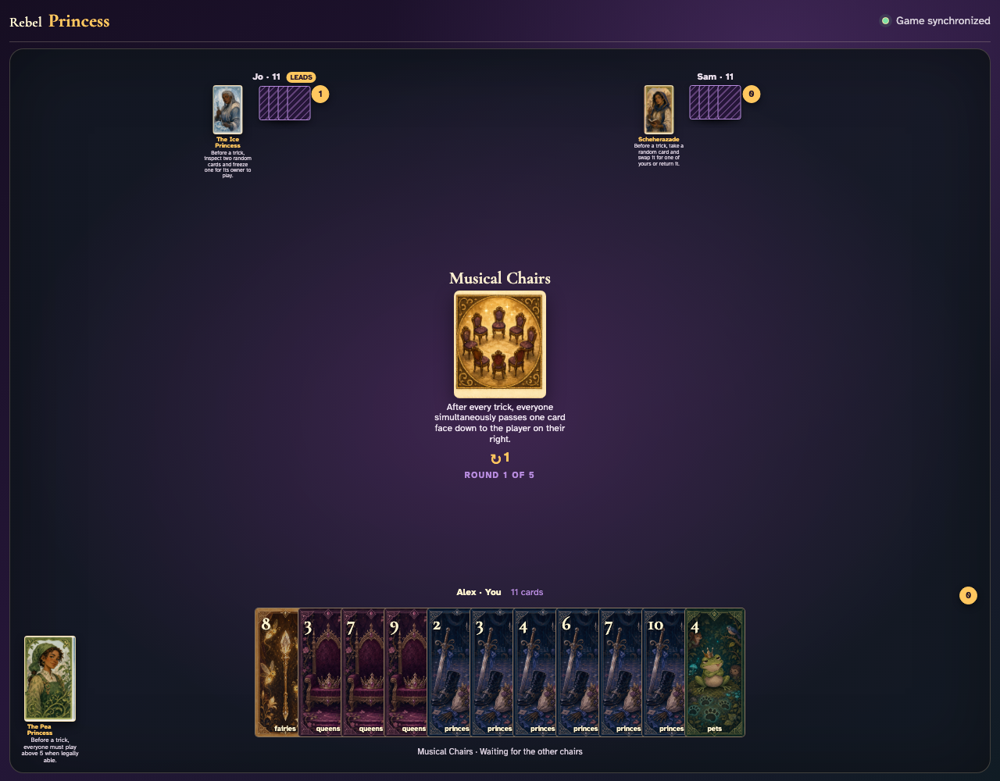

# Musical Chairs

Play a complete trick, select the exchange cards one client at a time, observe waiting, and prove each exact card reaches the player on its right.

## The center announces a simultaneous one-card pass to the right after every trick

**Verifications:**
- [x] The exact exchange rule is readable
- [x] No exchange prompt appears before a trick

---

## The ordinary trick completes (Fairies 3, Fairies 7, Fairies 2) and all three clients enter the exchange

**Verifications:**
- [x] Every client receives the Musical Chairs prompt
- [x] Every client still holds eleven cards before exchanging

---

## Alex clicks Fairies 8 face down; it remains hidden while Jo and Sam decide

**Verifications:**
- [x] Alex sees the explicit waiting message
- [x] Jo and Sam still have selectable exchange cards

---

## The simultaneous reveal resolves clockwise: Alex receives Fairies 9, Jo receives Fairies 4, and Sam receives Fairies 8

**Verifications:**
- [x] Alex receives Jo’s exact selected card
- [x] Jo receives Sam’s exact selected card
- [x] Sam receives Alex’s exact selected card
- [x] All hands remain conserved at eleven cards

---
