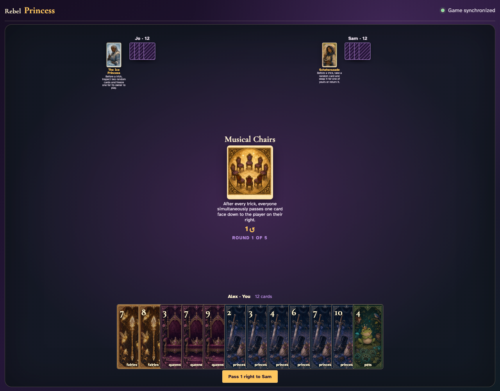
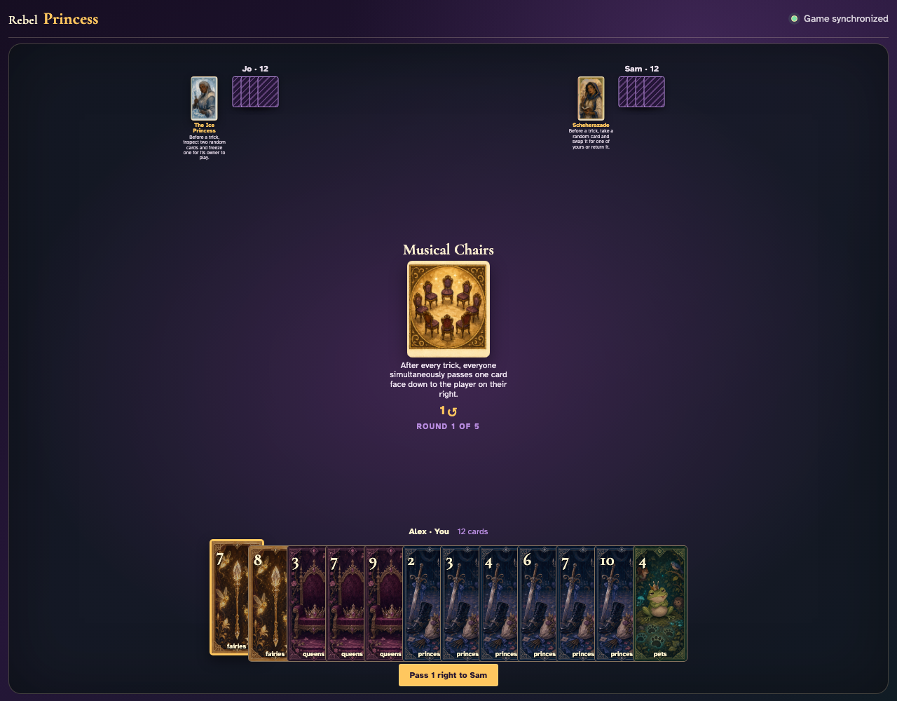
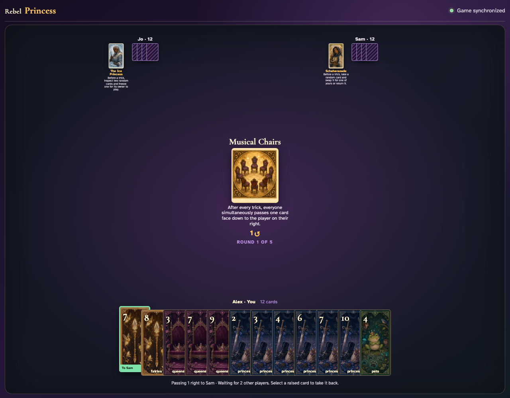
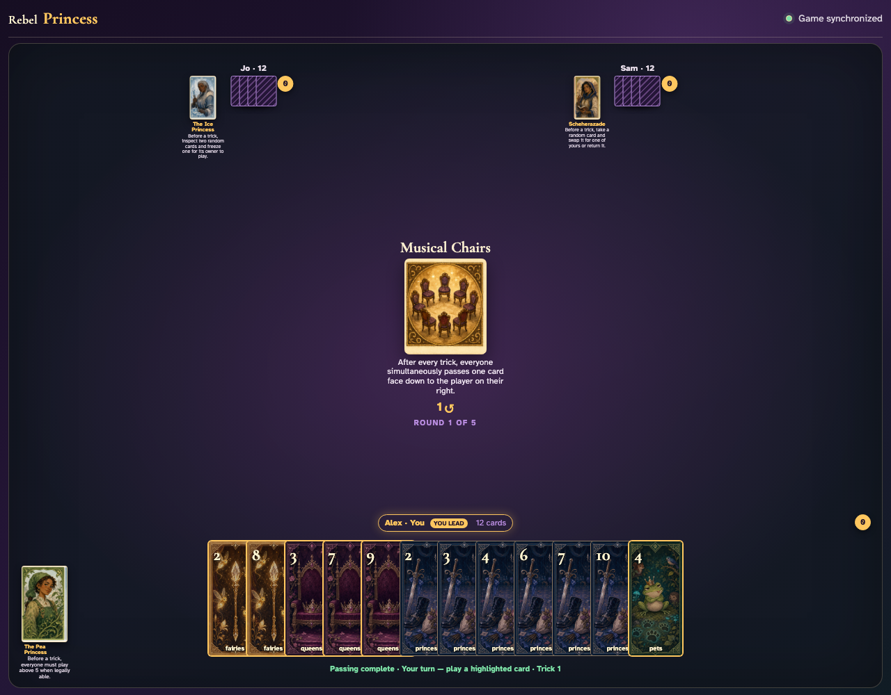
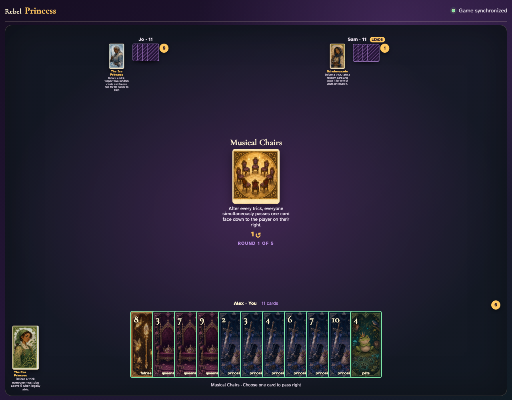
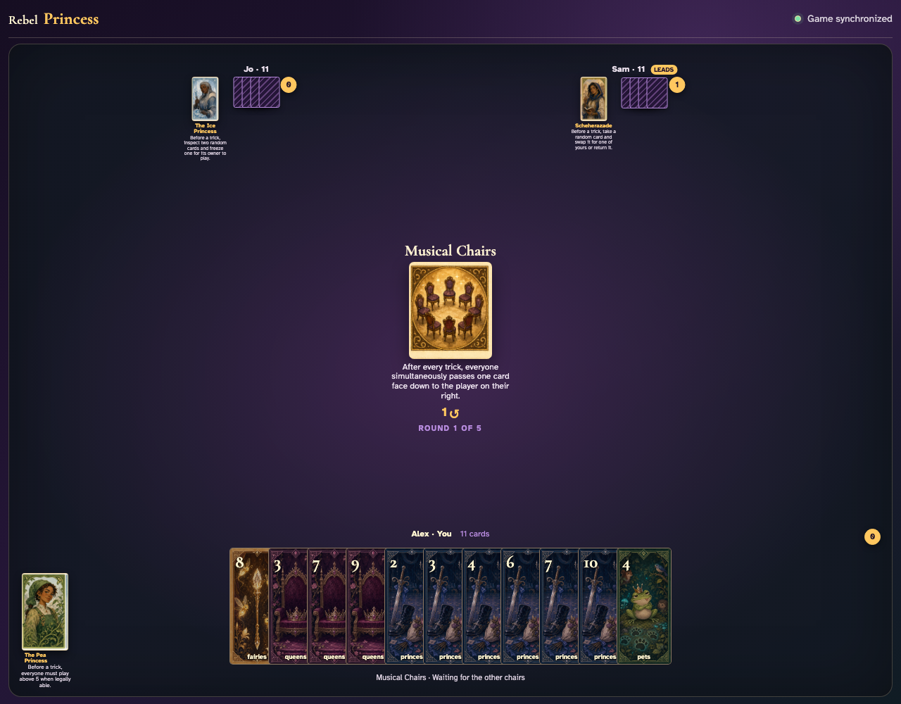

# Musical Chairs

Play a complete trick, select the exchange cards one client at a time, observe waiting, and prove each exact card reaches the player on its right.

## Musical Chairs prints a 1-card right pass before play begins

**Verifications:**
- [x] The center icon announces Pass 1 right
- [x] The action names Sam as the recipient
- [x] The pass cannot be committed before any card is chosen

---

## Alex clicks Fairies 7; it is assignment 1 of 1 to Sam

**Verifications:**
- [x] Exactly 1 chosen card is raised
- [x] Fairies 7 stays visibly selected
- [x] The complete printed pass is ready to commit

---

## Alex commits the 1 cards toward Sam while both other players are still choosing

**Verifications:**
- [x] All 1 outgoing cards remain visible and raised
- [x] The waiting message preserves the printed right direction
- [x] No incoming cards arrive before every player commits

---

## Jo commits next; Alex still sees the cards held until Sam makes the final decision

**Verifications:**
- [x] Exactly one other player remains
- [x] Alex can still identify every outgoing card

---

## Sam commits last; all three right transfers resolve simultaneously and play can begin

**Verifications:**
- [x] Every player again holds twelve cards
- [x] Alex receives the exact right incoming card
- [x] The table leaves the simultaneous pass phase for play or the Round card’s next action

---

## The center announces a simultaneous one-card pass to the right after every trick

**Verifications:**
- [x] The exact exchange rule is readable
- [x] No exchange prompt appears before a trick

---

## The ordinary trick completes (Fairies 2, Fairies 3, Fairies 4) and all three clients enter the exchange

**Verifications:**
- [x] Every client receives the Musical Chairs prompt
- [x] Every client still holds eleven cards before exchanging

---

## Alex clicks Fairies 8 face down; it remains hidden while Jo and Sam decide

**Verifications:**
- [x] Alex sees the explicit waiting message
- [x] Jo and Sam still have selectable exchange cards

---

## The simultaneous reveal resolves clockwise: Alex receives Fairies 9, Jo receives Fairies 5, and Sam receives Fairies 8

**Verifications:**
- [x] Alex receives Jo’s exact selected card
- [x] Jo receives Sam’s exact selected card
- [x] Sam receives Alex’s exact selected card
- [x] All hands remain conserved at eleven cards

---
